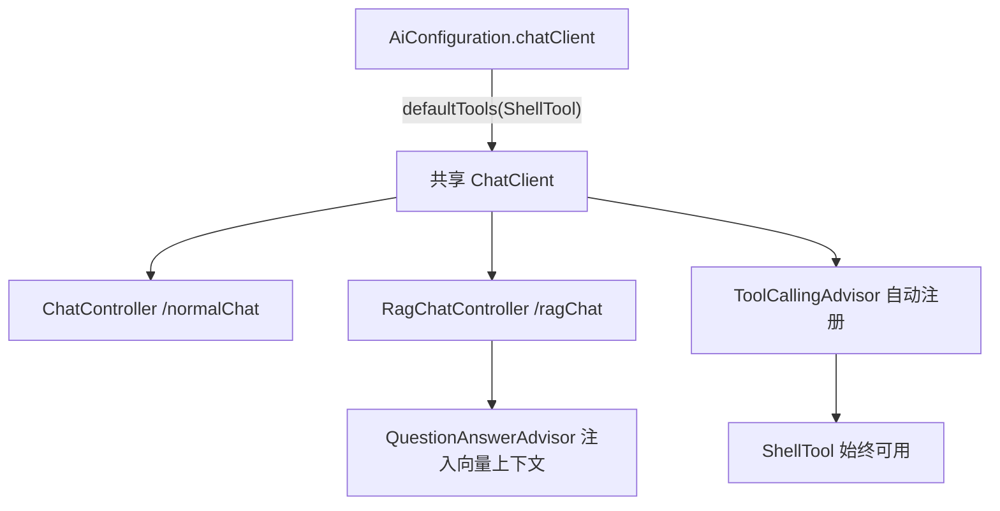
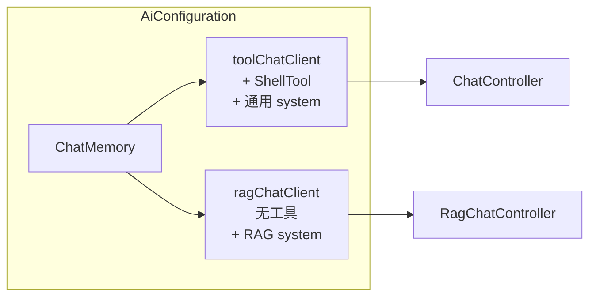

# RAG 与工具调用分离方案

## 问题根因

当前架构：



[`AiConfiguration.java`](my-chat-server/src/main/java/com/mychat/config/AiConfiguration.java) 第 41 行：

```java
.defaultTools(new ShellTool())
```

[`RagChatController.java`](my-chat-server/src/main/java/com/mychat/controller/RagChatController.java) 注入的是同一个 `chatClient`，因此每次 RAG 请求时模型同时看到：

1. `QuestionAnswerAdvisor` 检索并注入的知识库上下文
2. `ShellTool` 工具定义（通过 `defaultTools` 全局生效）

Spring AI 官方文档明确指出：[defaultTools 会作用于该 Builder 创建的所有 ChatClient 请求，"dangerous if not used carefully, risking to make them available when they shouldn't"](https://docs.spring.io/spring-ai/reference/2.0/api/tools.html)。模型在有工具可用时，倾向于走工具调用路径（如 `dir`、`type`、`git status`），而不是仅依赖检索到的文档片段回答。

**结论：不是 `QuestionAnswerAdvisor` 没生效，而是工具调用与 RAG 在同一条链路上竞争，且工具往往优先级更高。**

---

## 方案对比

| 方案                                 | 做法                                                    | 优点                                         | 缺点                                             |
| ------------------------------------ | ------------------------------------------------------- | -------------------------------------------- | ------------------------------------------------ |
| **A. 双 ChatClient Bean（推荐）**    | `toolChatClient` + `ragChatClient`                      | 职责清晰；RAG 可配专用 system prompt；零泄漏 | 多一个 Bean                                      |
| **B. 去掉 defaultTools，按请求注入** | 共享 Client，仅 `ChatController` 调 `.tools(shellTool)` | 改动最小                                     | RAG/普通聊天共用同一 system prompt，语义不够隔离 |
| **C. 仅靠 system prompt 约束**       | 告诉模型"不要用工具"                                    | 无代码结构变化                               | 不可靠，模型仍可能调用工具                       |

**不推荐方案 C**。`AdvisorParams.toolCallingAdvisorAutoRegister(false)` 只能禁用工具**自动执行**，工具定义仍会发给模型，无法从根本上解决问题。

---

## 推荐方案 A：双 ChatClient，共享 ChatMemory



前端 [`streamChat.ts`](my-chat-vue3/src/utils/streamChat.ts) 已按 `kbId` 分流到 `/ai/ragChat/chat` 与 `/ai/normalChat/chat`，后端分离与之对齐。

---

## 需要修改的代码

### 1. [`AiConfiguration.java`](my-chat-server/src/main/java/com/mychat/config/AiConfiguration.java)

将单个 `chatClient` 拆为两个 Bean，**移除共享 defaultTools**，各自配置 system prompt：

```java
@Configuration
public class AiConfiguration {

    @Autowired
    JdbcChatMemoryRepository jdbcChatMemoryRepository;

    @Bean
    public ChatMemory chatMemory() {
        return MessageWindowChatMemory.builder()
                .chatMemoryRepository(jdbcChatMemoryRepository)
                .maxMessages(64)
                .build();
    }

    /** 普通对话：支持 Shell 工具调用 */
    @Bean
    public ChatClient toolChatClient(OpenAiChatModel model, ChatMemory chatMemory, ShellTool shellTool) {
        return ChatClient.builder(model)
                .defaultSystem("请根据用户提问灵活回应。需要查看项目文件或执行只读命令时，可使用可用工具。")
                .defaultAdvisors(
                        new SimpleLoggerAdvisor(),
                        MessageChatMemoryAdvisor.builder(chatMemory).build()
                )
                .defaultTools(shellTool)   // 仅工具聊天 Client 注册工具
                .build();
    }

    /** 知识库 RAG：不注册任何工具，强制基于检索上下文回答 */
    @Bean
    public ChatClient ragChatClient(OpenAiChatModel model, ChatMemory chatMemory) {
        return ChatClient.builder(model)
                .defaultSystem("""
                        你是知识库问答助手。请严格基于系统提供的检索上下文回答问题。
                        如果上下文中没有足够信息，请明确告知用户"知识库中未找到相关信息"，不要编造。
                        不要尝试调用任何外部工具或命令。
                        """)
                .defaultAdvisors(
                        new SimpleLoggerAdvisor(),
                        MessageChatMemoryAdvisor.builder(chatMemory).build()
                )
                // 注意：不调用 defaultTools
                .build();
    }
}
```

### 2. [`ChatController.java`](my-chat-server/src/main/java/com/mychat/controller/ChatController.java)

注入 `toolChatClient` 替代 `chatClient`：

```java
@RequiredArgsConstructor
@RestController
@RequestMapping("/ai/normalChat")
public class ChatController {
    private final ChatMemory chatMemory;
    private final ChatClient toolChatClient;  // 改名注入

    private Flux<String> textChat(String prompt, String chatId) {
        return toolChatClient.prompt()   // 使用 toolChatClient
                .user(prompt)
                .advisors(a -> a.param(ChatMemory.CONVERSATION_ID, chatId))
                // ... 其余不变
    }
    // multiModalChat 同理改为 toolChatClient
}
```

若使用 `@RequiredArgsConstructor` + 字段名 `toolChatClient`，Spring 会按类型+参数名匹配 `@Bean toolChatClient()`，无需 `@Qualifier`。

### 3. [`RagChatController.java`](my-chat-server/src/main/java/com/mychat/controller/RagChatController.java)

注入 `ragChatClient`，可选增强 `QuestionAnswerAdvisor` 的 prompt 模板：

```java
@RestController
@RequestMapping("/ai/ragChat")
public class RagChatController {

    @Autowired
    private ChatClient ragChatClient;   // 使用无工具的 RAG 专用 Client
    @Autowired
    private VectorStore vectorStore;

    @RequestMapping(value = "/chat", produces = "text/html;charset=utf-8")
    public Flux<String> chat(
            @RequestParam("prompt") String prompt,
            @RequestParam("chatId") String chatId,
            @RequestParam("kbId") String kbId) {

        QuestionAnswerAdvisor qaAdvisor = QuestionAnswerAdvisor.builder(vectorStore)
                .searchRequest(SearchRequest.builder()
                        .topK(5)
                        .similarityThreshold(0.5)
                        .filterExpression("kbId == '" + kbId + "'")
                        .build())
                .build();

        return ragChatClient.prompt()    // 使用 ragChatClient
                .advisors(qaAdvisor)
                .advisors(a -> a.param(ChatMemory.CONVERSATION_ID, chatId))
                .user(prompt)
                .stream()
                .chatResponse()
                .map(/* 现有 map 逻辑不变 */);
    }
}
```

---

## 备选方案 B（最小改动）

若暂时不想拆 Bean，可只改 [`AiConfiguration.java`](my-chat-server/src/main/java/com/mychat/config/AiConfiguration.java)：

```java
@Bean
public ChatClient chatClient(OpenAiChatModel model, ChatMemory chatMemory) {
    return ChatClient.builder(model)
            .defaultSystem("请根据用户提问灵活回应。")
            .defaultAdvisors(
                    new SimpleLoggerAdvisor(),
                    MessageChatMemoryAdvisor.builder(chatMemory).build()
            )
            // 删除 .defaultTools(new ShellTool())
            .build();
}
```

然后在 [`ChatController.java`](my-chat-server/src/main/java/com/mychat/controller/ChatController.java) 每次请求显式注入工具：

```java
@RequiredArgsConstructor
public class ChatController {
    private final ChatClient chatClient;
    private final ShellTool shellTool;

    private Flux<String> textChat(String prompt, String chatId) {
        return chatClient.prompt()
                .tools(shellTool)   // 仅普通聊天注册工具
                .user(prompt)
                // ...
    }
}
```

[`RagChatController`](my-chat-server/src/main/java/com/mychat/controller/RagChatController.java) 保持不调用 `.tools()` 即可。此方案可行，但 RAG 与普通聊天仍共用同一 system prompt，长期维护不如方案 A 清晰。

---

## 可选增强（非必须）

1. **自定义 QuestionAnswerAdvisor 模板**：通过 `.promptTemplate()` 强化"仅依据以下文档回答"的指令，见 [RAG 官方文档](https://docs.spring.io/spring-ai/reference/2.0/api/retrieval-augmented-generation.html)
2. **升级到 `RetrievalAugmentationAdvisor`**：支持多查询扩展、重排序、空上下文时拒答等模块化 RAG 流程，适合后续精细化调优
3. **调参**：`topK`、`similarityThreshold` 影响检索质量；若检索结果为空，模型仍可能"自由发挥"，可配合空结果检测逻辑

---

## 验证步骤

1. 重启后端 `./mvnw.cmd spring-boot:run`
2. **普通聊天**（无 kbId）：提问"列出 src 目录结构"，应触发 ShellTool
3. **RAG 聊天**（带 kbId）：提问知识库文档中的内容，应直接基于检索上下文回答，不再执行 shell 命令
4. 观察日志中 `SimpleLoggerAdvisor` 输出，确认 RAG 请求的 prompt 含检索片段、且无 tool_calls

---

## 不在本次范围

- 前端 `streamChat.ts` 已正确分流，无需改动
- `RetrievalAugmentationAdvisor` 完整迁移（可作为后续优化）
- Token / 鉴权相关改造