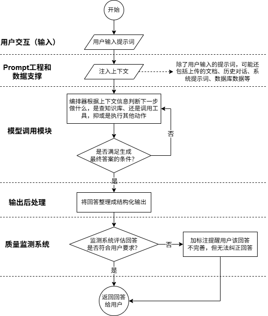

项目构建了一个agent系统，并在此基础上着重研究如何搭建适用于复杂生产环境的RAG系统。此外，也会扩展一些自用的功能模块。

# 1 agent业务总览

从用户进入聊天界面输入提示词按下回车开始，系统内部大概会经历以下流程：构造上下文、调用模型完成工作、整理最终AI回答、由质量监测系统评估该回答是否符合用户需求、向用户展示答案。

每一个流程背后都会牵涉到大量代码，这些代码在逻辑层面可划分为几个模块，比如用户在聊天界面输入提示词命令AI工作，这个涉及到**用户交互模块**；构造上下文涉及到**Prompt工程**和**数据支撑模块**；具体让AI执行工作需要**模型调用模块**，这个模块是比较核心的模块；AI生成回答后，不能直接给用户看，还要把它修改成同时符合用户需求和系统内部规范的形式，这需要用到**输出后处理模块**；此外，AI的回答还需要经过**质量监测模块**审核，以防回答偏离用户需求或是违反法律法规。