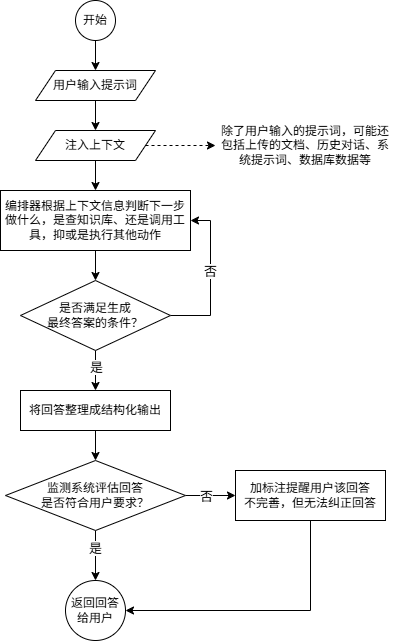

项目构建了一个agent系统，并在此基础上着重研究如何搭建适用于复杂生产环境的RAG系统。此外，也会扩展一些自用的功能模块。

# 1 agent业务总览

从用户进入聊天界面输入提示词按下回车开始，系统内部大概会经历以下流程：构造上下文、调用模型完成工作、整理最终AI回答、由质量监测系统评估该回答是否符合用户需求、向用户展示答案。

每一个流程背后都会牵涉到大量代码，这些代码在逻辑层面可划分为几个模块，比如用户在聊天界面输入提示词命令AI工作，这个涉及到**用户交互模块**；构造上下文涉及到**Prompt工程**和**数据支撑模块**；具体让AI执行工作需要**模型调用模块**，这个模块是比较核心的模块；AI生成回答后，不能直接给用户看，还要把它修改成同时符合用户需求和系统内部规范的形式，这需要用到**输出后处理模块**；此外，AI的回答还需要经过**质量监测模块**审核，以防回答偏离用户需求或是违反法律法规。

# 2 用户交互

项目采用C/S架构，前后端分离。其中前端为了实现流式聊天响应，不用Axios封装的api请求后端接口，而是用fetch：[`streamChat.ts`](../my-chat-vue3/src/utils/streamChat.ts)。

一般和AI聊天采用SSE流式输出，这类业务场景里AI吐出的内容可能很长，把一整段思考内容打印出来，再加上最终的回答，整个过程消耗几十分钟也说不定。所以前端和后端之间需要长连接，让服务器（AI）持续且单向地朝客户端推送信息流。

Axios更适合一次性请求-响应模式，并不原生支持 Server-Sent Events（SSE）这种长连接、流式数据推送协议。axios 基于 `XMLHttpRequest`，而 XHR 没有标准的 `ReadableStream`，虽然可以通过 `onDownloadProgress` 拿到部分 `responseText`，但它是累积文本，不是真正的流，你要自己记录上次读取位置、截取新增内容、处理分块边界、处理 UTF-8 多字节字符被截断、防止响应越长内存越大……总之拔高了开发成本。

而且 axios 的默认 `transformResponse`、拦截器、JSON 解析逻辑，会干扰 `text/event-stream` 这种非一次性 JSON 响应。虽然可以配置 `responseType: 'stream'`开启流式输出，并关闭拦截响应和超时判断，但相当于绕远路，浪费开发成本。

fetch 原生暴露 ReadableStream，适合逐 token 读取。而且 AI 聊天经常需要“停止生成”，`fetch` 可以配合 `AbortController`实现中断流式输出。fetch 还支持 POST、自定义 header、cookie、跨域配置等，比 axios 更灵活、更支持底层自定义。因此在AI聊天场景中使用fetch比axios更常见。

Websocket协议也可实现SSE，但是Websocket是全双工，常规AI聊天仅用半双工（服务器推送到客户端）就够用，Websocket太“重”。