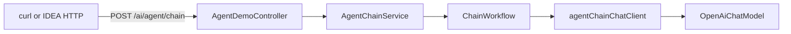

# P2-10 阶段 D：ChainWorkflow 落地行动方案

> **依据**：[docs/迭代规划/P2-10-agents开发规划.md](docs/迭代规划/P2-10-agents开发规划.md) 第三节「阶段 D」  
> **参考实现**：[06-agents/.../ChainWorkflow.java](06-agents/src/main/java/com/example/springai/agents/patterns/ChainWorkflow.java)  
> **目标**：在 My-Chat 后端以**独立调试 API** 跑通 Prompt Chaining，返回分步中间结果；**不进入**主聊天流、不改库表、不改前端。  
> **预估**：约 2～3 天（编码 + 验收）

---

## 一、目标与非目标

### 1.1 目标

1. 从 `06-agents` 移植 `ChainWorkflow` 到 `my-chat-server`。
2. 提供 `POST /ai/agent/chain`，输入一段含指标的文本，输出**每一步**的中间结果 + 最终 Markdown 表格。
3. 使用专用 `ChatClient`：**无 FileTools、无 MCP、无会话记忆**，仅做链式 LLM 调用。
4. 响应包装为现有 `Result<T>`，风格与其它 REST 控制器一致。

### 1.2 非目标（本阶段明确不做）

| 不做 | 原因 |
|------|------|
| 改 `/ai/normalChat`、`/ai/ragChat` | 避免干扰现网聊天与流式协议 |
| 改 `schema.sql` / 会话表 | 调试 API 无状态，无需落库 |
| 改 `my-chat-vue3` | 入门阶段用 curl / IDEA HTTP Client 即可 |
| 接入 Routing / Orchestrator 等其它模式 | 留给阶段 E 与进阶规划 |
| 在 Chain 步骤中调用工具 | 与「纯编排」学习目标冲突，且易误改工作区 |

---

## 二、启动前检查：与现存模块的关联

| 现存模块 | 关联方式 | 本阶段动作 |
|----------|----------|------------|
| `toolChatClient` + `ChatController` | 普通对话 + FileTools/MCP | **不改**；Chain 走独立路径 |
| `ragChatClient` + `RagChatController` | 知识库问答 | **不碰** |
| `FileTools` / MCP Client | 工具调用 | Chain 专用 Client **不注册**任何工具 |
| `MessageChatMemoryAdvisor` + JDBC Memory | 多轮会话 | Chain Client **不加**记忆 Advisor |
| `SimpleLoggerAdvisor` | 调试日志 | Chain Client **可挂**，便于对照 06-agents |
| `OpenAiChatModel`（DeepSeek） | 已有 Bean | **复用**，新建 `agentChainChatClient` |
| `Result` / `ResultCodeEnum` | 统一 API 包装 | Controller 返回 `Result.ok(...)` |
| CORS / `MvcConfiguration` | 全局已放行 | 一般无需改；若跨域测前端再另议 |
| Vite `/rag` 代理 | 前端调后端 | 本阶段不依赖；后端直连 `8100` 即可 |
| `06-agents` 工程 | 参考源 | 只读拷贝逻辑，**不改** 06-agents 本身 |

**结论**：本阶段为**旁路演示模块**，与主聊天、RAG、工作区、MCP 无写路径耦合；唯一共享依赖是 `OpenAiChatModel` 与 HTTP 端口。

---

## 三、目标架构



数据流：

1. 请求体 `{ "input": "..." }` → Controller 校验非空。  
2. Service 调用 `ChainWorkflow.run(input)`。  
3. Workflow 共 **4 次** `chatClient.prompt().call()`：每步输出作为下一步输入。  
4. 返回 `Result<ChainResultVO>`：含 `steps[]`（含 step0 原始输入）与 `finalOutput`。

---

## 四、建议新增 / 修改的文件

### 4.1 修改

| 文件 | 改动 |
|------|------|
| `my-chat-server/.../config/AiConfiguration.java` | 新增 Bean 方法 `agentChainChatClient(OpenAiChatModel model)` |

Bean 要求：

```text
ChatClient.builder(model)
  .defaultAdvisors(new SimpleLoggerAdvisor())  // 可选但推荐
  // 不注册 defaultTools
  // 不注册 MessageChatMemoryAdvisor
  .build();
```

Bean 名称建议：`agentChainChatClient`（与 `toolChatClient` / `ragChatClient` 并列，职责清晰）。

### 4.2 新建

| 路径 | 职责 |
|------|------|
| `.../agent/patterns/ChainWorkflow.java` | 链式编排；自 06-agents 移植并增强为结构化返回 |
| `.../agent/dto/ChainRequest.java` | 请求：`input`（String） |
| `.../agent/dto/ChainStepVO.java` | `stepIndex`、`label`、`output` |
| `.../agent/dto/ChainResultVO.java` | `steps`、`finalOutput` |
| `.../agent/AgentChainService.java` | 入参校验委托 + 调用 Workflow |
| `.../controller/AgentDemoController.java` | `POST /ai/agent/chain` |

包名约定：`com.mychat.agent.*`（与规划文档一致）。

### 4.3 默认四步（与 06-agents 对齐）

| stepIndex | label（中文，便于前端/日志） | 作用 |
|-----------|------------------------------|------|
| 0 | 原始输入 | 用户原文 |
| 1 | 提取数值 | Extract metrics |
| 2 | 标准化百分比 | Standardize |
| 3 | 降序排序 | Sort |
| 4 | Markdown 表格 | Format table |

**Prompt 语言**：第一版**保留 06-agents 英文 system prompt**，便于与官方 Demo 对照；确认行为正确后再可选改为中文指令（见第七节）。

---

## 五、API 契约

### 5.1 请求

```http
POST http://localhost:8100/ai/agent/chain
Content-Type: application/json

{
  "input": "本季度客户满意度 92 分，营收增长 45%，员工满意度 87 分。"
}
```

### 5.2 成功响应（示意）

```json
{
  "code": 200,
  "message": "success",
  "data": {
    "finalOutput": "| Metric | Value |\n|:--|--:|\n| ... | ... |",
    "steps": [
      { "stepIndex": 0, "label": "原始输入", "output": "本季度客户满意度 92 分..." },
      { "stepIndex": 1, "label": "提取数值", "output": "92: customer satisfaction\n..." },
      { "stepIndex": 2, "label": "标准化百分比", "output": "..." },
      { "stepIndex": 3, "label": "降序排序", "output": "..." },
      { "stepIndex": 4, "label": "Markdown 表格", "output": "| Metric | Value |..." }
    ]
  }
}
```

约定：`finalOutput` 等于 `steps` 中最后一步的 `output`。

### 5.3 失败

| 情况 | 建议 |
|------|------|
| `input` 为空 / 仅空白 | `Result` 业务失败（如参数错误码），**不调用**模型 |
| 某步 LLM 抛错 / 超时 | 记录已完成 steps（若易实现）或直接 5xx；日志打出 stepIndex |
| 某步返回 null/空串 | 将该步写入 `steps` 后**中止**后续步骤，并在 message 中说明 |

---

## 六、实施步骤（Checklist）

按顺序执行；完成一项勾一项。

### Day 1：装配与移植

- [ ] 在 `AiConfiguration` 增加 `agentChainChatClient`（无 tools、无 memory）
- [ ] 新建 `com.mychat.agent.patterns.ChainWorkflow`
  - [ ] 拷贝 06-agents 的 `DEFAULT_SYSTEM_PROMPTS` 与调用循环
  - [ ] 将返回值从「拼接大字符串」改为填充 `List<ChainStepVO>`
  - [ ] 构造注入 `@Qualifier("agentChainChatClient") ChatClient`（或方法参数按 Bean 名注入）
- [ ] 新建 `ChainStepVO` / `ChainResultVO` / `ChainRequest`

### Day 2：Service + Controller

- [ ] 新建 `AgentChainService`：空参校验 + `workflow.run`
- [ ] 新建 `AgentDemoController`：`@RequestMapping("/ai/agent")` + `@PostMapping("/chain")`
- [ ] 统一 `Result.ok(data)`；异常可走现有全局处理（若有）或 Controller 内 catch 后返回失败 Result
- [ ] 本地 `mvn compile` / IDEA 编译通过

### Day 3：验收与笔记

- [ ] 用下方用例调用接口，确认 `steps` 与 `finalOutput`
- [ ] 回归：随便测一句普通聊天、一句知识库聊天，确认无回归
- [ ] （可选）在个人笔记中记录：Workflow 四次调用 vs Tool-calling 单次 stream 的差异

---

## 七、验收用例

### 7.1 成功路径

**输入示例**：

```text
本季度客户满意度 92 分，营收增长 45%，员工满意度 87 分，NPS 为 61。
```

**期望**：

- HTTP 200，`code == 200`
- `data.steps` 长度 = 5（含原始输入）
- 最后一步（或 `finalOutput`）为 Markdown 表格，且能量化指标大致有序（数值大的靠前）
- 服务日志中可见 4 次模型调用（若启用 `SimpleLoggerAdvisor`）

### 7.2 参数失败

**输入**：`{ "input": "   " }`  

**期望**：不发起 LLM 调用；返回明确错误信息。

### 7.3 回归

| 接口 | 期望 |
|------|------|
| `POST /ai/normalChat/chat` | 仍可流式对话；工具行为不变 |
| `POST /ai/ragChat/chat` | 仍可知识库问答 |

---

## 八、风险与排错

| 风险 | 处理 |
|------|------|
| 4 次串行 LLM，延迟约 4× 单次 | 可接受；超时沿用 `spring.ai.openai.client.read-timeout`（当前 600s） |
| Token / 费用 | 调试用短文本；勿对超长报告反复刷 |
| 英文 prompt + 中文输入 | 一般可用；若提取不稳，再把四步 prompt 改成中文（可选优化） |
| 误注入 `toolChatClient` | 注入时务必指定 `agentChainChatClient`，避免带上 FileTools |
| 与 06-agents 结果不完全一致 | 模型不同（DeepSeek vs Azure）属正常；看「分步结构」是否正确即可 |
| 启动慢 / MCP 连不上 | Chain 路径不依赖 MCP；若主应用因 MCP `initialized=true` 起不来，属既有问题，与本模块无关 |

排错顺序建议：

1. 日志是否进入 `AgentDemoController`  
2. 是否用了正确的 ChatClient Bean  
3. 第几步开始返回空或异常  
4. 对比 06-agents UI 同输入的分步输出  

---

## 九、参考代码要点（实现时对照）

### 9.1 06-agents 核心循环（移植时保留语义）

```java
// 伪代码：每步用上一步 output 作为 stepInput
for (String prompt : systemPrompts) {
    response = chatClient.prompt()
        .user(u -> u.text("{systemPrompt}\n\nInput:\n{stepInput}")
            .param("systemPrompt", prompt)
            .param("stepInput", response))
        .call()
        .content();
    // 将 response 追加为 ChainStepVO
}
```

### 9.2 Controller 形态（示意）

```java
@RestController
@RequestMapping("/ai/agent")
public class AgentDemoController {
    @PostMapping("/chain")
    public Result<ChainResultVO> chain(@RequestBody ChainRequest request) {
        return Result.ok(agentChainService.runChain(request.getInput()));
    }
}
```

---

## 十、完成定义（DoD）

满足以下全部即视为阶段 D 完成：

- [ ] `POST /ai/agent/chain` 可用，返回结构化 `steps` + `finalOutput`
- [ ] Chain 使用独立 `agentChainChatClient`（无工具、无记忆）
- [ ] 未修改 `schema.sql`、主聊天 Controller、前端
- [ ] 普通聊天与 RAG 聊天回归通过
- [ ] 能向他人讲清：本 API 是 **Workflow 编排**，不是 Tool-calling

完成后即可进入 P2-10 **阶段 E（Routing）**；Routing 可复用本节的 `AgentDemoController` 前缀 `/ai/agent`。

---

*文档版本：P2-10 阶段 D 行动方案｜仅规划，编码按本清单另开任务实施。*
