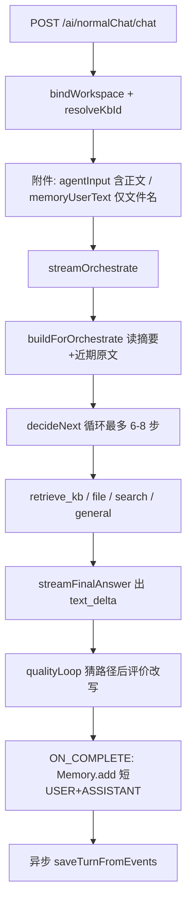

# 主聊天编排层：分阶段包级重构

## 原则（全程遵守）

- **行为冻结**：不改 URL、请求参数、NDJSON 事件形状、前端、`[schema.sql](my-chat-server/src/main/resources/schema.sql)`。
- **只搬家不改算法**：每个阶段结束必须 `mvn -pl my-chat-server test` 通过；Worker 的 ChatClient、`orch-`* conversationId、`WorkspaceContext` set/clear、检索 query 用原问，全部原样保留。
- **不过度设计**：不引入 Strategy 工厂、不拆三个 HTTP 入口、不把 Routing 与 Orchestrator Worker 强行合并。
- **风格对齐** `[service/knowledge/](my-chat-server/src/main/java/com/mychat/service/knowledge)`：小类、单职责、类/方法前一句注释；长方法内分步注释。
- **可回滚**：一阶段一 PR 心智；某阶段出问题只回滚该阶段。

`[ChatController](my-chat-server/src/main/java/com/mychat/controller/ChatController.java)` 保持薄入口，**不拆多 Controller**。前端仍是一个 `POST /ai/normalChat/chat?format=ndjson`。

---

## 冻结的数据流（重构时对照，禁止改语义）

必须保持不变的契约：

- **入口**：`prompt`、`chatId`、`files`、`format=ndjson`、可选 `kbId` / `qualityLoop` / `criteria`。图片双拒。`qualityLoop` 缺省 true，仅显式 `false` 关闭。
- **工作区**：Controller 按会话 `workDir`（无则默认根）写入 `WorkspaceContext`；请求 `doFinally` 再 `clear`。file/search Worker **内部仍** `set(root)` + `finally clear`（现状如此，本轮不「修好」它，以免改变线程池泄漏/继承行为）。
- **kbId**：请求参数优先，否则会话绑定；无 kbId 时 `retrieve_kb` 只记 `[约束]` 观察，不调检索。
- **两套用户文本**：`agentInput` = 文件正文 + 原问（进编排）；`memoryUserText` = 文件名列表 + 原问（进 `spring_ai_chat_memory`）。
- **编排**：首包 NDJSON `route=orchestrate`。Worker 用临时 `orch-kb-`* / `orch-file-*` / `orch-search-*`，**不**把会话 `chatId` 交给 `MessageChatMemoryAdvisor`。
- **ChatClient 分档**：kb → `ragChatClient`；file/search → `toolChatClient`；general / decideNext / 最终流式 → `agentWorkflowChatClient`。禁止 Tools+RAG 合并。
- **检索 query**：`kbSearchQuery` 只用用户原问，不用会话历史。
- **结束**：拼所有非空 `text_delta` 为 ASSISTANT 写入 Memory；`done` 后异步落 `chat_assistant_turns`。
- **Demo 旁路**：`POST /ai/agent/route|orchestrate|evaluate-optimize` 继续可用；Routing **不**并入主路。

质量环路径猜测、摘要热路径写库、Turn 的 `sleep(120)` —— **本轮不改行为**，只允许文件搬家。

---

## 目标包结构（相对 knowledge 模块：扁平 + 少数子包）

现在 `[service/agent/](my-chat-server/src/main/java/com/mychat/service/agent)` 7 个类挤在一起，Workflow 误放在 `[common/](my-chat-server/src/main/java/com/mychat/common)`（`common` 应只留协议/Result）。

目标（打开包名即知职责）：

- `[com.mychat.service.agent](my-chat-server/src/main/java/com/mychat/service/agent)` — 管道与编排循环（主路你从这里往下读）
  - `ChatOrchestrateStreamService` — NDJSON 管道：sink、驱动编排、质量环触发、落库
  - `AgentOrchestratorService` — 只保留 decideNext 循环、switch 分发、auto-finish
  - `OrchestrateListener` / `OrchestrateDialogueContextService`
  - `FinalAnswerComposer` — 弱答案判定、observation 合成、流式最终 prompt
  - `ChatUploadEnrichment` — 附件正文 / Memory 短 USER / 图片检测
  - `package-info.java` — 三行「怎么读」
- `com.mychat.service.agent.worker` — 按业务垂直：`KbWorker`、`FileWorker`、`SearchWorker`、`GeneralWorker`、`WorkerOutcome`、`WorkerPromptSupport`
- `com.mychat.service.agent.workflow` — 从 `common` 迁入：`OrchestratorWorkflow`、`RoutingWorkflow`、`EvaluatorOptimizerWorkflow`
- `com.mychat.service.agent.quality` — `AgentEvaluatorOptimizerService`
- `com.mychat.service.agent.demo` — `AgentRoutingService`、`AgentRouteDemoStreamService`（标明非主路）

**不动**：`controller/`、`service/chat/`、`service/knowledge/`、`tools/`、`config/AiConfiguration` 的三个 ChatClient Bean、`common/ChatStreamEvent`（协议，管道和 Demo 都用）、`utils/NdjsonStreamSupport`。

测试跟类走：`[AgentOrchestratorFinalAnswerTest](my-chat-server/src/test/java/com/mychat/service/agent/AgentOrchestratorFinalAnswerTest.java)` 拆到 Composer / WorkerPrompt 对应测试；`[OrchestratorWorkflowTest](my-chat-server/src/test/java/com/mychat/common/OrchestratorWorkflowTest.java)` 改包。

---

## 阶段 0 — 冻结说明与去误导（零行为）

**改什么**：javadoc / `package-info.java` 只。

- `[ChatController](my-chat-server/src/main/java/com/mychat/controller/ChatController.java)`、`[AgentOrchestratorService](my-chat-server/src/main/java/com/mychat/service/agent/AgentOrchestratorService.java)` 类注释改成「入口 → 管道 → 循环 → worker 包」。
- `[AgentRoutingService](my-chat-server/src/main/java/com/mychat/service/agent/AgentRoutingService.java)` 删掉「主聊天走 classify」——改为 **仅 Demo**。
- `[AgentDemoController](my-chat-server/src/main/java/com/mychat/controller/demo/AgentDemoController.java)` 去掉「与主聊天 agentMode=route 同构」里过时的主路暗示。

**验收**：diff 几乎只有注释；测试全绿。

---

## 阶段 1 — Workflow 迁包（纯移动）

**为什么先做**：`common` 里的三个类是 Agent 专用 prompt/结构化输出，不是通用基础设施。先迁包，后续拆类 import 稳定。

- 移动：`OrchestratorWorkflow`、`RoutingWorkflow`、`EvaluatorOptimizerWorkflow` → `service.agent.workflow`
- `ChatStreamEvent`、`Result` **留在** `common`
- `OrchestratorWorkflow` 仍由 `AgentOrchestratorService` **构造器 `new`**，不要改成 Spring Bean（避免接线变化）
- 更新生产代码与 `[OrchestratorWorkflowTest](my-chat-server/src/test/java/com/mychat/common/OrchestratorWorkflowTest.java)` 的 package/import

**验收**：全量单测；Demo `/ai/agent/`* 编译通过。逻辑行应无变化（理想是 git 显示 rename + import）。

---

## 阶段 2 — 抽出最终答复拼装（纯函数，有单测保护）

**为什么现在抽**：`[AgentOrchestratorFinalAnswerTest](my-chat-server/src/test/java/com/mychat/service/agent/AgentOrchestratorFinalAnswerTest.java)` 已覆盖弱答案、合成 Markdown、流式 prompt。这是风险最低的逻辑搬家。

从 `AgentOrchestratorService` 原样迁出到 `FinalAnswerComposer`：

- `resolveFinalAnswer` / `isWeakFinalAnswer` / `composeFinalAnswerFromSteps`
- `buildFinalAnswerStreamUserPrompt` / 材料截断 / `META_FINAL_MARKERS`
- `streamFinalAnswer` 仍留在编排器，内部改调 Composer（Flux 接线不动）

测试改为调用 Composer；断言字符串 **一字不改**。

**验收**：`AgentOrchestratorFinalAnswerTest` 中最终答复相关用例全绿；编排循环代码尚未动 Worker。

---

## 阶段 3 — 抽出附件 enrichment

从 `[ChatOrchestrateStreamService](my-chat-server/src/main/java/com/mychat/service/agent/ChatOrchestrateStreamService.java)` 迁出 `enrichPromptWithUploadedDocuments`、`buildMemoryUserText`、`containsImageFile` 及私有抽文本方法 → `ChatUploadEnrichment`（依赖现有 `[DocumentService.extractPlainText](my-chat-server/src/main/java/com/mychat/service/knowledge/DocumentService.java)`）。

`[ChatController](my-chat-server/src/main/java/com/mychat/controller/ChatController.java)` 改为注入 `ChatUploadEnrichment`；管道类不再出现 `MultipartFile`。截断 50_000 字、文件名列表格式、`formatFileSize` **保持字符串级一致**（否则 Memory 与气泡刷新会变）。

**验收**：无附件 / txt·md·pdf / 图片拒绝，三条路径手工或现有调用约定不变。

---

## 阶段 4 — 垂直拆 Worker（本轮核心，也是最高风险）

`AgentOrchestratorService.runWorker` 的 `switch` **留下**，四个分支改调 `@Service` Worker。共享文案进 `WorkerPromptSupport`（`buildWorkerUserMessage`、`truncateDialogueForWorker`、`kbSearchQuery`、`buildKbWorkerUserPrompt`），常量 `WORKER_DIALOGUE_HISTORY_MAX_CHARS` 跟过去。

每个 Worker 必须逐行对齐现状：

- **KbWorker**：`conversationId = orch-kb-` + UUID；`buildRagContext(kbId, query, KbScope.from(kbScope))`；`ragChatClient` + Memory advisor 只用临时 id；返回 `WorkerOutcome(content, citations)`。
- **FileWorker**：`orch-file-`*；`workDir` 空则 `workspaceUtil.getWorkspaceRoot()`；`WorkspaceContext.set` → `toolChatClient` + `[WorkspacePromptBuilder.build(root)](my-chat-server/src/main/java/com/mychat/utils/WorkspacePromptBuilder.java)` → `finally clear`。
- **SearchWorker**：`orch-search-`*；同样 set/clear；system 用 `SearchSystemPrompts.SEARCH`。
- **GeneralWorker**：`agentWorkflowChatClient`，现有 system 原文，无工具。

编排器继续负责：无 kbId 约束观察、`shouldAutoFinishAfterWorker`、listener、`truncateForHistory`。

测试：原 `buildWorkerUserMessage` / `kbSearchQuery` / `truncateDialogueForWorker` / `shouldAutoFinishAfterWorker` 改指向 `WorkerPromptSupport` 或仍留在编排器的门控方法。

**验收**：

- 单测全绿
- 手工：普通聊、知识库会话、工作区会话、附件、写盘后质量环（`qualityLoop=true` 默认）
- Demo `POST /ai/agent/orchestrate` 仍返回 `steps` + `finalAnswer`

**明确不做**：不把 `AgentRoutingService.handleKb/file/search` 改成调用新 Worker（Demo 行为可能有细微差别：kbScope、advisor）。阶段 5 只迁包。

---

## 阶段 5 — Demo 与质量环归位（仍是搬家）

- `AgentRoutingService`、`AgentRouteDemoStreamService` → `service.agent.demo`
- `AgentEvaluatorOptimizerService` → `service.agent.quality`（`[EvaluatorOptimizerWorkflow](my-chat-server/src/main/java/com/mychat/common/EvaluatorOptimizerWorkflow.java)` 已在阶段 1 进入 `workflow`）
- `[AgentDemoController](my-chat-server/src/main/java/com/mychat/controller/demo/AgentDemoController.java)` 只改 import，URL 不变
- 管道里质量环调用改 import，**不改** `WritePathExtractor` 启发式

**验收**：`/ai/agent/route` NDJSON、`/evaluate-optimize` JSON 与重构前一致。

---

## 每阶段自检清单

- 编译 + `my-chat-server` 单测
- 不改 `[schema.sql](my-chat-server/src/main/resources/schema.sql)`
- 不改前端 `streamChat.ts` / 事件类型
- 新类、新方法一行用途注释；搬过去的长方法保留原分步注释
- git 上优先看到 rename，而不是「删了重写」

---

## 明确排除（避免假装重构实则改产品）

- 三个 ChatClient 合并或拆 HTTP 入口
- 修好 `WorkspaceContext` 双层 set/clear、摘要热路径、Turn `sleep(120)`、质量环猜路径
- 主路挂 `ObservabilityStreamAdvisor`（会改变 NDJSON，前端时间线会变）
- 给 Workflow 补 Spring Bean / 接口层次

这些可以另开任务；本方案只解决「按包能找到业务、按文件能读懂一段代码」。