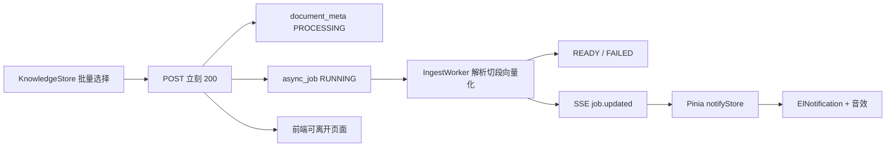

# 知识库批量异步入库

## 要不要先做「异步任务 + 消息通知」？

**要，但不要做成纯前端队列。** Dify / FastGPT / MaxKB 的共同模式是：**后端 Job 是事实源，前端只是订阅者**（通知铃 + 文档状态）。之后导出、长任务都可以挂同一套 `type`。

不要先写一套只活在 Pinia 里的任务系统：刷新/关页会丢，也无法在向量化失败时留下 `FAILED`。也不要在本阶段引入 Redis / RabbitMQ / Celery——单机 Spring Boot 用 **PostgreSQL 任务表 + `@Async`（已开虚拟线程）** 就是主流起步方案。

本次拆成两层，知识库只是第一个 `job_type`：

---

## 现状痛点

- `[FileController.uploadDocument](my-chat-server/src/main/java/com/mychat/controller/FileController.java)` 同步解析 + `VectorStore.add`，请求线程被 embedding 占满
- 前端 `[KnowledgeStore.vue](my-chat-vue3/src/views/knowledgeStore/KnowledgeStore.vue)` 单文件、`uploading` 锁死当前页；`[ragClient` timeout=25s](my-chat-vue3/src/types/enums.ts)
- `document_meta.status` 已有 `PROCESSING`，但上传成功才 insert，且写死 `READY`，PROCESSING 从未出现
- 文件只在内存流里解析，**没有落盘**，无法异步（请求结束后 InputStream 不可用）

---

## 1. 通用任务层（前置，薄）

### 库表（`[schema.sql](my-chat-server/src/main/resources/schema.sql)`）

新增 `async_job`：

- `id`, `job_type`（首个：`kb_ingest`）, `ref_id`（document_meta.id）, `status`（`PENDING/RUNNING/SUCCEEDED/FAILED`）, `title`, `error_message`, `created_at`, `updated_at`, `finished_at`
- 索引：`status`, `created_at DESC`

`document_meta` 增补：

- `error_message TEXT`（失败原因）
- `storage_path VARCHAR`（原始文件落盘路径，删除文档时一并删）
- 注释与代码统一为 `PROCESSING / READY / FAILED`（现在注释写 SUCCESS、代码写 READY）

### 后端

- 新包 `com.mychat.job`：`AsyncJob` PO / Mapper / `AsyncJobService` / `JobEventHub`
- `JobEventHub`：进程内 `SseEmitter` 列表；`emit(job)` 推 `job.updated` JSON
- `GET /ai/jobs/events`：SSE（`text/event-stream`）；`GET /ai/jobs/active`：刷新后补拉未完成任务
- `@EnableAsync` + 有界线程池（解析/embedding 并发 2～3，避免打爆阿里云 embedding）
- 启动时把卡在 `RUNNING/PROCESSING` 超过 N 分钟的任务标 `FAILED` 或重新入队（崩溃恢复，不做分布式锁）

### 前端（全局，不绑知识库页）

- `[src/stores/notify.ts](my-chat-vue3/src/stores/notify.ts)`：连接 SSE、维护进行中任务、`onComplete` 回调
- `[App.vue](my-chat-vue3/src/App.vue)` 挂载 `useNotifyStore().connect()`，路由切换不断线
- 完成/失败：`ElNotification`（非阻塞弹窗，符合 Element Plus 通知范式）+ 短音效
- 音效：首次点击上传时 `AudioContext.resume()` 解锁自动播放；用 Oscillator 短 ding（不提交版权音频）；需要 mp3 可再换 `assets`
- 新 API `[src/api/jobs.ts](my-chat-vue3/src/api/jobs.ts)`

这一层完成后，后续任意异步功能只需 `job_type` + worker，不必再做一套前端队列。

---

## 2. 知识库批量入库（接到任务层）

### API

放在知识库域，不塞进工作区 `[FileController](my-chat-server/src/main/java/com/mychat/controller/FileController.java)`：

- `POST /ai/knowledge-base/documents/upload`：`kbId` 必填 + `files` 多文件
- 校验：类型（现有 pdf/docx/xlsx/html/txt/md）、单文件大小、单次数量（建议 ≤20）
- **同步只做**：落盘到 `app.ingest.root`、insert `document_meta(PROCESSING)`、insert `async_job`、`@Async` 提交 worker
- 立刻返回文档列表（均为 PROCESSING），前端不等向量化
- 旧 `POST /ai/file/upload`：知识库页不再调用；可保留给无 kb 的临时向量化，或内部转调同一 worker（实现时二选一，优先转调以免两套逻辑）

### Worker 性能（市场常见 ingest pipeline）

复用 `[DocumentService.processDocument](my-chat-server/src/main/java/com/mychat/service/DocumentService.java)` 与 `[EmbeddingService](my-chat-server/src/main/java/com/mychat/service/EmbeddingService.java)`：

- 每文档：读盘 → 解析切段 → **分批** `vectorStore.add`（建议 16～32 段/批，对齐 embedding 供应商批量上限，而不是一次丢进 `max-document-batch-size: 10000`）
- 多文档：有界并发，禁止无限制并行
- 成功：`chunk_count` + `READY` + job `SUCCEEDED`
- 失败：`FAILED` + `error_message`，不留半截向量（失败时按已写入 segmentId 删除）
- 删除文档/知识库：现有级联 + 删 `storage_path` 文件

配置：`[application.yaml](my-chat-server/src/main/resources/application.yaml)` 增加 `app.ingest.root`、`max-file-size`、`max-files-per-request`、`embed-batch-size`、`ingest-parallelism`。

### 前端知识库页

- `[KnowledgeStore.vue](my-chat-vue3/src/views/knowledgeStore/KnowledgeStore.vue)`：`el-upload` 拖拽 + `multiple`，点上传后 `ElMessage`「已提交 N 个文档，可离开本页」
- 表格已有状态列：PROCESSING 用 `el-tag warning`；本页在处理中时轻量轮询 `documents`（2～3s）或听 SSE 刷新当前 kb——离开本页仍靠全局通知
- `[knowledge.ts](my-chat-vue3/src/api/knowledge.ts)`：`uploadBatch(files, kbId)` 替换单文件 `upload`

---

## 3. 明确不做（避免小众/过重）

- Redis / MQ / Spring Batch / JobRunr（单机够用后再说）
- 浏览器 `Notification` 系统权限弹窗（用 ElNotification 即可）
- 前端自己跑向量化或 WebWorker 解析
- 为通知单独做 WebSocket（SSE 足够；聊天已是 HTTP 流）

---

## 关键文件

后端：`schema.sql`、`KnowledgeBaseController`、新 `job/*`、`DocumentIngestService`（从 FileController 抽出）、`EmbeddingService` 分批、`AiConfiguration` 旁的 `AsyncConfig`、`application.yaml`

前端：`stores/notify.ts`、`App.vue`、`api/jobs.ts`、`api/knowledge.ts`、`KnowledgeStore.vue`