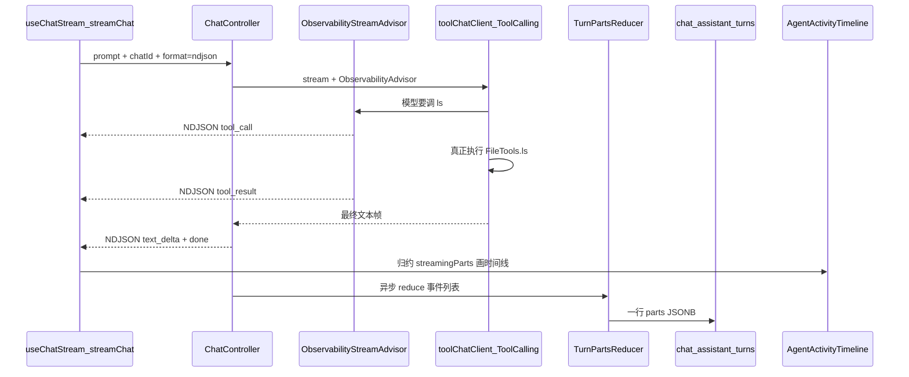

## 具体例子：用户说「列出工作区文件」

假设普通聊天（非 RAG），前端会请求 `POST /rag/ai/normalChat/chat?format=ndjson`。

### 执行路径（从请求到 UI）



1. **前端发流** — [`streamChat.ts`](my-chat-vue3/src/utils/streamChat.ts) 普通聊天固定 `?format=ndjson`，按行 `JSON.parse`，回调 `onEvent`。  
2. **入口** — [`ChatController`](my-chat-server/src/main/java/com/mychat/controller/ChatController.java) 建 `turnId`、`Sink`、累积列表，挂上 Advisor 后 `toolChatClient.stream()`。  
3. **工具旁路** — [`ObservabilityStreamAdvisor`](my-chat-server/src/main/java/com/mychat/utils/advisor/ObservabilityStreamAdvisor.java) 在工具循环内侧：看到模型要调工具 → 发 `tool_call`；下一轮请求里带工具结果 → 发 `tool_result`。**不改** Spring AI 的真实执行，只旁路给前端。  
4. **正文/思考** — Controller 的 `emitTextEvents`：无 toolCalls 的帧上发 `text_delta` / `thinking_delta`。  
5. **前端归约** — [`useChatStream.applyStreamEvent`](my-chat-vue3/src/composables/useChatStream.ts) 把事件收成 `streamingParts` + 正文；[`AgentActivityTimeline`](my-chat-vue3/src/components/AgentActivityTimeline.vue) 画工具行。  
6. **落库** — 流结束 `TurnPartsReducer.reduce` → [`ChatAssistantTurnService`](my-chat-server/src/main/java/com/mychat/service/ChatAssistantTurnService.java) 写入 `chat_assistant_turns`。  
7. **刷新** — `GET /ai/history/getMessages` 把 Memory 文本和表里的 `parts` 合成 `ChatMessageVO`，时间线可回放。

线上大致会看到这类 NDJSON（示意）：

```json
{"type":"tool_call","id":"call_1","name":"ls","args":{"path":"."}}
{"type":"tool_result","id":"call_1","ok":true,"preview":"目录: ..."}
{"type":"text_delta","text":"工作区根目录下有……"}
{"type":"done"}
```

### 重要类各干什么

| 类                              | 作用                                      |
| ------------------------------- | ----------------------------------------- |
| `ChatStreamEvent`               | 一行 NDJSON 的契约（协议层）              |
| `ChatStreamEventWriter`         | 事件 → 一行 JSON 字符串                   |
| `ObservabilityStreamAdvisor`    | 从工具循环里「偷看」并旁路 `tool_*`       |
| `ChatController`                | 编排 Sink、文本事件、异步落库             |
| `TurnPartsReducer`              | 多条流式事件 → 一轮最终态 `parts`（给库） |
| `ChatAssistantTurn` / Service   | 按 ASSISTANT 轮持久化 UI 轨迹             |
| `MessagePart` / `MessagePartVO` | 前端/后端同构的「片段」模型               |
| `useChatStream`                 | 浏览器侧事件归约（和 Reducer 对称）       |

注意：这里的「结构化」主要是 **可观测事件 / UI parts**，不是 Spring AI 的 `.entity()` 结构化输出（那是另一套，用在 Agent route 分类等场景）。

---

## `parts` 是什么？

**`parts` = 一条助手消息里、按顺序排列的「可展示片段」列表**（学 OpenCode / Cursor：消息不是一整坨纯文本，而是有结构的块）。

在本项目里（见 [`streamEvents.ts`](my-chat-vue3/src/types/AiModule/streamEvents.ts)）：

```ts
MessagePart =
  | { type: 'thinking'; text }
  | { type: 'text'; text }
  | { type: 'tool'; id, name, args, status, resultPreview, ... }
```

| 层面     | 含义                                                         |
| -------- | ------------------------------------------------------------ |
| **概念** | 时间线/回放的数据模型：工具一步、一段思考、一段正文各是一个 part |
| **实时** | `streamingParts`：边收 `tool_call`/`tool_result` 边更新      |
| **落库** | `chat_assistant_turns.parts`（JSONB）：本轮最终工具轨迹（当前 Reducer **主要存 tool**；thinking/text 另有列或气泡正文） |
| **展示** | `AgentActivityTimeline` 目前主要画 `type === 'tool'` 的 part |

和 **事件** 的关系：

- **事件（NDJSON）**：传输用，细粒度、可增量（很多条 `*_delta`）。  
- **parts**：产品/UI 用，把事件**归约**成「这一轮助手消息长什么样」。

所以 `TurnPartsReducer` 的名字就是：**把本轮流式事件 reduce 成可持久化的 parts（+ thinking/正文摘要）**。