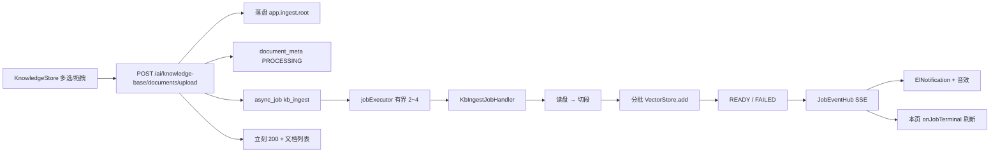

# P1-1 知识库批量异步入库

> **状态**：已落地（2026-08-23）  
> **目标**：多文档上传立刻返回；后台解析切段 + 分批 embedding；用户可离开页面；完成后已有的 ElNotification + 音效提醒。  
> **原则**：对标 Dify / FastGPT / MaxKB 的「文档级 Job + 列表状态 + 全局通知」。不新造队列，不引入 Redis/MQ。

前置文档：[`P2-11-异步任务+消息通知.md`](./P2-11-异步任务+消息通知.md)、[`知识库模式升级.md`](../正式迭代前待做/知识库模式升级.md)。  
P2-11 第六节已给出接入模板；本文是按**当前仓库**写的可执行切法。

---

## 一、一句话定位

HTTP 线程只做「校验 + 落盘 + 插 `document_meta(PROCESSING)` + `AsyncJobService.submit("kb_ingest")`」；  
向量化全部进已有 `jobExecutor`（core=2 / max=4）。前端继续挂 `App.vue` 的 `notifyStore`，知识库页只订阅终态刷新列表。



---

## 二、现状（相对升级文档，哪些已经不用再做）

| 升级文档原计划 | 现状 |
|----------------|------|
| `async_job` 表、`JobEventHub`、SSE、`StaleJobRecovery` | 已落地，见 `schema.sql` / `com.mychat.job` |
| Pinia `notifyStore` + `App.vue` + 音效 | 已落地；`onJobTerminal` **尚无调用方** |
| `kb_ingest` Handler | **没有**；未知 `job_type` 会立刻 FAILED |
| 批量上传 API / 落盘 / PROCESSING 真值 | **没有** |

仍卡在同步路径：

- [`FileController.uploadDocument`](../../my-chat-server/src/main/java/com/mychat/controller/FileController.java) 在请求线程里 `processDocument` + `vectorStore.add`，成功才 insert，且写死 `READY`
- [`KnowledgeStore.vue`](../../my-chat-vue3/src/views/knowledgeStore/KnowledgeStore.vue) 隐藏 `<input type="file">` **单选**，`uploading` 锁按钮；[`knowledgeApi.upload`](../../my-chat-vue3/src/api/knowledge.ts) 打 `/ai/file/upload`
- `ragClient` timeout=**25s**（[`enums.ts`](../../my-chat-vue3/src/types/enums.ts)），embedding 经常超时；本阶段 HTTP 必须秒回
- [`document_meta`](../../my-chat-server/src/main/resources/schema.sql) 无 `storage_path` / `error_message`；注释写 `SUCCESS`，实体写 `READY`
- [`DocumentService.processDocument`](../../my-chat-server/src/main/java/com/mychat/service/knowledge/DocumentService.java) **内部 new UUID**，与先插再跑的 Job 对不上
- [`EmbeddingService.storeSegments`](../../my-chat-server/src/main/java/com/mychat/service/knowledge/EmbeddingService.java) 一次 `add` 全量，对齐的是 `max-document-batch-size: 10000`，会打爆阿里云 embedding
- 删文档 / 删库 **不删磁盘文件**（现在本来没落盘）

市场对齐（不要自造）：

| 产品 | 可抄的点 | 本仓库对应 |
|------|----------|------------|
| Dify | 文档级任务；列表 PROCESSING；离开页面靠通知 | 一文件一 `kb_ingest`；表格状态列；已有 SSE |
| FastGPT | 上传先落库再向量化；失败可看原因 | `document_meta` 先 PROCESSING；`error_message` |
| MaxKB / 多数 RAG | 切段后 **按供应商 batch 上限** 调 embedding，而不是一次万段 | `embed-batch-size: 16~32` |
| 单机起步 | PG 任务表 + 有界线程池，不上 MQ | P2-11 已定，本阶段不改栈 |

---

## 三、数据模型（`schema.sql`）

`async_job` **不动**。只补 `document_meta`（新建库走 CREATE；已有库必须 ALTER，否则 `CREATE IF NOT EXISTS` 不会加列）：

```sql
ALTER TABLE document_meta ADD COLUMN IF NOT EXISTS storage_path VARCHAR(1000);
ALTER TABLE document_meta ADD COLUMN IF NOT EXISTS error_message TEXT;

COMMENT ON COLUMN document_meta.status IS '处理状态（PROCESSING / READY / FAILED）';
COMMENT ON COLUMN document_meta.storage_path IS '原始文件落盘路径，删文档时一并删';
COMMENT ON COLUMN document_meta.error_message IS '入库失败原因（用户可见）';
```

同步改 [`DocumentMeta`](../../my-chat-server/src/main/java/com/mychat/entity/po/DocumentMeta.java) 与前端 [`DocumentMeta`](../../my-chat-vue3/src/types/knowledgeStore/types.ts)（`errorMessage?`、`storagePath` 不必给前端）。

状态约定（全程统一 `READY`，不要再写 SUCCESS）：

| `document_meta.status` | 何时 |
|------------------------|------|
| `PROCESSING` | HTTP 落盘并 insert 的瞬间 |
| `READY` | Handler 全部分批 embedding 成功 |
| `FAILED` | 解析/向量化失败，或启动回收把对应 job 标失败 |

---

## 四、后端切法

包已按域拆好：实现放 `com.mychat.service.knowledge`，Handler 放 `com.mychat.job`（和 Dispatcher 同包，不要再建 `service.job`）。

### 4.1 配置（`application.yaml`）

```yaml
app:
  ingest:
    root: ./src/main/resources/ingest          # 与 workspace 分开，避免 Agent 工具摸到原文
    max-file-size-mb: 50                       # 知识库单文件；工作区导入仍用 servlet 200MB
    max-files-per-request: 20
    embed-batch-size: 32                       # 对齐 DashScope/OpenAI 兼容批量，勿用 10000
    allowed-extensions: pdf,docx,xlsx,html,htm,txt,md
```

`jobExecutor` 已是 2/4/队列 100，**本阶段不改池大小**。并发上限 = 池本身；禁止在 Handler 里再开无界并行。

### 4.2 同步 API（知识库域，不塞工作区 FileController）

`POST /ai/knowledge-base/documents/upload`  
`Content-Type: multipart/form-data`  
参数：`kbId`（必填）+ `files`（多文件）

同步只做：

1. kb 存在；数量 ≤ `max-files-per-request`；扩展名白名单；单文件 ≤ `max-file-size-mb`；拒绝空文件  
2. 每文件：`docId = UUID`，落到 `{ingest.root}/{kbId}/{docId}/{safeFilename}`  
3. insert `document_meta(id=docId, status=PROCESSING, chunk_count=0)`  
4. `asyncJobService.submit("kb_ingest", "向量化：" + filename, docId, payloadJson)`  
   payload 建议：`{"kbId","documentId","storagePath","filename"}`  
5. 全部 submit 后返回 `Result<List<DocumentMeta>>`（都是 PROCESSING）

**不要**在这个方法里调 `processDocument` / `vectorStore.add`。  
`ragClient` 25s 对「落盘+插行」通常够；本接口单独把 axios timeout 提到 **60s**（防 20 个大文件拷盘），不要改全局 25s。

旧 `POST /ai/file/upload`：知识库页不再调用。实现时 **抽一层 `DocumentIngestService.accept(...)`**，FileController 带 `kbId` 时转调同一方法（避免两套入库）。无 `kbId` 的临时向量化本阶段不扩展，可 `400` 提示必须绑知识库。

删文档仍走现有 `POST /ai/file/delete`（或一并迁到 knowledge-base，二选一、优先保持路径少改）：补上删 `storage_path` 文件。`KnowledgeBaseServiceImpl.deleteKb` 同样扫 `storage_path`。

### 4.3 Handler + 入库编排

```
com.mychat.job.KbIngestJobHandler          // type() = "kb_ingest"
com.mychat.service.knowledge.DocumentIngestService
```

`KbIngestJobHandler.execute`：解析 payload → `documentIngestService.ingest(documentId)`；失败抛异常（Dispatcher 写 job FAILED）。

`ingest` 步骤（主流 ingest pipeline）：

1. 读 `document_meta` + `storage_path`；文件不在则失败  
2. **必须用已有 `documentId` 切段**（改 `DocumentService.processDocument` 增加重载，禁止 Handler 再 new UUID，否则 `EmbeddingService.buildSegmentIds` 删不干净）  
3. `storeSegmentsBatched(segments, embed-batch-size)`：循环 `subList` + `vectorStore.add`  
4. 成功：`chunk_count`、`status=READY`、清空 `error_message`  
5. 失败：按**已写入批次数 × batchSize** 调 `deleteByDocumentId` 清半截向量；`status=FAILED` + `error_message`（截断到合理长度）；再抛给 Dispatcher

`DocumentService` 解析逻辑不动（pdf/docx/xlsx/html/txt/md + `TokenTextSplitter`），只补「指定 documentId」。

### 4.4 崩溃恢复（补 P2-11 缺口）

[`StaleJobRecovery`](../../my-chat-server/src/main/java/com/mychat/job/StaleJobRecovery.java) 现在只改 `async_job`。卡死的 `kb_ingest` 会留下永远 PROCESSING 的文档。

本阶段最小补法：`failStaleJobs` 之后，把 `job_type=kb_ingest` 且 job 已 FAILED、对应 meta 仍为 PROCESSING 的行标 `FAILED`，`error_message=任务超时或进程中断`。不要自动重跑（避免重复 embedding）。

### 4.5 性能（配套，不是后期再想）

| 手段 | 为什么是主流 |
|------|----------------|
| 一文件一 Job | 失败隔离；池自然限流；Dify 同模型 |
| 有界池 2～4 | 保护阿里云 embedding QPS，不和 Tomcat 虚拟线程抢 |
| 16～32 段/批 | 兼容 OpenAI-compatible embedding batch，避免单请求过大 |
| 先落盘再异步 | 请求结束后 InputStream 不可用；也是断点/排错前提 |
| 失败删已写 segment | 向量库没有事务，必须应用层补偿 |
| ingest 目录与 workspace 分离 | Agent FileTools 不该扫用户原文 |

明确不做：Spring Batch、Tika 全家桶替换现有解析、前端 WebWorker 切段、文档进度条 0–100（P2-11 已声明无进度字段）。

---

## 五、前端切法

通知管道 **不重做**。本页只接业务。

### 5.1 API

[`knowledge.ts`](../../my-chat-vue3/src/api/knowledge.ts)：`uploadBatch(files, kbId)` → `POST /ai/knowledge-base/documents/upload`，`timeout: 60_000`。删除单文件 `upload`。

### 5.2 知识库页

[`KnowledgeStore.vue`](../../my-chat-vue3/src/views/knowledgeStore/KnowledgeStore.vue)：

- 用 `el-upload`：`drag` + `multiple` + `auto-upload=false` + `accept` 对齐白名单；点「开始入库」一次提交全部  
- 提交前 `notifyStore.unlockSound()`（手势解锁，音效才响）  
- 成功：`ElMessage.success('已提交 N 个文档，可离开本页')`，用返回列表合并进表格（PROCESSING / warning tag 已有）  
- **不要** `uploading` 锁到向量化结束；按钮只在「正在提交 HTTP」时 loading  
- `onMounted`：`notifyStore.onJobTerminal`，`jobType==='kb_ingest'` 则 `fetchDocList()`；`onUnmounted` 取消订阅  
- 本页有 PROCESSING 时 3s 轻量轮询 `documents`（SSE 丢包/漏弹窗的补偿）；离开本页停轮询，完成仍靠全局通知  
- 表格 FAILED：tag danger，可用 `el-tooltip` 显示 `errorMessage`

批量完成会连响多次：`notifyStore` 对 `kb_ingest` **1.5s 合并**一条「已完成 n 个 / 失败 m 个」（音效仍按 P2-11 响一轮即可）。不要改成系统 `Notification`。

### 5.3 用户路径（验收）

1. 选知识库 → 拖 3 个 pdf → 提交 → 立刻看到 3 行 PROCESSING  
2. 切到大厅/聊天，任务继续  
3. 完成后任意页弹出 ElNotification + 门铃三连  
4. 回到知识库，状态 READY、分片数 > 0  
5. 故意传空/超限/坏文件：HTTP 4xx 或该行 FAILED，不堵页

---

## 六、实现顺序（建议 4 步，可连续提交）

1. **表 + 配置 + PO**：`schema.sql` ALTER、`DocumentMeta`、`app.ingest.*`  
2. **入库内核**：`DocumentService` 指定 id、`EmbeddingService` 分批、`DocumentIngestService`、`KbIngestJobHandler`、Stale 连带 meta  
3. **API**：`KnowledgeBaseController` 批量上传；FileController 转调；删除清磁盘  
4. **前端**：`uploadBatch`、`el-upload`、解锁音效、`onJobTerminal`、kb_ingest 通知合并  

单测优先：`DocumentService` 指定 id 后 segmentId 可复现；`EmbeddingService` 分批次数；Handler 失败会清向量（mock VectorStore）。不强制起真实 embedding。

---

## 七、明确不做

- Redis / RabbitMQ / JobRunr / Spring Batch  
- 浏览器系统通知权限弹窗  
- 前端解析/向量化  
- 为入库新开 WebSocket  
- 任务中心完整 UI、取消、重试按钮（失败可下一阶段再「重新入库」）  
- 多用户鉴权  

---

## 八、关键文件

**改**

- 后端：`schema.sql`、`application.yaml`、`DocumentMeta`、`DocumentService`、`EmbeddingService`、`KnowledgeBaseServiceImpl`、`KnowledgeBaseController`、`FileController`、`StaleJobRecovery`（或 `AsyncJobService.failStaleJobs`）  
- 前端：`api/knowledge.ts`、`types/knowledgeStore/types.ts`、`KnowledgeStore.vue`、`stores/notify.ts`（仅合并 kb_ingest 通知）

**新增**

- `my-chat-server/.../job/KbIngestJobHandler.java`  
- `my-chat-server/.../service/knowledge/DocumentIngestService.java`  
- 可选：`entity/dto` 上传结果 VO（也可用现有 `DocumentMeta` 列表）

**不改**

- `JobController` / SSE / `App.vue` 挂载方式  
- Orchestrator / RAG 查询路径（`kbId` 过滤照旧；PROCESSING 文档尚未入向量，问到也检索不到，符合预期）
