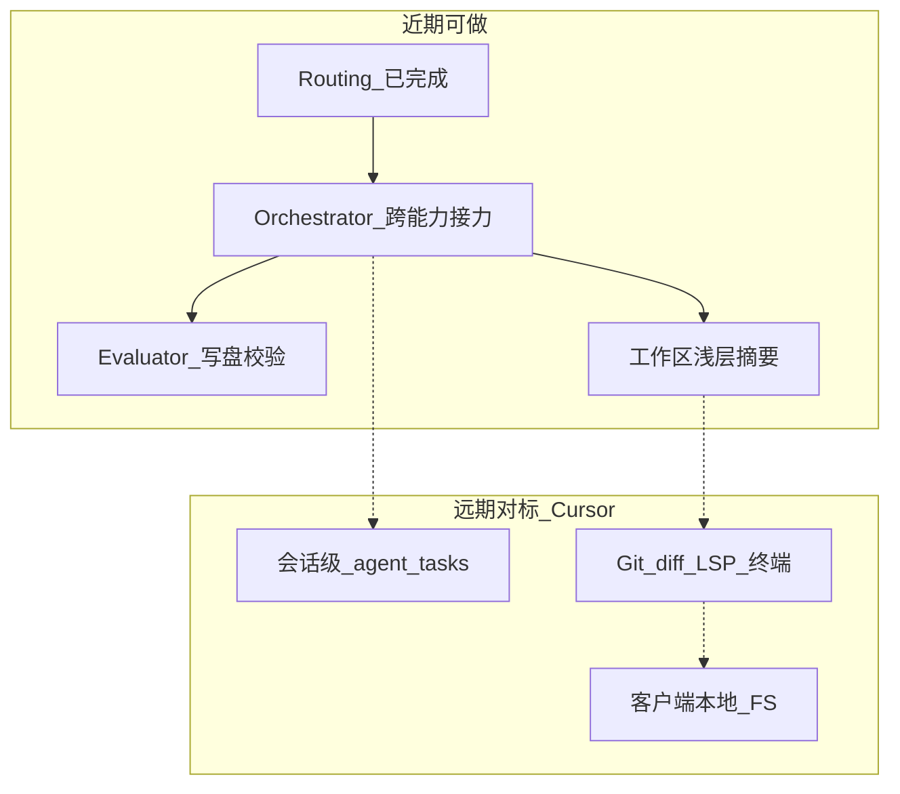

# My-Chat Agents 开发规划（v1.1）

> **版本**：v1.1（相对 [v1.0](./P2-10-agents开发规划（v1.0）.md)）  
> **更新要点**：固化「Routing 已接入主聊天」后的现状；明确 **近期可做** 与 **远期对标 Cursor** 两档目标，避免把 IDE 级能力与回合内编排混为一谈。  
> **参考**：  
> - [Spring AI — Building Effective Agents](https://docs.spring.io/spring-ai/reference/api/effective-agents.html)  
> - [P0-7 工具与知识库注意力隔离](./P0-7-工具调用和向量知识库竞争模型注意力解决方案.md)  
> - [P1-AI 工作区上下文技术分析](./P1-AI工作区上下文-技术分析.md)  
> - [P2-9 MCP 协议规划](./P2-9-mcp协议规划.md)  
> - 项目速查：[AGENTS.md](../../AGENTS.md)

---

## 一、一句话定位

做 Agents **不是**再堆一堆 `ChatClient`，而是：

| 层 | 含义 | My-Chat 对应 |
|----|------|--------------|
| **ChatClient** | 能力配置档（工具 / RAG / 记忆 / system） | `toolChatClient` / `ragChatClient` / `agentWorkflowChatClient` |
| **Workflow** | Java 编排（谁决定下一步 = 代码） | Routing 已落地；Orchestrator 为近期重点 |
| **内层 Tool-calling** | 单次 Client 请求内模型选工具 | `FileTools` / MCP（仅 tool 路径） |
| **外层 Agent 循环** | 计划 → 行动 → 观察 → 再决策（可换能力） | **未做**（对标 Cursor 核心语义的近期目标） |

业界对「分类专用 Client + switch 分发」的常见称呼：**Routing Workflow** / **LLM Router（Classifier + Dispatcher）** / **Triage → Specialist**。属于主流企业做法；Cursor 更接近 **Autonomous Agent + 本地 IDE 执行面**。

---

## 二、v1.1 现状快照（相对 v1.0）

### 2.1 已完成

| 能力 | 说明 | 关键路径 |
|------|------|----------|
| 三档 ChatClient | 工具+MCP / 纯 RAG / 无工具编排 | `AiConfiguration` |
| **Routing 接入主聊天** | 每轮 `classify` → 分发 `file` / `kb` / `search` / `general` | `ChatController` + `AgentRoutingService` |
| 会话约束 | `kbId` / `workDir` 进分类；无 kb 时禁止 `kb` | `RoutingWorkflow` + `applyConstraints` |
| NDJSON `route` / `step` 事件 | 时间线展示分流与编排步骤；`parts` 落库可回放 | `ChatStreamEvent` / `AgentActivityTimeline` |
| **Orchestrator 接入主聊天** | 主路默认多步编排（可显式 `agentMode=route` 回退） | `ChatController` + `AgentOrchestratorService` |
| **Evaluator 质量环** | 主路默认开启；可解析 write 路径时执行（可显式 `qualityLoop=false`） | `ChatController` + `AgentEvaluatorOptimizerService` |
| 工作区浅层摘要 | file 路径 system 注入 depth≤2 骨架 | `WorkspacePromptBuilder` |
| 前端统一入口 | `/rag/ai/normalChat/chat?format=ndjson`（默认 orchestrate + qualityLoop） | `streamChat.ts` |
| 调试 API 保留 | `POST /ai/agent/route`、`/orchestrate`、`/evaluate-optimize` | `AgentDemoController` |

### 2.2 当前行为边界（务必认清）

```text
主路默认：用户一句 → Orchestrator 多步换 Worker（可跨 Client）→ 可解析 write 时 qualityLoop → 结束
调试回退：agentMode=route → classify（一次）→ 单 Client；qualityLoop=false 关闭质量环
```

- **已实现**：主聊天默认 Orchestrator + 写盘质量环；`file` Worker 含浅层摘要；调试 API 旁路保留。  
- **未实现**：会话级 plan/todo 状态机；可暂停续跑的长任务（见远期 `agent_tasks`）。

#### 2.2.1 聊天附件与 Agent（文本进编排；图片暂不支持）

> **现状（已调整）**：聊天上传仅支持 **txt / md / pdf**。服务端抽文本后拼入本轮用户目标，与无附件相同进入 **Orchestrator**（或显式 `agentMode=route` 的 Routing），**不再**因有 `files` 旁路到独立多模态路径。  
> **图片**：前后端双拒（前端 `accept`/校验拦截；后端遇 `image/*` 返回 400），看图能力后续另开迭代（需 file Worker 支持 multimodal `media`）。

**Memory / 气泡**：附件**正文仅注入本轮** Agent 输入（Orchestrator `input` 或 Routing 本轮 `system` 附录）；`spring_ai_chat_memory` 与刷新后气泡只保留**文件名列表 + 用户原问**，避免把 PDF/长文铺进历史。

**注意**：聊天附件是提示上下文，不会自动 `write` 进工作区；PDF 扫描件无文字层时抽取结果可能为空（不做 OCR）。多轮追问若不重新上传，模型可能不再看见附件正文（与 Memory 不存全文一致）。

#### 2.2.2 已知局限：联网搜索（Smithery / Exa）外部失败

> **现象**：主聊天默认 Orchestrator 常走 `search` Worker；模型通过 MCP `execute` → `connections.exa.search(...)` 时，可能收到 **Cloudflare 403**（拦截 `mcp.exa.ai`），表现为「联网工具不可用」。  
> **与合并的关系**：合并前单次 Routing 未必每次都调 search；默认多步编排后 kb→search 更频繁，**同一外部故障更容易暴露**。MCP 客户端装配本身仍正常（`get_toolbox_status` 可显示 exa connected）。

**代码侧缓解**：

1. search system 禁止臆造 `connections.search`；MCP 403 时改用本地工具。  
2. `ToolExecutionExceptionProcessor(alwaysThrow=false)`：工具失败回灌模型，避免整次 Worker 被打断。  
3. **本地 `WebSearchTools.searchWeb`**：Exa REST → Bocha → Tavily → DuckDuckGo（短超时）——**不经** `mcp.exa.ai`。

**密钥易错点（已踩坑）**：

| 环境变量 | 用途 | 常见错误 |
|----------|------|----------|
| `EXA_API_KEY` | `api.exa.ai` REST | 误填 `SMITHERY_API_KEY` → **HTTP 401 Invalid API key** |
| `SMITHERY_API_KEY` | MCP `mcp.smithery.run` | 不能用于 Exa REST；且 MCP 分发到 `mcp.exa.ai` 可能 Cloudflare 403 |
| `BOCHA_API_KEY` / `TAVILY_API_KEY` | 国内/备用搜索 | 可选；DuckDuckGo 在国内常 connect timeout |

**后人排查顺序**：看 `searchWeb` 返回是否含 `401 Invalid API key`（换真正的 Exa Dashboard 密钥并**重启进程**）；或配置 Bocha/Tavily；MCP Cloudflare 403 属上游，不能靠改 Orchestrator 解决。

#### 2.2.3 最终答复进 Memory（勿把干货只留在时间线）

> **现象**：kb→search 等多步编排后，主气泡 / `spring_ai_chat_memory` 只有一句「向用户完整作答…」提纲，定义与案例代码却在时间线 `step` 的 observation 里。  
> **约定**：`finish.instruction` 必须是**面向用户的完整 Markdown 答复**（默认 Markdown，用户另有格式要求除外），须汇总各步 observation；禁止元指令/提纲。  
> **兜底**：`AgentOrchestratorService.resolveFinalAnswer` 若判定 finish 文案过弱，按步骤 observation 合成 Markdown 再写入 `text_delta` / Memory；编排历史 observation 预算大于 UI 预览截断。

### 2.3 关键代码位置（v1.1）

| 角色 | 路径 |
|------|------|
| ChatClient 装配 | `my-chat-server/.../config/AiConfiguration.java` |
| 主聊天 + Routing 分发 | `my-chat-server/.../controller/ChatController.java` |
| 分类与同步调试编排 | `my-chat-server/.../service/AgentRoutingService.java` |
| 分类器 Structured Output | `my-chat-server/.../common/RoutingWorkflow.java` |
| 流式事件协议 | `my-chat-server/.../common/ChatStreamEvent.java` |
| 调试入口 | `my-chat-server/.../controller/AgentDemoController.java` |
| 前端流式 / 时间线 | `my-chat-vue3/src/utils/streamChat.ts`、`AgentActivityTimeline.vue` |

---

## 三、复杂度总览：不要一上来追平 Cursor

| 目标档 | 含义 | 体感 | 建议 |
|--------|------|------|------|
| **A. 回合内 Orchestrator** | 外层循环跨 kb/file/search | 中（约 2～4 周） | **近期主攻** |
| **B. 会话级任务状态** | DB 存 plan、可暂停续跑 | 中高（+2～3 周） | 有刚需再做 |
| **C. 工作区更像 IDE** | 目录摘要、diff、写后校验（仍服务端 FS） | 高 | 与 A 穿插低成本项 |
| **D. 真·本地客户端 Agent** | 浏览器/桌面本地 FS、LSP、终端 | 很高（架构级） | **远期对标** |

完整追平 Cursor（D + 全套 IDE 产品面）与当前「服务端工作区 + HTTP 流式聊天」**不完全同构**。市场「Agent 产品感」约八成来自 **A + C 的一部分**，不必先搬客户端。



---

## 四、近期可做（Near-term）

> 原则：继续 **Workflow（代码定路径）**；复用现有三个 ChatClient；**禁止**把 Tools 与 `QuestionAnswerAdvisor` 塞进同一个 Client（遵守 P0-7）。  
> 主聊天默认保持「单次 Routing」；Agent 多步循环先走调试 API，稳定后再用开关接入主聊天。

### 4.1 第一优先级：回合内 Orchestrator-Workers

**要解决的缺口**：分类到 kb 后，任务进行中需要联网/改文件时，应能 **换 Worker（换 Client）**，而不是锁死 `ragChatClient`。

**做法**：

1. 新增 `OrchestratorWorkflow` + `AgentOrchestratorService`（建议包：`com.mychat.agent` 或与现有 `service` 并列）。  
2. 编排 LLM（使用无工具的 `agentWorkflowChatClient`）每步产出 Structured Output，例如：  
   - `next_action`: `retrieve_kb` | `file` | `search` | `general` | `finish`  
   - `instruction`: 给 Worker 的子任务描述  
   - `reasoning`: 简短理由  
3. Java `switch` 调用现有 specialist（与 Routing 同源能力档）。  
4. 将 Worker 观察结果（检索摘要 / 工具结果摘要）回灌编排器，直到 `finish` 或 `maxSteps`（建议默认 **5～8**）。  
5. 调试入口：`POST /ai/agent/orchestrate`（扩展 `AgentDemoController`），返回步骤列表 + 最终答案。  
6. 协议：NDJSON 增加 `step`（或同一回合多次 `route`），前端时间线展示换手。

**验收用例（至少一条跨能力路径）**：

- 「根据知识库总结 X，并搜索补充最新信息」→ 日志可见 `retrieve_kb` 与 `search` 两步、两个不同 Client，无报错。  
- 或：「根据知识库写出结论并写入工作区某文件」→ `retrieve_kb` → `file`（`write`）。

**本切片不做**：修改 `schema.sql`；客户端本地 FS；主聊天默认强制 Orchestrator。

### 4.2 第二优先级：Evaluator-Optimizer 写盘校验（任务内质量环）

场景：`write` → 读回 / 简单规则检查 → 不合格再改（**任务内质量环**，不是离线 Agent 评测）。

- 与 4.1 共用迭代上限、超时、取消思路；调试入口：`POST /ai/agent/evaluate-optimize`。  
- 前端工具时间线已具备；本切片先走同步调试 API，主聊天接入另开。

**测试提醒（未来务必补测，本次暂忽略）**：

强模型在常规 `criteria` / `mustContain` 下常一次性满足所有要求，难以自然触发结果纠正机制：

1. **多轮 refine**（`rounds.length >= 2`、非空 `feedback` 后覆盖重写）；  
2. **触顶路径**（`finishedReason=max_iterations`）。

本次验收以「写盘 → 读回 → 评价 → 通过」主路径为准，上述两条 **暂时忽略**，但后续迭代或回归时需专门构造用例（推荐：`mustContain` 隐藏标记串，或调试开关强制首轮失败），**勿仅依赖提示词让模型故意写砸**。

### 4.3 第三优先级：工作区浅层上下文预注入（低成本体感）

对齐 P1 文档「差距 1」：

- 在 `buildWorkspaceSystemPrompt`（或抽取 `WorkspacePromptBuilder`）注入浅层目录摘要（如 depth≤2、行数上限）。  
- 可选：按 `lastModifiedTime` 列出最近修改文件。  
- **近期不做**：`WatchService` 全量监听、完整 git 集成。

### 4.4 近期风险清单（贯穿）

| 风险 | 措施 |
|------|------|
| 无限循环 | `maxSteps` + 超时 |
| 工具越权写盘 | 继续 `WorkspaceUtil.resolveSafe()` |
| 检索与工具抢注意力 | Worker 级隔离，不合并进单一 Client |
| 成本/延迟上升 | 主聊天默认 Routing；Orchestrator 显式模式或启发式开启 |
| MCP 不可用 | 保持 ObjectProvider 软依赖 |

### 4.5 近期交付检查清单

- [x] `OrchestratorWorkflow` + Service，Structured Output `next_action`  
- [x] Workers 复用 rag / tool / general；至少一条 kb→search 或 kb→file  
- [x] `/ai/agent/orchestrate` 可 curl 验收，步骤可回传  
- [x] 步骤事件可进入时间线（主聊天 `agentMode=orchestrate` + NDJSON `step`）  
- [x] 循环上限 / 取消路径验证（`maxSteps` 钳制；流取消走现有 completeSink）  
- [x] file 路径 system prompt 注入目录摘要（`WorkspacePromptBuilder`）  
- [x] Evaluator-Optimizer 主聊天门控（`qualityLoop`）  

---

## 五、远期对标 Cursor 的主要目标（Long-term）

> 以下能力用于 **对标产品形态**，不是下一迭代必做项。实施前应单独开规划/评估部署模式。

### 5.1 会话级 Agent 任务（跨多轮）

| 目标 | 说明 |
|------|------|
| 任务持久化 | `schema.sql` 增加如 `agent_tasks` / `agent_task_steps`（`plan` jsonb、`status`、`conversation_id`） |
| 与现有表分工 | `chat_assistant_turns.parts` = UI 轨迹；`agent_tasks` = 可恢复状态机 |
| 体验 | 暂停、续跑、失败重试；跨天长任务 |

### 5.2 工作区「像 IDE」（仍可为服务端 FS）

| 目标 | Cursor 侧参照 | 说明 |
|------|---------------|------|
| 变更感知 | Git diff / 打开文件 | `git diff`、`git log` 工具或变更列表注入 |
| 写后诊断环 | LSP / lint | 写入后跑 eslint 等，结果回灌 Agent |
| 进度与截断 UX | 长工具进度条 | 工具超 2s 推中间状态；截断可展开查看 |
| 工作目录历史 | 最近项目 | DB 或 localStorage 最近 workDir |

详见 [P1-AI工作区上下文-技术分析](./P1-AI工作区上下文-技术分析.md) 第五节差距表。

### 5.3 真·本地执行面（架构级）

| 目标 | 说明 |
|------|------|
| 客户端本地文件系统 | 浏览器 File System Access / 桌面壳；与当前「选服务端目录」模型不同 |
| 内置终端 / Shell | 超出纯 Java NIO `FileTools` 的命令执行边界与安全模型 |
| 多文件 diff 确认 UI | 变更预览、按文件接受/拒绝 |
| 与 Routing 的关系 | **不建议**改为「单一超大 Agent 同时挂满工具+RAG」；远期仍宜 Orchestrator + 隔离 Worker |

### 5.4 远期明确不做或慎做

- 为每个 route 无限新建 ChatClient Bean（能力档保持少量即可）。  
- 用「一个 Client + 全工具 + QA Advisor」换取表面智能（回退 P0-7）。  
- 在未解决安全与取消机制前开放无上限自治循环。

---

## 六、推荐节奏（汇总）

```text
【已完成 · v1.1 基线】
  Routing Workflow → 主聊天 NDJSON + 时间线 route

【近期 · 下一迭代主线】
  Orchestrator-Workers（跨能力接力）
    → Evaluator-Optimizer（写盘校验）
    → 工作区浅层摘要（低成本）

【中期 · 有产品刚需再开】
  schema.sql 会话级 agent_tasks
  git/变更感知、更强可观测进度

【远期 · 对标 Cursor 产品面】
  客户端本地 FS / LSP / 终端 / diff 确认 UI
```

### 第一个可交付切片（建议 1～2 周内完成）

1. `OrchestratorWorkflow` + `AgentOrchestratorService`  
2. `POST /ai/agent/orchestrate`  
3. 至少一条跨能力路径验收  
4. **不改** `schema.sql`  
5. 通过后再评估是否以开关形式挂入主聊天 NDJSON  
