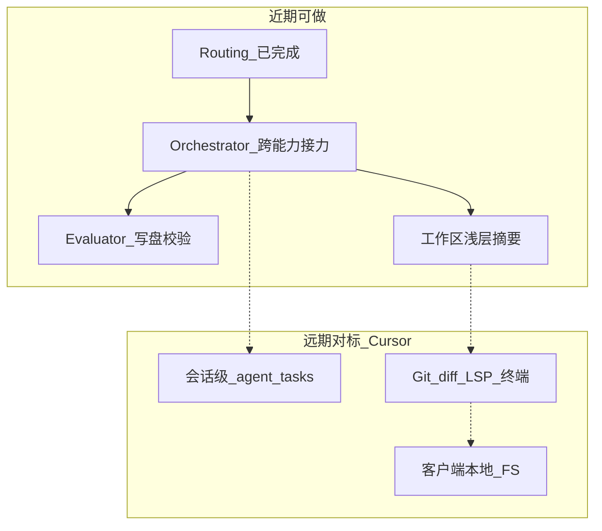

# My-Chat Agents 开发规划（v1.1）

> **版本**：v1.1（相对 [v1.0](./P2-10-agents开发规划（v1.0）.md)）  
> **更新要点**：固化「Routing 已接入主聊天」后的现状；明确 **近期可做** 与 **远期对标 Cursor** 两档目标，避免把 IDE 级能力与回合内编排混为一谈。  
> **参考**：  
> - [Spring AI — Building Effective Agents](https://docs.spring.io/spring-ai/reference/api/effective-agents.html)  
> - [P0-7 工具与知识库注意力隔离](./P0-7-工具调用和向量知识库竞争模型注意力解决方案.md)  
> - [P1-AI 工作区上下文技术分析](./P1-AI工作区上下文-技术分析.md)  
> - [P2-9 MCP 协议规划](./P2-9-mcp协议规划.md)  
> - 项目速查：[AGENTS.md](../../AGENTS.md)

---

## 一、一句话定位

做 Agents **不是**再堆一堆 `ChatClient`，而是：

| 层 | 含义 | My-Chat 对应 |
|----|------|--------------|
| **ChatClient** | 能力配置档（工具 / RAG / 记忆 / system） | `toolChatClient` / `ragChatClient` / `agentWorkflowChatClient` |
| **Workflow** | Java 编排（谁决定下一步 = 代码） | Routing 已落地；Orchestrator 为近期重点 |
| **内层 Tool-calling** | 单次 Client 请求内模型选工具 | `FileTools` / MCP（仅 tool 路径） |
| **外层 Agent 循环** | 计划 → 行动 → 观察 → 再决策（可换能力） | **未做**（对标 Cursor 核心语义的近期目标） |

业界对「分类专用 Client + switch 分发」的常见称呼：**Routing Workflow** / **LLM Router（Classifier + Dispatcher）** / **Triage → Specialist**。属于主流企业做法；Cursor 更接近 **Autonomous Agent + 本地 IDE 执行面**。

---

## 二、v1.1 现状快照（相对 v1.0）

### 2.1 已完成

| 能力 | 说明 | 关键路径 |
|------|------|----------|
| 三档 ChatClient | 工具+MCP / 纯 RAG / 无工具编排 | `AiConfiguration` |
| **Routing 接入主聊天** | 每轮 `classify` → 分发 `file` / `kb` / `search` / `general` | `ChatController` + `AgentRoutingService` |
| 会话约束 | `kbId` / `workDir` 进分类；无 kb 时禁止 `kb` | `RoutingWorkflow` + `applyConstraints` |
| NDJSON `route` 事件 | 时间线展示分流；`parts` 落库可回放 | `ChatStreamEvent` / `AgentActivityTimeline` |
| 前端统一入口 | `/rag/ai/normalChat/chat?format=ndjson`（可选 `kbId`） | `streamChat.ts` |
| 调试 API 保留 | `POST /ai/agent/route` | `AgentDemoController` |

### 2.2 当前行为边界（务必认清）

```text
用户一句 → classify（一次）→ 锁定一个 ChatClient →（该 Client 内可多次 Tool）→ 结束
```

- **已实现**：回合内固定路由；`file`/`search` 路径上的 Tool-calling 循环。  
- **未实现**：回合中途换 Client（例如 kb 做到一半再调度 search）；显式 plan/todo 状态机；会话级可暂停任务。

### 2.3 关键代码位置（v1.1）

| 角色 | 路径 |
|------|------|
| ChatClient 装配 | `my-chat-server/.../config/AiConfiguration.java` |
| 主聊天 + Routing 分发 | `my-chat-server/.../controller/ChatController.java` |
| 分类与同步调试编排 | `my-chat-server/.../service/AgentRoutingService.java` |
| 分类器 Structured Output | `my-chat-server/.../common/RoutingWorkflow.java` |
| 流式事件协议 | `my-chat-server/.../common/ChatStreamEvent.java` |
| 调试入口 | `my-chat-server/.../controller/AgentDemoController.java` |
| 前端流式 / 时间线 | `my-chat-vue3/src/utils/streamChat.ts`、`AgentActivityTimeline.vue` |

---

## 三、复杂度总览：不要一上来追平 Cursor

| 目标档 | 含义 | 体感 | 建议 |
|--------|------|------|------|
| **A. 回合内 Orchestrator** | 外层循环跨 kb/file/search | 中（约 2～4 周） | **近期主攻** |
| **B. 会话级任务状态** | DB 存 plan、可暂停续跑 | 中高（+2～3 周） | 有刚需再做 |
| **C. 工作区更像 IDE** | 目录摘要、diff、写后校验（仍服务端 FS） | 高 | 与 A 穿插低成本项 |
| **D. 真·本地客户端 Agent** | 浏览器/桌面本地 FS、LSP、终端 | 很高（架构级） | **远期对标** |

完整追平 Cursor（D + 全套 IDE 产品面）与当前「服务端工作区 + HTTP 流式聊天」**不完全同构**。市场「Agent 产品感」约八成来自 **A + C 的一部分**，不必先搬客户端。



---

## 四、近期可做（Near-term）

> 原则：继续 **Workflow（代码定路径）**；复用现有三个 ChatClient；**禁止**把 Tools 与 `QuestionAnswerAdvisor` 塞进同一个 Client（遵守 P0-7）。  
> 主聊天默认保持「单次 Routing」；Agent 多步循环先走调试 API，稳定后再用开关接入主聊天。

### 4.1 第一优先级：回合内 Orchestrator-Workers

**要解决的缺口**：分类到 kb 后，任务进行中需要联网/改文件时，应能 **换 Worker（换 Client）**，而不是锁死 `ragChatClient`。

**做法**：

1. 新增 `OrchestratorWorkflow` + `AgentOrchestratorService`（建议包：`com.mychat.agent` 或与现有 `service` 并列）。  
2. 编排 LLM（使用无工具的 `agentWorkflowChatClient`）每步产出 Structured Output，例如：  
   - `next_action`: `retrieve_kb` | `file` | `search` | `general` | `finish`  
   - `instruction`: 给 Worker 的子任务描述  
   - `reasoning`: 简短理由  
3. Java `switch` 调用现有 specialist（与 Routing 同源能力档）。  
4. 将 Worker 观察结果（检索摘要 / 工具结果摘要）回灌编排器，直到 `finish` 或 `maxSteps`（建议默认 **5～8**）。  
5. 调试入口：`POST /ai/agent/orchestrate`（扩展 `AgentDemoController`），返回步骤列表 + 最终答案。  
6. 协议：NDJSON 增加 `step`（或同一回合多次 `route`），前端时间线展示换手。

**验收用例（至少一条跨能力路径）**：

- 「根据知识库总结 X，并搜索补充最新信息」→ 日志可见 `retrieve_kb` 与 `search` 两步、两个不同 Client，无报错。  
- 或：「根据知识库写出结论并写入工作区某文件」→ `retrieve_kb` → `file`（`write`）。

**本切片不做**：修改 `schema.sql`；客户端本地 FS；主聊天默认强制 Orchestrator。

### 4.2 第二优先级：Evaluator-Optimizer 写盘校验（质量环）

场景：`write` → `cat` / 简单规则检查 → 不合格再改。

- 与 4.1 共用 `maxSteps`、单步超时、用户取消（前端已有 abort）。  
- 前端工具时间线已具备，后端补「评价 → 再调用」循环即可。

### 4.3 第三优先级：工作区浅层上下文预注入（低成本体感）

对齐 P1 文档「差距 1」：

- 在 `buildWorkspaceSystemPrompt`（或抽取 `WorkspacePromptBuilder`）注入浅层目录摘要（如 depth≤2、行数上限）。  
- 可选：按 `lastModifiedTime` 列出最近修改文件。  
- **近期不做**：`WatchService` 全量监听、完整 git 集成。

### 4.4 近期风险清单（贯穿）

| 风险 | 措施 |
|------|------|
| 无限循环 | `maxSteps` + 超时 |
| 工具越权写盘 | 继续 `WorkspaceUtil.resolveSafe()` |
| 检索与工具抢注意力 | Worker 级隔离，不合并进单一 Client |
| 成本/延迟上升 | 主聊天默认 Routing；Orchestrator 显式模式或启发式开启 |
| MCP 不可用 | 保持 ObjectProvider 软依赖 |

### 4.5 近期交付检查清单

- [ ] `OrchestratorWorkflow` + Service，Structured Output `next_action`  
- [ ] Workers 复用 rag / tool / general；至少一条 kb→search 或 kb→file  
- [ ] `/ai/agent/orchestrate` 可 curl 验收，步骤可回传  
- [ ] 步骤事件可进入时间线（调试或主聊天开关）  
- [ ] 循环上限 / 取消路径验证  
- [ ] （可选）file 路径 system prompt 注入目录摘要  

---

## 五、远期对标 Cursor 的主要目标（Long-term）

> 以下能力用于 **对标产品形态**，不是下一迭代必做项。实施前应单独开规划/评估部署模式。

### 5.1 会话级 Agent 任务（跨多轮）

| 目标 | 说明 |
|------|------|
| 任务持久化 | `schema.sql` 增加如 `agent_tasks` / `agent_task_steps`（`plan` jsonb、`status`、`conversation_id`） |
| 与现有表分工 | `chat_assistant_turns.parts` = UI 轨迹；`agent_tasks` = 可恢复状态机 |
| 体验 | 暂停、续跑、失败重试；跨天长任务 |

### 5.2 工作区「像 IDE」（仍可为服务端 FS）

| 目标 | Cursor 侧参照 | 说明 |
|------|---------------|------|
| 变更感知 | Git diff / 打开文件 | `git diff`、`git log` 工具或变更列表注入 |
| 写后诊断环 | LSP / lint | 写入后跑 eslint 等，结果回灌 Agent |
| 进度与截断 UX | 长工具进度条 | 工具超 2s 推中间状态；截断可展开查看 |
| 工作目录历史 | 最近项目 | DB 或 localStorage 最近 workDir |

详见 [P1-AI工作区上下文-技术分析](./P1-AI工作区上下文-技术分析.md) 第五节差距表。

### 5.3 真·本地执行面（架构级）

| 目标 | 说明 |
|------|------|
| 客户端本地文件系统 | 浏览器 File System Access / 桌面壳；与当前「选服务端目录」模型不同 |
| 内置终端 / Shell | 超出纯 Java NIO `FileTools` 的命令执行边界与安全模型 |
| 多文件 diff 确认 UI | 变更预览、按文件接受/拒绝 |
| 与 Routing 的关系 | **不建议**改为「单一超大 Agent 同时挂满工具+RAG」；远期仍宜 Orchestrator + 隔离 Worker |

### 5.4 远期明确不做或慎做

- 为每个 route 无限新建 ChatClient Bean（能力档保持少量即可）。  
- 用「一个 Client + 全工具 + QA Advisor」换取表面智能（回退 P0-7）。  
- 在未解决安全与取消机制前开放无上限自治循环。

---

## 六、推荐节奏（汇总）

```text
【已完成 · v1.1 基线】
  Routing Workflow → 主聊天 NDJSON + 时间线 route

【近期 · 下一迭代主线】
  Orchestrator-Workers（跨能力接力）
    → Evaluator-Optimizer（写盘校验）
    → 工作区浅层摘要（低成本）

【中期 · 有产品刚需再开】
  schema.sql 会话级 agent_tasks
  git/变更感知、更强可观测进度

【远期 · 对标 Cursor 产品面】
  客户端本地 FS / LSP / 终端 / diff 确认 UI
```

### 第一个可交付切片（建议 1～2 周内完成）

1. `OrchestratorWorkflow` + `AgentOrchestratorService`  
2. `POST /ai/agent/orchestrate`  
3. 至少一条跨能力路径验收  
4. **不改** `schema.sql`  
5. 通过后再评估是否以开关形式挂入主聊天 NDJSON  

---

## 七、与 v1.0 的关系

| 主题 | v1.0 | v1.1 |
|------|------|------|
| 学习路径 / 五模式入门 | 主内容 | 仍有效，参见 [v1.0](./P2-10-agents开发规划（v1.0）.md) |
| Routing | 规划为阶段 E 调试 API | **已产品化进主聊天** |
| 进阶 Orchestrator / Evaluator | 列为未来进阶 | **拆成近期可做清单** |
| 对标 Cursor | 分散在 P1 工作区文档 | **单独成章：近期 vs 远期** |
| 数据库 | 提醒勿过早加表 | 明确：近期切片不改 `schema.sql`；会话级任务为远期/中期 |

新人仍建议先读 v1.0 建立 Workflow vs Agent 直觉，再以本文 v1.1 作为 **当前迭代的执行与边界说明**。
