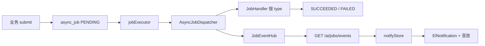

# P2-11 异步任务 + 消息通知

> **状态**：已落地（验收用 `demo_sleep` 已删除，管道保留）  
> **目标**：长任务不堵 HTTP；用户可离开当前页；完成后全局弹窗 + 音效。  
> **原则**：后端 Job 是事实源，前端只订阅。对标 Dify / FastGPT 的「任务 + 通知铃」，不用 Redis/MQ，也不在 Pinia 里自管队列。

---

## 一、一句话定位

业务代码只做一件事：`AsyncJobService.submit(jobType, title, refId, payload)`。  
落库后立刻返回；有界线程池执行 `JobHandler`；状态变化经 SSE 推到挂在 `App.vue` 的 `notifyStore`。切路由不断线。



当前仓库里 **还没有业务 Handler**（知识库入库等下一阶段接入）。没有 Handler 的 `job_type` 会立刻 `FAILED`（`未知 job_type`）。

---

## 二、为何这样设计

本业务是单向消息通知，需要半双工通信通道。前端通过`RESTFUL API`开启一个异步任务之后，需要监听后端的通知，等待后端把任务做完后发一个完成通知，并且只有服务端向客户端发消息，暂时没有客户端向服务端发消息。用SSE模型更合适。传统Result实体类封装响应是发了请求马上回应并关闭连接，但后端执行任务的时间长短不固定，发得太早任务还没结束，发得太晚超时了误以为请求失败。不用Websocket是因为它是全双工通信，对于目前的项目太重，用不上。

| 做法 | 结论 |
|------|------|
| 纯前端队列 | 刷新/关页丢失，失败无法落 `FAILED` |
| Redis / RabbitMQ / Celery | 单机过重 |
| 聊天同款 NDJSON `Flux` | 浏览器 `EventSource` 吃不了，且绑在某次聊天请求上 |
| 标准 SSE + 任务表 | 与 Element Plus 通知中心接法一致；离开业务页连接仍在 |

和本仓库的契合点：

- PostgreSQL + MyBatis-Plus，风格对齐 `knowledge_base`
- Tomcat 已开虚拟线程；**后台任务仍用有界池**，避免以后 embedding 打满 API
- `ragClient` 会解包 `Result<T>` 且 timeout=25s，**不能**订 SSE

---

## 三、数据模型

表 [`async_job`](../../my-chat-server/src/main/resources/schema.sql)：

| 列 | 含义 |
|----|------|
| `id` | UUID |
| `job_type` | Handler 注册名，如后续 `kb_ingest` |
| `status` | `PENDING` → `RUNNING` → `SUCCEEDED` \| `FAILED` |
| `title` | 通知标题（用户可见） |
| `ref_id` | 业务主键，如 `document_meta.id` |
| `payload` | JSON 字符串，Handler 入参 |
| `error_message` | 失败原因（调度器截断到 1000 字） |
| `finished_at` | 进入终态时间 |

终态不再改。无 `user_id`（当前单机单用户）。

---

## 四、后端

### 4.1 关键类

| 类 | 职责 |
|----|------|
| [`AsyncJobService.submit`](../../my-chat-server/src/main/java/com/mychat/service/AsyncJobService.java) | insert `PENDING`，立刻 `dispatch`，HTTP 不等待 |
| [`AsyncJobDispatcher`](../../my-chat-server/src/main/java/com/mychat/job/AsyncJobDispatcher.java) | 独立 Bean 上 `@Async("jobExecutor")`，避免 Service 自调用导致异步失效 |
| [`JobHandler`](../../my-chat-server/src/main/java/com/mychat/job/JobHandler.java) | `type()` + `execute(job)`；成功返回，失败抛异常 |
| [`JobEventHub`](../../my-chat-server/src/main/java/com/mychat/job/JobEventHub.java) | 进程内 `SseEmitter` 扇出；15s 注释心跳 |
| [`StaleJobRecovery`](../../my-chat-server/src/main/java/com/mychat/job/StaleJobRecovery.java) | 启动时把卡住超过 `app.jobs.stale-minutes`（默认 10）的 PENDING/RUNNING 标 FAILED |
| [`AsyncConfiguration`](../../my-chat-server/src/main/java/com/mychat/config/AsyncConfiguration.java) | `@EnableAsync` + `@EnableScheduling`；池 core=2 / max=4 / queue=100 / CallerRuns |

调度步骤（`dispatch`）：

1. CAS：`PENDING → RUNNING`（`update=0` 则跳过，防重复）
2. SSE 推 `RUNNING`
3. 按 `job_type` 找 Handler；没有则 `FAILED`
4. `execute`；异常 → `FAILED` + `error_message`
5. SSE 推终态

### 4.2 HTTP

[`JobController`](../../my-chat-server/src/main/java/com/mychat/controller/JobController.java) `/ai/jobs`：

| 方法 | 路径 | 说明 |
|------|------|------|
| GET | `/active` | `Result<List<AsyncJobVO>>`，刷新后补未完成任务 |
| GET | `/events` | **SSE**，`event: job`，data 为 VO JSON；**不是** `Result` 信封 |

验收接口 `POST /ai/jobs/demo` 与 `DemoSleepJobHandler` **已删除**。

### 4.3 长连接超时（必配）

否则 SSE 几十秒被掐断：

- [`application.yaml`](../../my-chat-server/src/main/resources/application.yaml)：`spring.mvc.async.request-timeout: 24h`
- [`vite.config.ts`](../../my-chat-vue3/vite.config.ts) `/rag` 代理：`timeout` / `proxyTimeout` = 24h

`JobEventHub` 另设 Emitter 24h + `Cache-Control: no-cache`、`X-Accel-Buffering: no`。

---

## 五、前端

| 文件 | 职责 |
|------|------|
| [`stores/notify.ts`](../../my-chat-vue3/src/stores/notify.ts) | 先 `listActive`，再 `EventSource('/rag/ai/jobs/events')`；仅终态弹窗 |
| [`App.vue`](../../my-chat-vue3/src/App.vue) | `onMounted(connect)`，路由切换不断线 |
| [`api/jobs.ts`](../../my-chat-vue3/src/api/jobs.ts) | REST 用 `ragClient`；流用原生 `EventSource` |
| [`utils/notifySound.ts`](../../my-chat-vue3/src/utils/notifySound.ts) | 双音门铃连响三遍（约 2s） |

行为约定：

- `RUNNING` 只更新 `activeJobs`，不弹窗
- `SUCCEEDED` / `FAILED`：`ElNotification`（5s）+ 音效；从 `activeJobs` 移除
- 音效需用户手势：首次 `pointerdown` 解锁 `AudioContext`；业务提交前也可调 `notifyStore.unlockSound()`
- 静音策略下 **弹窗仍出现**
- `onJobTerminal(cb)`：给知识库页等挂「刷新列表」；本阶段无调用方

不要用 `ElMessageBox`（会打断当前页）。不要用系统 `Notification` 权限弹窗。

---

## 六、如何接入新业务（知识库入库模板）

1. 实现 `JobHandler`，`type()` 返回稳定字符串（如 `kb_ingest`）。
2. 业务 API **同步只做**校验 + 落盘/插元数据 + `submit(...)`，立即返回。
3. Handler 从 `payload` / `refId` 读入参；成功正常 return，失败抛异常。
4. 需要刷新某页时：该页 `onMounted` 里 `notifyStore.onJobTerminal(...)`，按 `jobType` / `refId` 拉数据。
5. 用户可听见声音：在「提交」点击里调用 `unlockSound()`。

```java
@Component
public class KbIngestJobHandler implements JobHandler {
    @Override
    public String type() {
        return "kb_ingest";
    }

    @Override
    public void execute(AsyncJob job) throws Exception {
        // 解析 payload / refId → 切段 → VectorStore.add
    }
}
```

```java
asyncJobService.submit("kb_ingest", "向量化：" + filename, documentId, payloadJson);
```

---

## 七、明确不做 / 已知缺口

**不做（本阶段）**

- Redis、MQ、WebSocket、任务中心完整 UI（取消、进度条）
- 多用户鉴权、任务权限
- 浏览器系统通知

**缺口（后续可补）**

- SSE 断线期间完成的任务：重连不重放历史；`/active` 只含未完成，可能漏弹窗
- 单进程 `JobEventHub`：多实例部署互不可见（要上 Redis pub/sub 或 MQ）
- 无进度字段：只有四态，没有 0–100%
- 无取消 API

---

## 八、相关代码索引

后端：`entity/po/AsyncJob.java`、`mapper/AsyncJobMapper.java`、`service/AsyncJobService.java`、`job/*`、`controller/JobController.java`、`config/AsyncConfiguration.java`

前端：`types/jobs.ts`、`api/jobs.ts`、`stores/notify.ts`、`utils/notifySound.ts`、`App.vue`
