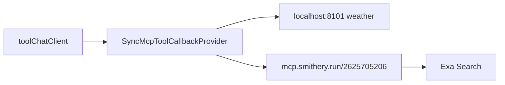

# 接入 Smithery 工具箱（Exa Search）

## 原理

Smithery 给你的地址是 **Namespace MCP Endpoint**（见 [Connect to MCPs](https://smithery.ai/docs/use/connect)）：

```text
https://mcp.smithery.run/{namespace}
→ 你的是 https://mcp.smithery.run/2625705206
```

它会把工具箱里所有已连接的 MCP（含 Exa Search）聚合到一个端点。工具名通常带连接前缀（如 `exa_search` / `connectionId.toolName`）。



鉴权：后端访问该端点需带 **Smithery API Key**（[Account API Keys](https://smithery.ai/account/api-keys)）：

```http
Authorization: Bearer <SMITHERY_API_KEY>
```

Spring AI 2.0 的 `streamable-http.connections` **不支持 YAML 写 headers**，官方做法是注册 `McpClientCustomizer<HttpClientStreamableHttpTransport.Builder>`，在指定连接上调用 `.httpRequestCustomizer(...)`。

URL 切分注意：默认 `endpoint` 是 `/mcp`。Smithery 路径本身就是完整 MCP 路径，应写成：

| 配置项     | 值                         |
| ---------- | -------------------------- |
| `url`      | `https://mcp.smithery.run` |
| `endpoint` | `/2625705206`              |

若写成 `url: https://mcp.smithery.run/2625705206` + 默认 `endpoint: /mcp`，会错误请求 `.../2625705206/mcp`。

## 前置（你本地完成）

1. 在 [smithery.ai/account/api-keys](https://smithery.ai/account/api-keys) 创建 API Key。
2. 确认工具箱里 Exa 已是 **connected**（若状态是 `input_required`/`auth_required`，先在网站完成 Exa API Key / OAuth）。
3. 设置环境变量 `SMITHERY_API_KEY`（不要写进仓库）。
4. IDEA Reload Maven 后重启 `my-chat-server`。

## 需要改/新增的文件

### 1. [`my-chat-server/src/main/resources/application.yaml`](my-chat-server/src/main/resources/application.yaml)

在现有 `spring.ai.mcp.client.streamable-http.connections` 下**追加** Smithery 连接（保留天气服务）：

```yaml
streamable-http:
  connections:
    mcp-weather-server:
      url: http://localhost:8101
      endpoint: /mcp
    smithery-toolbox:          # 连接名，自定义izer 用它过滤
      url: https://mcp.smithery.run
      endpoint: /2625705206    # 你的 namespace，勿再拼 /mcp
```

可适当加大 `request-timeout`（远程搜索常 >30s，例如 `60s`）。

另：

```yaml
app:
  mcp:
    smithery:
      api-key: ${SMITHERY_API_KEY:}
      connection-name: smithery-toolbox
```

### 2. 新增 [`my-chat-server/src/main/java/com/mychat/config/SmitheryMcpConfiguration.java`](my-chat-server/src/main/java/com/mychat/config/SmitheryMcpConfiguration.java)

```java
@Bean
McpClientCustomizer<HttpClientStreamableHttpTransport.Builder> smitheryAuthCustomizer(
    @Value("${app.mcp.smithery.api-key:}") String apiKey,
    @Value("${app.mcp.smithery.connection-name:smithery-toolbox}") String connectionName) {
  return (name, transportBuilder) -> {
    if (!connectionName.equals(name) || apiKey == null || apiKey.isBlank()) {
      return; // 不影响本地天气等无鉴权连接
    }
    transportBuilder.httpRequestCustomizer(
        (req, method, endpoint, body, ctx) ->
            req.header("Authorization", "Bearer " + apiKey));
  };
}
```

关键 import：

- `io.modelcontextprotocol.client.transport.HttpClientStreamableHttpTransport`
- `org.springframework.ai.mcp.customizer.McpClientCustomizer`

### 3. [`AiConfiguration.java`](my-chat-server/src/main/java/com/mychat/config/AiConfiguration.java) / [`McpToolsDiagnostics.java`](my-chat-server/src/main/java/com/mychat/config/McpToolsDiagnostics.java)

**无需为 Smithery 再改**。`SyncMcpToolCallbackProvider` 已聚合所有 `McpSyncClient`；诊断日志应能看到 Exa 相关工具名。仅可微调 system prompt 一句「可用网页搜索类 MCP 工具时按需调用」。

### 4. 前端

不改。工具经现有 `/ai/normalChat/chat` 链路由模型选择调用。

## 验证

1. 启动后看日志：`MCP tools discovered: [...]` 应含 Exa/search 类工具名（可能带前缀）。
2. 对话：「用搜索工具查一下 Spring AI MCP 最新动态」。
3. 若仅有天气工具、没有 Exa：查 `SMITHERY_API_KEY`、Smithery 控制台连接状态、以及 endpoint 是否误拼成 `/2625705206/mcp`。
4. 401/403：API Key 无效或未注入 Authorization。

## 交付方式

确认本方案后，按你的约束**仅输出可复制的完整文件内容**（标注路径），不直接改仓库。