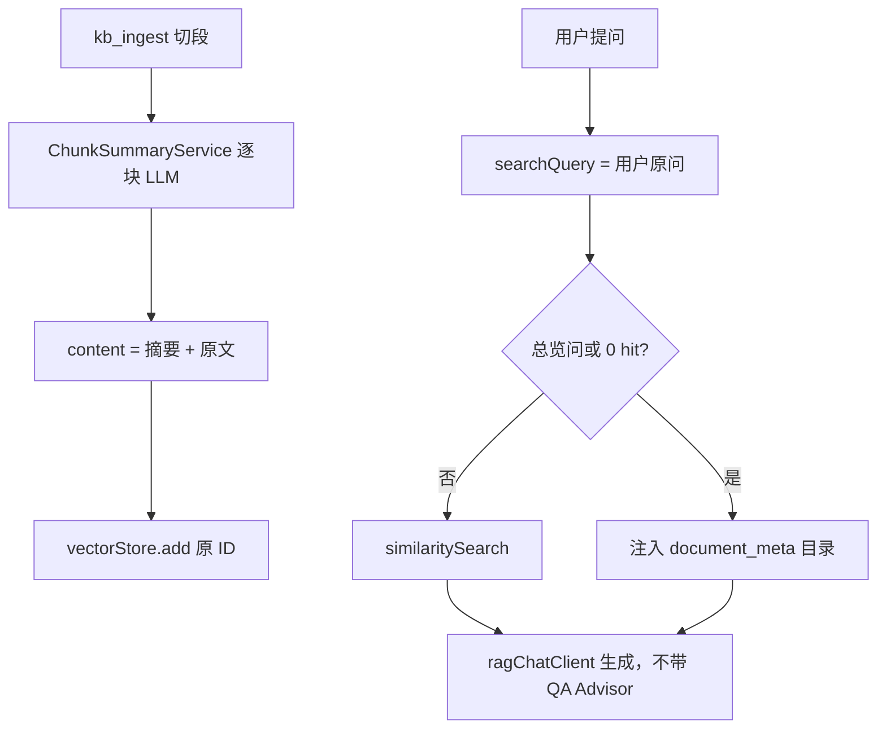

有，而且学术界已经把这类问题单独起了个名字：**global query / query-focused summarization**——问的是「整库在讲什么」，不是「某一段里有没有这句话」。

微软 GraphRAG 论文写得很直白：朴素 RAG 在「数据集的主要主题是什么」这类问题上会失败，因为这本来就不是检索任务，而是**面向问题的摘要任务**。向量库擅长找针，不擅长读整堆草。

市场上大致分四档，越往下越贵、越重。

## 1. 问句分流 + 目录（最轻，也是你们计划里那档）

识别「总览 / 总结 / 这个库讲了什么」，**不走 chunk 向量检索**，而是把文档清单、文件名、章节目录塞给模型。

LlamaIndex 的做法是双索引 + Router：具体问题走 Vector Index，总结问题走 Summary Index。业界常说「别让向量库去做摘要」。

适合你们现在这种 4 份互不相关的资料库。代价几乎是一次 SQL。

## 2. 入库时写摘要层（主流知识库产品在做的）

不在问答时现读全文，而是**入库用 LLM 先写出摘要，再把摘要也向量化**。总览类问句更像摘要语言，更容易命中。

| 产品                                | 做法                                                         |
| ----------------------------------- | ------------------------------------------------------------ |
| **Dify 1.12 Summary Index**         | 官方把用户问题分成两类：具体问答 vs「这篇的要点是什么」。给每个 chunk 挂摘要；问总结时更容易命中摘要，再带回相关 chunk。 |
| **LlamaIndex DocumentSummaryIndex** | 每篇文档一篇 LLM 摘要；检索先对摘要打分，再取出该文档的节点。介于「只搜一小段」和「把全文硬塞模型」之间。 |
| **RAGFlow Transformer**             | 入库流水线可生成 Summary / Keywords / Questions；摘要可以挂在整篇或每个 chunk 上。 |

适合：用户经常问「这篇讲了啥」「提炼要点」。代价是入库多一次 LLM，改切段规则还要重跑摘要。

注意：Dify 这层更偏向**单篇/相关段落汇总**。四份完全不同主题的文档（Java、计基、面试）堆在一个库里，单靠 chunk 摘要仍可能漏掉「库里一共有哪几类资料」。

## 3. 分层摘要树（RAPTOR / TreeRAG）

先摘要小段，再摘要「摘要的摘要」，问总览时走上层节点。

RAGFlow 的 TreeRAG、斯坦福 RAPTOR、LlamaIndex 的 `tree_summarize` 都是这条路。适合长文档、章节很多、需要「先定位再展开读」。对「这个知识库总体而言」也比纯向量强，但实现和 token 成本明显高于目录。

## 4. GraphRAG 全局检索（专门为总览而生）

这是目前**名字就对准总览问题**的方案。入库抽实体和关系，聚成社区，**预先写好社区报告**；问答时用 map-reduce 扫这些报告，而不是扫原文 chunk。

典型问法就是：「数据的主要主题是什么？」「这份资料整体在讲什么？」

效果最好，也最贵：入库要大量 LLM，查询还要多轮 map-reduce。几份课件级别的知识库通常不值得上。

---

和你们这次失败的对应关系：

- 混合检索 / Rerank / 父子分段：仍然是 **local RAG**（找针）。
- 总览类：业界公认要换索引类型——至少是**目录或文档摘要**，重则 RAPTOR / GraphRAG。

对你们当前规模，市场共识的顺序是：**先分流 + 文档目录（计划里那步）→ 若用户经常要「每篇讲了啥」，再在入库时给每篇写一篇短摘要并检索摘要**。GraphRAG 可以当后续选项，不必塞进这次修复。

---
name: Chunk summary action
overview: 执行前行动方案：每个 chunk 入库时生成摘要并拼进同一条向量；检索用用户原问、不把聊天历史交给 QuestionAnswerAdvisor；空命中时注入 document_meta 目录。schema.sql 不改表，只补 metadata 约定注释。
todos:
  - id: chunk-summary-ingest
    content: 新增 ChunkSummaryService；ingest 切段后顺序摘要并拼进 content；失败降级为仅原文；reindex 复用
    status: pending
  - id: retrieve-test-summary
    content: KnowledgeRetrieveHit 增加 summary；召回测试 UI 可折叠展示
    status: pending
  - id: fix-search-query
    content: retrieve_kb 自行 similaritySearch（query=用户原问），不再把 Worker 历史交给 QuestionAnswerAdvisor
    status: pending
  - id: catalog-fallback
    content: 总览问或 0 hit 时注入 document_meta 目录；改 rag 系统提示，禁止把 topK 当全集
    status: pending
    isProject: false
---

# 行动方案：Chunk 摘要入库 + 总览召回兜底

## 1. 目标与边界

要解决两件事：总览问句与技术正文向量对不上（阈值一高 0 hit）；多轮里 `QuestionAnswerAdvisor` 用整段 Worker 消息（含上一轮 Java 问答）做 embedding，召回被带偏。

做法已确认：对齐 RAGFlow Transformer，每块 chunk 用 LLM 写摘要，把「摘要 + 原文」拼成一条 `content` 再 embedding。不另开向量行，不换 ID。

明确不做：摘要独立第二条向量、摘要编辑 UI、GraphRAG、混合检索、Rerank、父子分段、新建业务表。

代码风格：每个新增/改动的类前、每个方法前加简短注释；方法体较长时按步骤加注释（与现有 `DocumentIngestService.ingest` 一致）。

## 2. 数据库（schema.sql）

不新增表、不新增列。摘要写入现有 `[vector_store.metadata](my-chat-server/src/main/resources/schema.sql)` JSONB，正文拼进 `content`。

仅在 `schema.sql` 补可重复执行的 `COMMENT ON`：

- `vector_store.content`：有摘要时为「【摘要】…【原文】…」，否则为切段原文
- `vector_store.metadata`：`kbId`、`documentId`、`filename` 必填；可选 `summary`、`original`

应用层约定：

- `summary`：2–4 句中文；生成失败则缺省
- `original`：未拼接的切段原文，供召回测试把摘要和正文分开显示
- 向量 ID 仍为 `uuid(documentId + "_" + i)`，`[EmbeddingService.buildSegmentIds](my-chat-server/src/main/java/com/mychat/service/knowledge/EmbeddingService.java)` 不改

`document_meta` / `knowledge_base` 不改。目录兜底用现有 `filename` + `chunk_count` + `status`。已入库文档需对每篇点「重新向量化」才会有摘要。

## 3. 总体流程

## 4. 后端

### 4.1 新增 ChunkSummaryService

路径：[my-chat-server/src/main/java/com/mychat/service/knowledge/ChunkSummaryService.java](my-chat-server/src/main/java/com/mychat/service/knowledge/ChunkSummaryService.java)

- 类注释：入库切段后的 Transformer，为每块生成短摘要并拼进 Document 文本
- 注入 `@Qualifier("agentWorkflowChatClient") ChatClient`（无工具、无 Memory）
- `enrich`：顺序处理；日志 `chunk i/N`；单块失败保留原文、不写 summary
- `summarizeOne`：原文超过约 4000 字先截断；提示词要求 2–4 句中文、只概括本段、禁止发挥
- `mergeContent` 固定格式：`【摘要】` + summary + `【原文】` + original
- metadata 写回 `summary`、`original`；id / kbId / documentId / filename 不动

### 4.2 改 DocumentIngestService.ingest

文件：[DocumentIngestService.java](my-chat-server/src/main/java/com/mychat/service/knowledge/DocumentIngestService.java)

切段之后、`storeSegmentsBatched` 之前调用 `chunkSummaryService.enrich`。`submitReindex` 已走同一 `ingest`，无需新 Job。构造器增加依赖；[DocumentIngestReindexTest](my-chat-server/src/test/java/com/mychat/service/knowledge/DocumentIngestReindexTest.java) mock `enrich` 原样返回。

### 4.3 扩 KnowledgeRetrievalService

文件：[KnowledgeRetrievalService.java](my-chat-server/src/main/java/com/mychat/service/knowledge/KnowledgeRetrievalService.java)

Spring AI 的 `QuestionAnswerAdvisor` 会用 **user 全文** 做 query，主路径必须自己检索。

- `isOverviewQuery`：命中「总体|整体|讲了什么|讲了些什么|有哪些文档|这个知识库」等视为总览
- `listCatalog`：该库 READY 文档的 filename + chunk_count，可附带知识库 name/description
- `searchChunks`：现有 `KbSearchRequests.filtered` + similaritySearch
- `buildRagContext(kbId, query)`：总览则只组目录；否则向量检索；0 hit 且有 READY 文档则改组目录。目录必须写明「这是文档清单不是全部正文，禁止说仅有 N 个章节」
- `retrieveTest` 的 `toHit`：读 metadata.summary；text 优先 original，兼容旧向量

DTO [KnowledgeRetrieveHit](my-chat-server/src/main/java/com/mychat/entity/dto/KnowledgeRetrieveHit.java) 增加 `summary`。

### 4.4 改 workerKb 与 Routing kb

[AgentOrchestratorService](my-chat-server/src/main/java/com/mychat/service/agent/AgentOrchestratorService.java)：`runWorker` 传入 `userGoal`；`retrieve_kb` 的 searchQuery 用用户原问，不要用 `buildWorkerUserMessage` 去 embed；`workerKb` 不挂 QuestionAnswerAdvisor，先 `buildRagContext` 再把「历史 + 任务 + 检索上下文」交给 `ragChatClient`。

[AgentRoutingService.handleKb](my-chat-server/src/main/java/com/mychat/service/agent/AgentRoutingService.java) 与 [AgentRouteDemoStreamService](my-chat-server/src/main/java/com/mychat/service/agent/AgentRouteDemoStreamService.java) 的 kb 分支同样先 `buildRagContext` 再生成。Demo 的 userText 已是用户原问。

### 4.5 改 ragChatClient 系统提示

[AiConfiguration.ragChatClient](my-chat-server/src/main/java/com/mychat/config/AiConfiguration.java)：

- 上下文含文档目录时，按目录概括有哪些资料，并请用户问具体问题
- 只有若干片段时，不得把这些片段说成知识库全部内容
- 仅当上下文明确为空且无目录时，才说「知识库中未找到相关信息」

## 5. 前端

[types.ts](my-chat-vue3/src/types/knowledgeStore/types.ts) 的 `KnowledgeRetrieveHit` 增加 `summary`。

[KnowledgeStore.vue](my-chat-vue3/src/views/knowledgeStore/KnowledgeStore.vue) 召回命中：摘要可折叠，正文沿用现有展开。旧向量无 summary 只显示正文。不做 chunk 编辑器。

## 6. 测试与验证

- `ChunkSummaryServiceTest`：拼装格式；LLM 抛错降级为原文
- `DocumentIngestReindexTest`：enrich 后仍按旧 ID 写入；失败回滚仍按 chunkCount 删
- `KnowledgeRetrievalServiceTest`：toHit 读 summary/original；总览问不走或少走 similaritySearch
- Orchestrator：检索 query 不含会话历史（抽 package 可见方法单测）

手工（实现后）：4 篇旧文档重新向量化 → 召回测试「总体而言」能看到摘要或目录 → 新会话与带 Java 历史的旧会话各问一次总览。

## 7. 实现顺序

1. schema.sql 注释 + ChunkSummaryService + ingest 挂钩 + 单测
2. buildRagContext + hit.summary + 召回测试 UI
3. Orchestrator / Routing / Demo 主路径改为 buildRagContext
4. 调整 ragChatClient 系统提示
5. 浏览器走通召回测试；聊天总览需重新向量化后再验

## 8. 风险

- 入库变慢：每块一次 LLM，已在 kb_ingest 线程
- 摘要失败：降级原文，与现网一致
- 四篇主题互不相关时 topK 仍可能偏科，用目录兜底覆盖「库里有哪几类文件」
