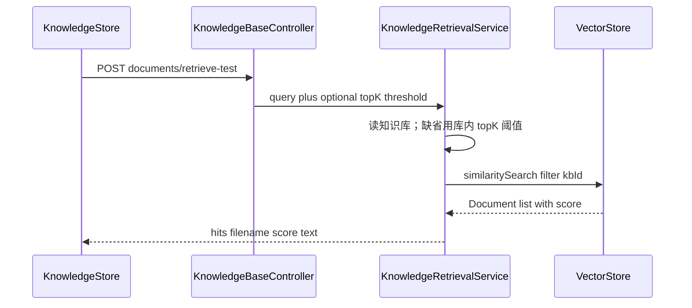

# 知识库召回测试

对齐 Dify「检索测试」、FastGPT「搜索测试」：给**知识库配置者**看命中片段和分数，不进聊天、不调 LLM。本项目已有按 `kbId` 过滤的 `SearchRequest` 与知识库 `topK` / `similarityThreshold`，本轮只把同一检索摊开返回。

## 边界（贴市场、不膨胀）

- **做**：选中知识库 → 输入模拟问题 → 列出片段正文、分数、来源文件名；可用该库已保存的 topK/阈值，或在测试页临时改这两项（不写库，对应 Dify「仅当前测试生效」）。
- **不做**：检索历史表、混合检索/Rerank、父子分段、聊天引用角标、新路由、改 `[schema.sql](my-chat-server/src/main/resources/schema.sql)`（无新表无新列）。

## 流程

与问答共用过滤表达式 `kbId == '{id}'`（入库 metadata 已是 `kbId` / `filename` / `documentId`，见 `[DocumentService](my-chat-server/src/main/java/com/mychat/service/knowledge/DocumentService.java)`）。

## 后端

**1. 抽出检索请求构造（避免测试与 Advisor 滤条件分叉）**

新增小工具类 `[KbSearchRequests](my-chat-server/src/main/java/com/mychat/service/knowledge/KbSearchRequests.java)`（或放在 `knowledge` 包下同名）：`filtered(kbId, topK, threshold)` 返回已设 `topK`、`similarityThreshold`、`filterExpression` 的 `SearchRequest.Builder`。

`[AgentRoutingService.buildKbAdvisor](my-chat-server/src/main/java/com/mychat/service/agent/AgentRoutingService.java)` 改为用该 Builder `.build()`，行为与现网一致（Advisor 仍自己填 query）。

**2. `KnowledgeRetrievalService`**

新类，职责仅「召回测试」：

- 知识库必须存在
- `query` 去空白后非空，长度上限 1000
- `topK` / `threshold` 未传则用该库已存值（`KnowledgeBaseSettings.topKOrDefault` / `thresholdOrDefault`）；传入则只做与设置页相同的范围校验（1–20、0–1），**不 update 知识库**
- `vectorStore.similaritySearch(builder.query(query).build())`
- 映射为 DTO：`text`、`score`（`Document.getScore()`，没有则 metadata）、`filename`、`documentId`；保持 VectorStore 返回顺序（分数高在前）
- 空列表合法（阈值滤光），不要当错误

**3. API / DTO**

- `POST /ai/knowledge-base/documents/retrieve-test`
- Body：`kbId`、`query`，可选 `topK`、`similarityThreshold`
- 响应：`kbId`、实际使用的 `topK` / `similarityThreshold`、`hits[]`
- 挂在 `[KnowledgeBaseController](my-chat-server/src/main/java/com/mychat/controller/KnowledgeBaseController.java)`，`IllegalArgumentException` → 400，风格同 update / reindex

类与 public 方法一行注释；检索方法内按「解析参数 / 检索 / 映射 hits」分步注释。

## 前端

放在现有 `[KnowledgeStore.vue](my-chat-vue3/src/views/knowledgeStore/KnowledgeStore.vue)`，不新开路由（Dify 也是知识库内一页，不是聊天里）。

- 顶栏增加「召回测试」，与「设置 / 上传」并列；未选库时禁用
- `content-area` 在「文档表」和「召回面板」间切换（切库时回到文档表并清空结果）
- 面板：上方 `el-input` textarea +「测试」；旁侧两个 `el-input-number`（topK、阈值），打开面板时从 `currentKb` 拷贝；文案注明**仅本次有效，不保存到设置**
- 结果：`el-empty` 无命中；有则卡片/列表，每条显示分数（`el-tag`）、文件名、正文（过长折叠）
- `[knowledge.ts](my-chat-vue3/src/api/knowledge.ts)` + `[types.ts](my-chat-vue3/src/types/knowledgeStore/types.ts)` 增加 `retrieveTest`

不改聊天页、不改 `[notify.ts](my-chat-vue3/src/stores/notify.ts)`。

## 测试

- Mock `VectorStore`：断言 `SearchRequest` 带 `filterExpression` 含该 `kbId`、`query`、默认或覆盖的 topK/阈值
- 空 query、不存在的 kbId 抛 `IllegalArgumentException`
- `vue-tsc --noEmit`

## 明确不做

- `schema.sql` 变更、检索日志落库
- 测试页改切分大小（切分只影响入库；对比切分请先重新向量化再测）
- 混合检索、Rerank、引用到聊天气泡