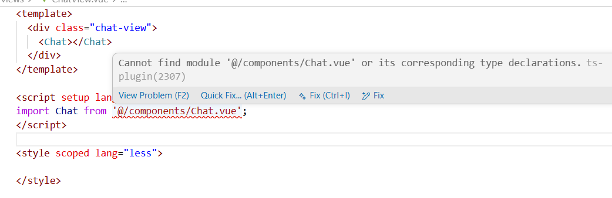

# [1-2026/4/10] 解决报错Cannot find module '@/components/Chat.vue' or its corresponding type declarations.



这个错误本身不影响运行，但为了美观还是得改一下。参考：[【彻底解决】vue3+setup+ts项目问题解决：Cannot find module ‘xxx‘ or its corresponding type declarations._vue: cannot find module or its corresponding type -CSDN博客](https://blog.csdn.net/XiugongHao/article/details/143630559)

**第一步：在项目根目录添加名为`env.d.ts`的文件，里面写如下代码：**

```typescript
//Vue 文件的类型声明,无需手动添加
declare module '*.vue' {
    import type { DefineComponent } from "vue";
    const component: DefineComponent<{}, {}, any>;
    export default component;
}
```

**第二步：在`tsconfig.app.json`添加如下代码：**

```json
"include": [
"src/**/*.ts",
"src/**/*.tsx",
"src/**/*.vue",
"env.d.ts"
]
```

**第三步：保存刷新**

# [2-2026/4/13] Spring AI版本冲突问题

如下pom文件：

```xml
<?xml version="1.0" encoding="UTF-8"?>
<project xmlns="http://maven.apache.org/POM/4.0.0"
         xmlns:xsi="http://www.w3.org/2001/XMLSchema-instance"
         xsi:schemaLocation="http://maven.apache.org/POM/4.0.0 http://maven.apache.org/xsd/maven-4.0.0.xsd">
    <modelVersion>4.0.0</modelVersion>

    <groupId>com.mychat</groupId>
    <artifactId>my-chat-server</artifactId>
    <version>1.0-SNAPSHOT</version>
    <name>my-chat</name>
    <description>my-chat</description>

    <properties>
        <maven.compiler.source>17</maven.compiler.source>
        <spring-ai.version>1.0.0</spring-ai.version>
    </properties>

    <parent>
        <groupId>org.springframework.boot</groupId>
        <artifactId>spring-boot-starter-parent</artifactId>
        <version>3.3.0</version>
        <relativePath/> <!-- lookup parent from repository -->
    </parent>

    <dependencyManagement>
        <dependencies>
            <dependency>
                <groupId>org.springframework.ai</groupId>
                <artifactId>spring-ai-bom</artifactId>
                <version>${spring-ai.version}</version>
                <type>pom</type>
                <scope>import</scope>
            </dependency>
        </dependencies>
    </dependencyManagement>

    <dependencies>
        <dependency>
            <groupId>org.springframework.boot</groupId>
            <artifactId>spring-boot-starter-web</artifactId>
        </dependency>
        
        <!-- 无法添加Spring AI依赖，一旦添加并刷新maven，其他依赖会被从本地仓库清空。但如果去掉Spring AI依赖并再次刷新maven，所有依赖又正常了。推测原因是Spring AI与 Spring Boot存在版本不兼容，导致 Maven 依赖解析失败，进而触发 IDE（IntelliJ）的极端清理行为——它会清空本地 Maven 仓库中已下载的依赖缓存。当您重新注释掉该依赖时，项目回到兼容状态，IDE 重新下载并恢复依赖。-->
<!--        <dependency>-->
<!--            <groupId>org.springframework.ai</groupId>-->
<!--            <artifactId>spring-ai-openai-spring-boot-starter</artifactId>-->
<!--            &lt;!&ndash; 排除可能的冲突传递依赖 &ndash;&gt;-->
<!--            <exclusions>-->
<!--                <exclusion>-->
<!--                    <groupId>org.springframework</groupId>-->
<!--                    <artifactId>spring-core</artifactId>-->
<!--                </exclusion>-->
<!--                <exclusion>-->
<!--                    <groupId>org.springframework.boot</groupId>-->
<!--                    <artifactId>spring-boot-autoconfigure</artifactId>-->
<!--                </exclusion>-->
<!--            </exclusions>-->
<!--        </dependency>-->
        <dependency>
            <groupId>com.mysql</groupId>
            <artifactId>mysql-connector-j</artifactId>
            <scope>runtime</scope>
        </dependency>
        <dependency>
            <groupId>org.springframework.boot</groupId>
            <artifactId>spring-boot-starter-test</artifactId>
            <scope>test</scope>
        </dependency>
        <dependency>
            <groupId>org.projectlombok</groupId>
            <artifactId>lombok</artifactId>
            <version>1.18.22</version>
        </dependency>
        <dependency>
            <groupId>com.baomidou</groupId>
            <artifactId>mybatis-plus-spring-boot3-starter</artifactId>
            <version>3.5.10.1</version>
        </dependency>
    </dependencies>

    <build>
        <plugins>
            <plugin>
                <groupId>org.springframework.boot</groupId>
                <artifactId>spring-boot-maven-plugin</artifactId>
            </plugin>
        </plugins>
    </build>

    <!-- 关键：添加 Spring 仓库确保依赖可下载 -->
    <repositories>
        <repository>
            <id>spring-milestones</id>
            <name>Spring Milestones</name>
            <url>https://repo.spring.io/milestone</url>
            <snapshots>
                <enabled>false</enabled>
            </snapshots>
        </repository>
        <repository>
            <id>central</id>
            <url>https://repo1.maven.org/maven2</url>
            <snapshots>
                <enabled>false</enabled>
            </snapshots>
        </repository>
    </repositories>
</project>
```

目前试过一系列组合版本，只有Spring AI 1.0.0-M6不会导致其他依赖误删除，可以随意组合spring boot版本，其他所有spring ai版本统统会导致误删除。问题根因：

这是一个典型的 **Spring AI 版本间 artifactId 变更** 问题。

## 2.1 🔍 问题根源分析

通过对比您本地 Maven 仓库中的 BOM 文件，我发现了关键差异：

| Spring AI 版本      | OpenAI Starter 的 artifactId           |
| ------------------- | -------------------------------------- |
| **1.0.0-M6**        | `spring-ai-openai-spring-boot-starter` |
| **1.0.0（正式版）** | `spring-ai-starter-model-openai`       |
| **1.1.2**           | `spring-ai-starter-model-openai`       |

**问题原因**：
您的 `pom.xml` 中使用了旧的 artifactId `spring-ai-openai-spring-boot-starter`，但 Spring AI 1.0.0+ 的 BOM 中只定义了新的 artifactId `spring-ai-starter-model-openai`，导致 Maven 无法找到版本号，从而触发依赖解析失败和本地仓库清理。

## 2.2 ✅ 已修复的 `pom.xml`

我已经帮您修复了文件，主要更改如下：

```xml pom.xml
<?xml version="1.0" encoding="UTF-8"?>
<project xmlns="http://maven.apache.org/POM/4.0.0"
         xmlns:xsi="http://www.w3.org/2001/XMLSchema-instance"
         xsi:schemaLocation="http://maven.apache.org/POM/4.0.0 http://maven.apache.org/xsd/maven-4.0.0.xsd">
    <!-- ... 其他部分不变 ... -->
    
    <properties>
        <maven.compiler.source>17</maven.compiler.source>
        <maven.compiler.target>17</maven.compiler.target>
        <project.build.sourceEncoding>UTF-8</project.build.sourceEncoding>
        <!-- 升级到与 Spring Boot 3.5.0 兼容的 Spring AI 版本 -->
        <spring-ai.version>1.2.1</spring-ai.version>
        <mysql.version>8.0.33</mysql.version>
    </properties>

    <dependencies>
        <!-- ... 其他依赖 ... -->
        <!-- 关键修复：使用正确的 artifactId -->
        <dependency>
            <groupId>org.springframework.ai</groupId>
            <artifactId>spring-ai-starter-model-openai</artifactId>  <!-- 修改了这一行 -->
        </dependency>
        <dependency>
            <groupId>org.springframework.ai</groupId>
            <artifactId>spring-ai-pdf-document-reader</artifactId>
        </dependency>
        <!-- ... 其他依赖 ... -->
    </dependencies>

    <!-- 添加了 Spring 仓库以确保依赖可下载 -->
    <repositories>
        <repository>
            <id>spring-milestones</id>
            <name>Spring Milestones</name>
            <url>https://repo.spring.io/milestone</url>
            <snapshots>
                <enabled>false</enabled>
            </snapshots>
        </repository>
        <repository>
            <id>spring-releases</id>
            <name>Spring Releases</name>
            <url>https://repo.spring.io/release</url>
            <snapshots>
                <enabled>false</enabled>
            </snapshots>
        </repository>
    </repositories>
</project>
```

## 2.3 📋 版本兼容性指南

如果您想使用其他版本组合，请参考下表选择合适的 artifactId：

| Spring Boot 版本 | Spring AI 版本 | 正确的 artifactId                      |
| ---------------- | -------------- | -------------------------------------- |
| 3.3.x            | 1.0.0-M6       | `spring-ai-openai-spring-boot-starter` |
| 3.3.x            | 1.0.0          | `spring-ai-starter-model-openai`       |
| 3.4.x            | 1.1.x          | `spring-ai-starter-model-openai`       |
| **3.5.0**        | **1.2.1**      | **`spring-ai-starter-model-openai`** ✅ |

## 2.4 🔧 后续操作步骤

1. **保存已修复的 `pom.xml`**
2. **在 IDE 中刷新 Maven 项目**：
   - IntelliJ：点击 Maven 工具栏的刷新按钮
   - 或执行：Maven → Reload Project
3. **如果仍有问题，清理本地仓库缓存**：
   ```bash
   # 方法1：使用 Maven 命令
   mvn dependency:purge-local-repository -DactTransitively=false -DreResolve=false
   
   # 方法2：手动删除 Spring AI 相关缓存
   # 删除目录：~/.m2/repository/org/springframework/ai/
   ```

## 2.5 📝 额外建议

1. **MySQL 驱动 groupId**：您使用的是 `mysql:mysql-connector-java`，但官方推荐的是 `com.mysql:mysql-connector-j`。建议修改为：
   ```xml
   <dependency>
       <groupId>com.mysql</groupId>
       <artifactId>mysql-connector-j</artifactId>
       <version>${mysql.version}</version>
       <scope>runtime</scope>
   </dependency>
   ```

2. **备用方案**：如果仍然遇到问题，可以暂时注释掉 `spring-ai-pdf-document-reader` 依赖，等主要依赖解析成功后再取消注释。

## 2.6 🎯 为什么只有 1.0.0-M6 能工作？

因为您一直使用 `spring-ai-openai-spring-boot-starter` 这个 artifactId，而这个 artifactId 只在 1.0.0-M6 的 BOM 中存在。Spring AI 团队在正式版中统一了命名规范，将 `-spring-boot-starter` 后缀移到了中间位置。

现在您已经了解了问题的根本原因，应该可以自由选择任何兼容的 Spring AI 版本了！

## 2.7 最终pom.xml（无报错、无警告）

```xml
<?xml version="1.0" encoding="UTF-8"?>
<project xmlns="http://maven.apache.org/POM/4.0.0"
         xmlns:xsi="http://www.w3.org/2001/XMLSchema-instance"
         xsi:schemaLocation="http://maven.apache.org/POM/4.0.0 http://maven.apache.org/xsd/maven-4.0.0.xsd">
    <modelVersion>4.0.0</modelVersion>

    <groupId>com.mychat</groupId>
    <artifactId>my-chat-server</artifactId>
    <version>1.0-SNAPSHOT</version>

    <parent>
        <groupId>org.springframework.boot</groupId>
        <artifactId>spring-boot-starter-parent</artifactId>
        <version>3.3.4</version>
        <relativePath/> <!-- lookup parent from repository -->
    </parent>

    <properties>
        <maven.compiler.source>17</maven.compiler.source>
        <maven.compiler.target>17</maven.compiler.target>
        <project.build.sourceEncoding>UTF-8</project.build.sourceEncoding>
        <spring-ai.version>1.0.0</spring-ai.version>
        <mysql.version>8.0.33</mysql.version>
    </properties>

    <dependencies>
        <dependency>
            <groupId>org.springframework.boot</groupId>
            <artifactId>spring-boot-starter-web</artifactId>
        </dependency>
        <dependency>
            <groupId>org.springframework.ai</groupId>
            <artifactId>spring-ai-starter-model-openai</artifactId>
        </dependency>
        <dependency>
            <groupId>org.springframework.ai</groupId>
            <artifactId>spring-ai-pdf-document-reader</artifactId>
        </dependency>
        <dependency>
            <groupId>org.springframework.boot</groupId>
            <artifactId>spring-boot-starter-test</artifactId>
            <scope>test</scope>
        </dependency>
        <!-- mysql驱动 -->
        <dependency>
            <groupId>com.mysql</groupId>
            <artifactId>mysql-connector-j</artifactId>
            <version>${mysql.version}</version>
            <scope>runtime</scope>
        </dependency>
    </dependencies>

    <dependencyManagement>
        <dependencies>
            <dependency>
                <groupId>org.springframework.ai</groupId>
                <artifactId>spring-ai-bom</artifactId>
                <version>${spring-ai.version}</version>
                <type>pom</type>
                <scope>import</scope>
            </dependency>
        </dependencies>
    </dependencyManagement>

    <repositories>
        <repository>
            <id>spring-milestones</id>
            <name>Spring Milestones</name>
            <url>https://repo.spring.io/milestone</url>
            <snapshots>
                <enabled>false</enabled>
            </snapshots>
        </repository>
        <repository>
            <id>spring-releases</id>
            <name>Spring Releases</name>
            <url>https://repo.spring.io/release</url>
            <snapshots>
                <enabled>false</enabled>
            </snapshots>
        </repository>
    </repositories>

    <build>
        <plugins>
            <plugin>
                <groupId>org.springframework.boot</groupId>
                <artifactId>spring-boot-maven-plugin</artifactId>
            </plugin>
        </plugins>
    </build>
</project>

```

# [3-2026/4/20] 启动报错：无法找到sql脚本？

```
2026-04-20T21:19:28.863+08:00 ERROR 16072 --- [my-chat] [           main] o.s.boot.SpringApplication               : Application run failed

org.springframework.beans.factory.UnsatisfiedDependencyException: Error creating bean with name 'aiConfiguration': Unsatisfied dependency expressed through field 'jdbcChatMemoryRepository': Error creating bean with name 'jdbcChatMemoryRepository' defined in class path resource [org/springframework/ai/model/chat/memory/repository/jdbc/autoconfigure/JdbcChatMemoryRepositoryAutoConfiguration.class]: Unsatisfied dependency expressed through method 'jdbcChatMemoryRepository' parameter 0: Error creating bean with name 'jdbcChatMemoryScriptDatabaseInitializer' defined in class path resource [org/springframework/ai/model/chat/memory/repository/jdbc/autoconfigure/JdbcChatMemoryRepositoryAutoConfiguration.class]: No schema scripts found at location 'classpath:org/springframework/ai/chat/memory/repository/jdbc/schema-h2.sql'

	at org.springframework.beans.factory.annotation.AutowiredAnnotationBeanPostProcessor$AutowiredFieldElement.resolveFieldValue(AutowiredAnnotationBeanPostProcessor.java:788) ~[spring-beans-6.1.13.jar:6.1.13]

	at org.springframework.beans.factory.annotation.AutowiredAnnotationBeanPostProcessor$AutowiredFieldElement.inject(AutowiredAnnotationBeanPostProcessor.java:768) ~[spring-beans-6.1.13.jar:6.1.13]

	at org.springframework.beans.factory.annotation.InjectionMetadata.inject(InjectionMetadata.java:145) ~[spring-beans-6.1.13.jar:6.1.13]

	at org.springframework.beans.factory.annotation.AutowiredAnnotationBeanPostProcessor.postProcessProperties(AutowiredAnnotationBeanPostProcessor.java:509) ~[spring-beans-6.1.13.jar:6.1.13]

	at org.springframework.beans.factory.support.AbstractAutowireCapableBeanFactory.populateBean(AbstractAutowireCapableBeanFactory.java:1439) ~[spring-beans-6.1.13.jar:6.1.13]

	at org.springframework.beans.factory.support.AbstractAutowireCapableBeanFactory.doCreateBean(AbstractAutowireCapableBeanFactory.java:599) ~[spring-beans-6.1.13.jar:6.1.13]

	at org.springframework.beans.factory.support.AbstractAutowireCapableBeanFactory.createBean(AbstractAutowireCapableBeanFactory.java:522) ~[spring-beans-6.1.13.jar:6.1.13]

	at org.springframework.beans.factory.support.AbstractBeanFactory.lambda$doGetBean$0(AbstractBeanFactory.java:337) ~[spring-beans-6.1.13.jar:6.1.13]

	at org.springframework.beans.factory.support.DefaultSingletonBeanRegistry.getSingleton(DefaultSingletonBeanRegistry.java:234) ~[spring-beans-6.1.13.jar:6.1.13]

	at org.springframework.beans.factory.support.AbstractBeanFactory.doGetBean(AbstractBeanFactory.java:335) ~[spring-beans-6.1.13.jar:6.1.13]

	at org.springframework.beans.factory.support.AbstractBeanFactory.getBean(AbstractBeanFactory.java:200) ~[spring-beans-6.1.13.jar:6.1.13]

	at org.springframework.beans.factory.support.DefaultListableBeanFactory.preInstantiateSingletons(DefaultListableBeanFactory.java:975) ~[spring-beans-6.1.13.jar:6.1.13]

	at org.springframework.context.support.AbstractApplicationContext.finishBeanFactoryInitialization(AbstractApplicationContext.java:971) ~[spring-context-6.1.13.jar:6.1.13]

	at org.springframework.context.support.AbstractApplicationContext.refresh(AbstractApplicationContext.java:625) ~[spring-context-6.1.13.jar:6.1.13]

	at org.springframework.boot.web.servlet.context.ServletWebServerApplicationContext.refresh(ServletWebServerApplicationContext.java:146) ~[spring-boot-3.3.4.jar:3.3.4]

	at org.springframework.boot.SpringApplication.refresh(SpringApplication.java:754) ~[spring-boot-3.3.4.jar:3.3.4]

	at org.springframework.boot.SpringApplication.refreshContext(SpringApplication.java:456) ~[spring-boot-3.3.4.jar:3.3.4]

	at org.springframework.boot.SpringApplication.run(SpringApplication.java:335) ~[spring-boot-3.3.4.jar:3.3.4]

	at org.springframework.boot.SpringApplication.run(SpringApplication.java:1363) ~[spring-boot-3.3.4.jar:3.3.4]

	at org.springframework.boot.SpringApplication.run(SpringApplication.java:1352) ~[spring-boot-3.3.4.jar:3.3.4]

	at com.mychat.Application.main(Application.java:11) ~[classes/:na]

Caused by: org.springframework.beans.factory.UnsatisfiedDependencyException: Error creating bean with name 'jdbcChatMemoryRepository' defined in class path resource [org/springframework/ai/model/chat/memory/repository/jdbc/autoconfigure/JdbcChatMemoryRepositoryAutoConfiguration.class]: Unsatisfied dependency expressed through method 'jdbcChatMemoryRepository' parameter 0: Error creating bean with name 'jdbcChatMemoryScriptDatabaseInitializer' defined in class path resource [org/springframework/ai/model/chat/memory/repository/jdbc/autoconfigure/JdbcChatMemoryRepositoryAutoConfiguration.class]: No schema scripts found at location 'classpath:org/springframework/ai/chat/memory/repository/jdbc/schema-h2.sql'

	at org.springframework.beans.factory.support.ConstructorResolver.createArgumentArray(ConstructorResolver.java:795) ~[spring-beans-6.1.13.jar:6.1.13]

	at org.springframework.beans.factory.support.ConstructorResolver.instantiateUsingFactoryMethod(ConstructorResolver.java:542) ~[spring-beans-6.1.13.jar:6.1.13]

	at org.springframework.beans.factory.support.AbstractAutowireCapableBeanFactory.instantiateUsingFactoryMethod(AbstractAutowireCapableBeanFactory.java:1355) ~[spring-beans-6.1.13.jar:6.1.13]

	at org.springframework.beans.factory.support.AbstractAutowireCapableBeanFactory.createBeanInstance(AbstractAutowireCapableBeanFactory.java:1185) ~[spring-beans-6.1.13.jar:6.1.13]

	at org.springframework.beans.factory.support.AbstractAutowireCapableBeanFactory.doCreateBean(AbstractAutowireCapableBeanFactory.java:562) ~[spring-beans-6.1.13.jar:6.1.13]

	at org.springframework.beans.factory.support.AbstractAutowireCapableBeanFactory.createBean(AbstractAutowireCapableBeanFactory.java:522) ~[spring-beans-6.1.13.jar:6.1.13]

	at org.springframework.beans.factory.support.AbstractBeanFactory.lambda$doGetBean$0(AbstractBeanFactory.java:337) ~[spring-beans-6.1.13.jar:6.1.13]

	at org.springframework.beans.factory.support.DefaultSingletonBeanRegistry.getSingleton(DefaultSingletonBeanRegistry.java:234) ~[spring-beans-6.1.13.jar:6.1.13]

	at org.springframework.beans.factory.support.AbstractBeanFactory.doGetBean(AbstractBeanFactory.java:335) ~[spring-beans-6.1.13.jar:6.1.13]

	at org.springframework.beans.factory.support.AbstractBeanFactory.getBean(AbstractBeanFactory.java:200) ~[spring-beans-6.1.13.jar:6.1.13]

	at org.springframework.beans.factory.config.DependencyDescriptor.resolveCandidate(DependencyDescriptor.java:254) ~[spring-beans-6.1.13.jar:6.1.13]

	at org.springframework.beans.factory.support.DefaultListableBeanFactory.doResolveDependency(DefaultListableBeanFactory.java:1443) ~[spring-beans-6.1.13.jar:6.1.13]

	at org.springframework.beans.factory.support.DefaultListableBeanFactory.resolveDependency(DefaultListableBeanFactory.java:1353) ~[spring-beans-6.1.13.jar:6.1.13]

	at org.springframework.beans.factory.annotation.AutowiredAnnotationBeanPostProcessor$AutowiredFieldElement.resolveFieldValue(AutowiredAnnotationBeanPostProcessor.java:785) ~[spring-beans-6.1.13.jar:6.1.13]

	... 20 common frames omitted

Caused by: org.springframework.beans.factory.BeanCreationException: Error creating bean with name 'jdbcChatMemoryScriptDatabaseInitializer' defined in class path resource [org/springframework/ai/model/chat/memory/repository/jdbc/autoconfigure/JdbcChatMemoryRepositoryAutoConfiguration.class]: No schema scripts found at location 'classpath:org/springframework/ai/chat/memory/repository/jdbc/schema-h2.sql'

	at org.springframework.beans.factory.support.AbstractAutowireCapableBeanFactory.initializeBean(AbstractAutowireCapableBeanFactory.java:1806) ~[spring-beans-6.1.13.jar:6.1.13]

	at org.springframework.beans.factory.support.AbstractAutowireCapableBeanFactory.doCreateBean(AbstractAutowireCapableBeanFactory.java:600) ~[spring-beans-6.1.13.jar:6.1.13]

	at org.springframework.beans.factory.support.AbstractAutowireCapableBeanFactory.createBean(AbstractAutowireCapableBeanFactory.java:522) ~[spring-beans-6.1.13.jar:6.1.13]

	at org.springframework.beans.factory.support.AbstractBeanFactory.lambda$doGetBean$0(AbstractBeanFactory.java:337) ~[spring-beans-6.1.13.jar:6.1.13]

	at org.springframework.beans.factory.support.DefaultSingletonBeanRegistry.getSingleton(DefaultSingletonBeanRegistry.java:234) ~[spring-beans-6.1.13.jar:6.1.13]

	at org.springframework.beans.factory.support.AbstractBeanFactory.doGetBean(AbstractBeanFactory.java:335) ~[spring-beans-6.1.13.jar:6.1.13]

	at org.springframework.beans.factory.support.AbstractBeanFactory.getBean(AbstractBeanFactory.java:200) ~[spring-beans-6.1.13.jar:6.1.13]

	at org.springframework.beans.factory.support.AbstractBeanFactory.doGetBean(AbstractBeanFactory.java:313) ~[spring-beans-6.1.13.jar:6.1.13]

	at org.springframework.beans.factory.support.AbstractBeanFactory.getBean(AbstractBeanFactory.java:200) ~[spring-beans-6.1.13.jar:6.1.13]

	at org.springframework.beans.factory.config.DependencyDescriptor.resolveCandidate(DependencyDescriptor.java:254) ~[spring-beans-6.1.13.jar:6.1.13]

	at org.springframework.beans.factory.support.DefaultListableBeanFactory.doResolveDependency(DefaultListableBeanFactory.java:1443) ~[spring-beans-6.1.13.jar:6.1.13]

	at org.springframework.beans.factory.support.DefaultListableBeanFactory.resolveDependency(DefaultListableBeanFactory.java:1353) ~[spring-beans-6.1.13.jar:6.1.13]

	at org.springframework.beans.factory.support.ConstructorResolver.resolveAutowiredArgument(ConstructorResolver.java:904) ~[spring-beans-6.1.13.jar:6.1.13]

	at org.springframework.beans.factory.support.ConstructorResolver.createArgumentArray(ConstructorResolver.java:782) ~[spring-beans-6.1.13.jar:6.1.13]

	... 33 common frames omitted

Caused by: java.lang.IllegalStateException: No schema scripts found at location 'classpath:org/springframework/ai/chat/memory/repository/jdbc/schema-h2.sql'

	at org.springframework.boot.sql.init.AbstractScriptDatabaseInitializer.getScripts(AbstractScriptDatabaseInitializer.java:129) ~[spring-boot-3.3.4.jar:3.3.4]

	at org.springframework.boot.sql.init.AbstractScriptDatabaseInitializer.applyScripts(AbstractScriptDatabaseInitializer.java:106) ~[spring-boot-3.3.4.jar:3.3.4]

	at org.springframework.boot.sql.init.AbstractScriptDatabaseInitializer.applySchemaScripts(AbstractScriptDatabaseInitializer.java:98) ~[spring-boot-3.3.4.jar:3.3.4]

	at org.springframework.boot.sql.init.AbstractScriptDatabaseInitializer.initializeDatabase(AbstractScriptDatabaseInitializer.java:76) ~[spring-boot-3.3.4.jar:3.3.4]

	at org.springframework.boot.sql.init.AbstractScriptDatabaseInitializer.afterPropertiesSet(AbstractScriptDatabaseInitializer.java:66) ~[spring-boot-3.3.4.jar:3.3.4]

	at org.springframework.beans.factory.support.AbstractAutowireCapableBeanFactory.invokeInitMethods(AbstractAutowireCapableBeanFactory.java:1853) ~[spring-beans-6.1.13.jar:6.1.13]

	at org.springframework.beans.factory.support.AbstractAutowireCapableBeanFactory.initializeBean(AbstractAutowireCapableBeanFactory.java:1802) ~[spring-beans-6.1.13.jar:6.1.13]

	... 46 common frames omitted
```

这个问题是 **Spring AI 1.0.0 版本的已知问题**。Spring AI 1.0.0 的 `JdbcChatMemoryRepository` 需要特定的 SQL 脚本来创建表，但这些脚本在依赖中缺失了。错误信息明确指出：

```
No schema scripts found at location 'classpath:org/springframework/ai/chat/memory/repository/jdbc/schema-h2.sql'
```

Spring AI 1.0.0 期望在 classpath 中找到这个文件，但实际不存在。

把spring ai从1.0.0升级到1.1.3暂时解决了启动报错问题。
