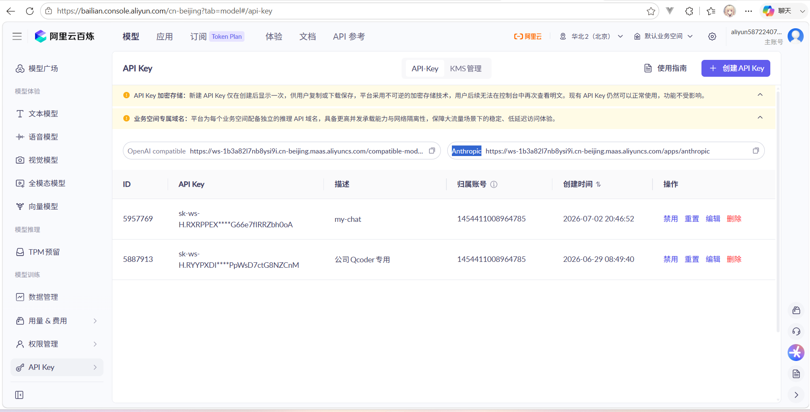

# [1-2026/4/10] 解决报错Cannot find module '@/components/Chat.vue' or its corresponding type declarations.


这个错误本身不影响运行，但为了美观还是得改一下。参考：[【彻底解决】vue3+setup+ts项目问题解决：Cannot find module ‘xxx‘ or its corresponding type declarations._vue: cannot find module or its corresponding type -CSDN博客](https://blog.csdn.net/XiugongHao/article/details/143630559)

**第一步：在项目根目录添加名为`env.d.ts`的文件，里面写如下代码：**

```typescript
//Vue 文件的类型声明,无需手动添加
declare module '*.vue' {
    import type { DefineComponent } from "vue";
    const component: DefineComponent<{}, {}, any>;
    export default component;
}
```

**第二步：在`tsconfig.app.json`添加如下代码：**

```json
"include": [
"src/**/*.ts",
"src/**/*.tsx",
"src/**/*.vue",
"env.d.ts"
]
```

**第三步：保存刷新**

# [2-2026/4/13] Spring AI版本冲突问题

如下pom文件：

```xml
<?xml version="1.0" encoding="UTF-8"?>
<project xmlns="http://maven.apache.org/POM/4.0.0"
         xmlns:xsi="http://www.w3.org/2001/XMLSchema-instance"
         xsi:schemaLocation="http://maven.apache.org/POM/4.0.0 http://maven.apache.org/xsd/maven-4.0.0.xsd">
    <modelVersion>4.0.0</modelVersion>

    <groupId>com.mychat</groupId>
    <artifactId>my-chat-server</artifactId>
    <version>1.0-SNAPSHOT</version>
    <name>my-chat</name>
    <description>my-chat</description>

    <properties>
        <maven.compiler.source>17</maven.compiler.source>
        <spring-ai.version>1.0.0</spring-ai.version>
    </properties>

    <parent>
        <groupId>org.springframework.boot</groupId>
        <artifactId>spring-boot-starter-parent</artifactId>
        <version>3.3.0</version>
        <relativePath/> <!-- lookup parent from repository -->
    </parent>

    <dependencyManagement>
        <dependencies>
            <dependency>
                <groupId>org.springframework.ai</groupId>
                <artifactId>spring-ai-bom</artifactId>
                <version>${spring-ai.version}</version>
                <type>pom</type>
                <scope>import</scope>
            </dependency>
        </dependencies>
    </dependencyManagement>

    <dependencies>
        <dependency>
            <groupId>org.springframework.boot</groupId>
            <artifactId>spring-boot-starter-web</artifactId>
        </dependency>
        
        <!-- 无法添加Spring AI依赖，一旦添加并刷新maven，其他依赖会被从本地仓库清空。但如果去掉Spring AI依赖并再次刷新maven，所有依赖又正常了。推测原因是Spring AI与 Spring Boot存在版本不兼容，导致 Maven 依赖解析失败，进而触发 IDE（IntelliJ）的极端清理行为——它会清空本地 Maven 仓库中已下载的依赖缓存。当您重新注释掉该依赖时，项目回到兼容状态，IDE 重新下载并恢复依赖。-->
<!--        <dependency>-->
<!--            <groupId>org.springframework.ai</groupId>-->
<!--            <artifactId>spring-ai-openai-spring-boot-starter</artifactId>-->
<!--            &lt;!&ndash; 排除可能的冲突传递依赖 &ndash;&gt;-->
<!--            <exclusions>-->
<!--                <exclusion>-->
<!--                    <groupId>org.springframework</groupId>-->
<!--                    <artifactId>spring-core</artifactId>-->
<!--                </exclusion>-->
<!--                <exclusion>-->
<!--                    <groupId>org.springframework.boot</groupId>-->
<!--                    <artifactId>spring-boot-autoconfigure</artifactId>-->
<!--                </exclusion>-->
<!--            </exclusions>-->
<!--        </dependency>-->
        <dependency>
            <groupId>com.mysql</groupId>
            <artifactId>mysql-connector-j</artifactId>
            <scope>runtime</scope>
        </dependency>
        <dependency>
            <groupId>org.springframework.boot</groupId>
            <artifactId>spring-boot-starter-test</artifactId>
            <scope>test</scope>
        </dependency>
        <dependency>
            <groupId>org.projectlombok</groupId>
            <artifactId>lombok</artifactId>
            <version>1.18.22</version>
        </dependency>
        <dependency>
            <groupId>com.baomidou</groupId>
            <artifactId>mybatis-plus-spring-boot3-starter</artifactId>
            <version>3.5.10.1</version>
        </dependency>
    </dependencies>

    <build>
        <plugins>
            <plugin>
                <groupId>org.springframework.boot</groupId>
                <artifactId>spring-boot-maven-plugin</artifactId>
            </plugin>
        </plugins>
    </build>

    <!-- 关键：添加 Spring 仓库确保依赖可下载 -->
    <repositories>
        <repository>
            <id>spring-milestones</id>
            <name>Spring Milestones</name>
            <url>https://repo.spring.io/milestone</url>
            <snapshots>
                <enabled>false</enabled>
            </snapshots>
        </repository>
        <repository>
            <id>central</id>
            <url>https://repo1.maven.org/maven2</url>
            <snapshots>
                <enabled>false</enabled>
            </snapshots>
        </repository>
    </repositories>
</project>
```

目前试过一系列组合版本，只有Spring AI 1.0.0-M6不会导致其他依赖误删除，可以随意组合spring boot版本，其他所有spring ai版本统统会导致误删除。问题根因：

这是一个典型的 **Spring AI 版本间 artifactId 变更** 问题。

## 2.1 🔍 问题根源分析

通过对比您本地 Maven 仓库中的 BOM 文件，我发现了关键差异：

| Spring AI 版本      | OpenAI Starter 的 artifactId           |
| ------------------- | -------------------------------------- |
| **1.0.0-M6**        | `spring-ai-openai-spring-boot-starter` |
| **1.0.0（正式版）** | `spring-ai-starter-model-openai`       |
| **1.1.2**           | `spring-ai-starter-model-openai`       |

**问题原因**：
您的 `pom.xml` 中使用了旧的 artifactId `spring-ai-openai-spring-boot-starter`，但 Spring AI 1.0.0+ 的 BOM 中只定义了新的 artifactId `spring-ai-starter-model-openai`，导致 Maven 无法找到版本号，从而触发依赖解析失败和本地仓库清理。

## 2.2 ✅ 已修复的 `pom.xml`

我已经帮您修复了文件，主要更改如下：

```xml pom.xml
<?xml version="1.0" encoding="UTF-8"?>
<project xmlns="http://maven.apache.org/POM/4.0.0"
         xmlns:xsi="http://www.w3.org/2001/XMLSchema-instance"
         xsi:schemaLocation="http://maven.apache.org/POM/4.0.0 http://maven.apache.org/xsd/maven-4.0.0.xsd">
    <!-- ... 其他部分不变 ... -->
    
    <properties>
        <maven.compiler.source>17</maven.compiler.source>
        <maven.compiler.target>17</maven.compiler.target>
        <project.build.sourceEncoding>UTF-8</project.build.sourceEncoding>
        <!-- 升级到与 Spring Boot 3.5.0 兼容的 Spring AI 版本 -->
        <spring-ai.version>1.2.1</spring-ai.version>
        <mysql.version>8.0.33</mysql.version>
    </properties>

    <dependencies>
        <!-- ... 其他依赖 ... -->
        <!-- 关键修复：使用正确的 artifactId -->
        <dependency>
            <groupId>org.springframework.ai</groupId>
            <artifactId>spring-ai-starter-model-openai</artifactId>  <!-- 修改了这一行 -->
        </dependency>
        <dependency>
            <groupId>org.springframework.ai</groupId>
            <artifactId>spring-ai-pdf-document-reader</artifactId>
        </dependency>
        <!-- ... 其他依赖 ... -->
    </dependencies>

    <!-- 添加了 Spring 仓库以确保依赖可下载 -->
    <repositories>
        <repository>
            <id>spring-milestones</id>
            <name>Spring Milestones</name>
            <url>https://repo.spring.io/milestone</url>
            <snapshots>
                <enabled>false</enabled>
            </snapshots>
        </repository>
        <repository>
            <id>spring-releases</id>
            <name>Spring Releases</name>
            <url>https://repo.spring.io/release</url>
            <snapshots>
                <enabled>false</enabled>
            </snapshots>
        </repository>
    </repositories>
</project>
```

## 2.3 📋 版本兼容性指南

如果您想使用其他版本组合，请参考下表选择合适的 artifactId：

| Spring Boot 版本 | Spring AI 版本 | 正确的 artifactId                      |
| ---------------- | -------------- | -------------------------------------- |
| 3.3.x            | 1.0.0-M6       | `spring-ai-openai-spring-boot-starter` |
| 3.3.x            | 1.0.0          | `spring-ai-starter-model-openai`       |
| 3.4.x            | 1.1.x          | `spring-ai-starter-model-openai`       |
| **3.5.0**        | **1.2.1**      | **`spring-ai-starter-model-openai`** ✅ |

## 2.4 🔧 后续操作步骤

1. **保存已修复的 `pom.xml`**
2. **在 IDE 中刷新 Maven 项目**：
   - IntelliJ：点击 Maven 工具栏的刷新按钮
   - 或执行：Maven → Reload Project
3. **如果仍有问题，清理本地仓库缓存**：
   ```bash
   # 方法1：使用 Maven 命令
   mvn dependency:purge-local-repository -DactTransitively=false -DreResolve=false
   
   # 方法2：手动删除 Spring AI 相关缓存
   # 删除目录：~/.m2/repository/org/springframework/ai/
   ```

## 2.5 📝 额外建议

1. **MySQL 驱动 groupId**：您使用的是 `mysql:mysql-connector-java`，但官方推荐的是 `com.mysql:mysql-connector-j`。建议修改为：
   ```xml
   <dependency>
       <groupId>com.mysql</groupId>
       <artifactId>mysql-connector-j</artifactId>
       <version>${mysql.version}</version>
       <scope>runtime</scope>
   </dependency>
   ```

2. **备用方案**：如果仍然遇到问题，可以暂时注释掉 `spring-ai-pdf-document-reader` 依赖，等主要依赖解析成功后再取消注释。

## 2.6 🎯 为什么只有 1.0.0-M6 能工作？

因为您一直使用 `spring-ai-openai-spring-boot-starter` 这个 artifactId，而这个 artifactId 只在 1.0.0-M6 的 BOM 中存在。Spring AI 团队在正式版中统一了命名规范，将 `-spring-boot-starter` 后缀移到了中间位置。

现在您已经了解了问题的根本原因，应该可以自由选择任何兼容的 Spring AI 版本了！

## 2.7 最终pom.xml（无报错、无警告）

```xml
<?xml version="1.0" encoding="UTF-8"?>
<project xmlns="http://maven.apache.org/POM/4.0.0"
         xmlns:xsi="http://www.w3.org/2001/XMLSchema-instance"
         xsi:schemaLocation="http://maven.apache.org/POM/4.0.0 http://maven.apache.org/xsd/maven-4.0.0.xsd">
    <modelVersion>4.0.0</modelVersion>

    <groupId>com.mychat</groupId>
    <artifactId>my-chat-server</artifactId>
    <version>1.0-SNAPSHOT</version>

    <parent>
        <groupId>org.springframework.boot</groupId>
        <artifactId>spring-boot-starter-parent</artifactId>
        <version>3.3.4</version>
        <relativePath/> <!-- lookup parent from repository -->
    </parent>

    <properties>
        <maven.compiler.source>17</maven.compiler.source>
        <maven.compiler.target>17</maven.compiler.target>
        <project.build.sourceEncoding>UTF-8</project.build.sourceEncoding>
        <spring-ai.version>1.0.0</spring-ai.version>
        <mysql.version>8.0.33</mysql.version>
    </properties>

    <dependencies>
        <dependency>
            <groupId>org.springframework.boot</groupId>
            <artifactId>spring-boot-starter-web</artifactId>
        </dependency>
        <dependency>
            <groupId>org.springframework.ai</groupId>
            <artifactId>spring-ai-starter-model-openai</artifactId>
        </dependency>
        <dependency>
            <groupId>org.springframework.ai</groupId>
            <artifactId>spring-ai-pdf-document-reader</artifactId>
        </dependency>
        <dependency>
            <groupId>org.springframework.boot</groupId>
            <artifactId>spring-boot-starter-test</artifactId>
            <scope>test</scope>
        </dependency>
        <!-- mysql驱动 -->
        <dependency>
            <groupId>com.mysql</groupId>
            <artifactId>mysql-connector-j</artifactId>
            <version>${mysql.version}</version>
            <scope>runtime</scope>
        </dependency>
    </dependencies>

    <dependencyManagement>
        <dependencies>
            <dependency>
                <groupId>org.springframework.ai</groupId>
                <artifactId>spring-ai-bom</artifactId>
                <version>${spring-ai.version}</version>
                <type>pom</type>
                <scope>import</scope>
            </dependency>
        </dependencies>
    </dependencyManagement>

    <repositories>
        <repository>
            <id>spring-milestones</id>
            <name>Spring Milestones</name>
            <url>https://repo.spring.io/milestone</url>
            <snapshots>
                <enabled>false</enabled>
            </snapshots>
        </repository>
        <repository>
            <id>spring-releases</id>
            <name>Spring Releases</name>
            <url>https://repo.spring.io/release</url>
            <snapshots>
                <enabled>false</enabled>
            </snapshots>
        </repository>
    </repositories>

    <build>
        <plugins>
            <plugin>
                <groupId>org.springframework.boot</groupId>
                <artifactId>spring-boot-maven-plugin</artifactId>
            </plugin>
        </plugins>
    </build>
</project>

```

# [3-2026/4/20] 启动报错：无法找到sql脚本？

```
2026-04-20T21:19:28.863+08:00 ERROR 16072 --- [my-chat] [           main] o.s.boot.SpringApplication               : Application run failed

org.springframework.beans.factory.UnsatisfiedDependencyException: Error creating bean with name 'aiConfiguration': Unsatisfied dependency expressed through field 'jdbcChatMemoryRepository': Error creating bean with name 'jdbcChatMemoryRepository' defined in class path resource [org/springframework/ai/model/chat/memory/repository/jdbc/autoconfigure/JdbcChatMemoryRepositoryAutoConfiguration.class]: Unsatisfied dependency expressed through method 'jdbcChatMemoryRepository' parameter 0: Error creating bean with name 'jdbcChatMemoryScriptDatabaseInitializer' defined in class path resource [org/springframework/ai/model/chat/memory/repository/jdbc/autoconfigure/JdbcChatMemoryRepositoryAutoConfiguration.class]: No schema scripts found at location 'classpath:org/springframework/ai/chat/memory/repository/jdbc/schema-h2.sql'

	at org.springframework.beans.factory.annotation.AutowiredAnnotationBeanPostProcessor$AutowiredFieldElement.resolveFieldValue(AutowiredAnnotationBeanPostProcessor.java:788) ~[spring-beans-6.1.13.jar:6.1.13]

	at org.springframework.beans.factory.annotation.AutowiredAnnotationBeanPostProcessor$AutowiredFieldElement.inject(AutowiredAnnotationBeanPostProcessor.java:768) ~[spring-beans-6.1.13.jar:6.1.13]

	at org.springframework.beans.factory.annotation.InjectionMetadata.inject(InjectionMetadata.java:145) ~[spring-beans-6.1.13.jar:6.1.13]

	at org.springframework.beans.factory.annotation.AutowiredAnnotationBeanPostProcessor.postProcessProperties(AutowiredAnnotationBeanPostProcessor.java:509) ~[spring-beans-6.1.13.jar:6.1.13]

	at org.springframework.beans.factory.support.AbstractAutowireCapableBeanFactory.populateBean(AbstractAutowireCapableBeanFactory.java:1439) ~[spring-beans-6.1.13.jar:6.1.13]

	at org.springframework.beans.factory.support.AbstractAutowireCapableBeanFactory.doCreateBean(AbstractAutowireCapableBeanFactory.java:599) ~[spring-beans-6.1.13.jar:6.1.13]

	at org.springframework.beans.factory.support.AbstractAutowireCapableBeanFactory.createBean(AbstractAutowireCapableBeanFactory.java:522) ~[spring-beans-6.1.13.jar:6.1.13]

	at org.springframework.beans.factory.support.AbstractBeanFactory.lambda$doGetBean$0(AbstractBeanFactory.java:337) ~[spring-beans-6.1.13.jar:6.1.13]

	at org.springframework.beans.factory.support.DefaultSingletonBeanRegistry.getSingleton(DefaultSingletonBeanRegistry.java:234) ~[spring-beans-6.1.13.jar:6.1.13]

	at org.springframework.beans.factory.support.AbstractBeanFactory.doGetBean(AbstractBeanFactory.java:335) ~[spring-beans-6.1.13.jar:6.1.13]

	at org.springframework.beans.factory.support.AbstractBeanFactory.getBean(AbstractBeanFactory.java:200) ~[spring-beans-6.1.13.jar:6.1.13]

	at org.springframework.beans.factory.support.DefaultListableBeanFactory.preInstantiateSingletons(DefaultListableBeanFactory.java:975) ~[spring-beans-6.1.13.jar:6.1.13]

	at org.springframework.context.support.AbstractApplicationContext.finishBeanFactoryInitialization(AbstractApplicationContext.java:971) ~[spring-context-6.1.13.jar:6.1.13]

	at org.springframework.context.support.AbstractApplicationContext.refresh(AbstractApplicationContext.java:625) ~[spring-context-6.1.13.jar:6.1.13]

	at org.springframework.boot.web.servlet.context.ServletWebServerApplicationContext.refresh(ServletWebServerApplicationContext.java:146) ~[spring-boot-3.3.4.jar:3.3.4]

	at org.springframework.boot.SpringApplication.refresh(SpringApplication.java:754) ~[spring-boot-3.3.4.jar:3.3.4]

	at org.springframework.boot.SpringApplication.refreshContext(SpringApplication.java:456) ~[spring-boot-3.3.4.jar:3.3.4]

	at org.springframework.boot.SpringApplication.run(SpringApplication.java:335) ~[spring-boot-3.3.4.jar:3.3.4]

	at org.springframework.boot.SpringApplication.run(SpringApplication.java:1363) ~[spring-boot-3.3.4.jar:3.3.4]

	at org.springframework.boot.SpringApplication.run(SpringApplication.java:1352) ~[spring-boot-3.3.4.jar:3.3.4]

	at com.mychat.Application.main(Application.java:11) ~[classes/:na]

Caused by: org.springframework.beans.factory.UnsatisfiedDependencyException: Error creating bean with name 'jdbcChatMemoryRepository' defined in class path resource [org/springframework/ai/model/chat/memory/repository/jdbc/autoconfigure/JdbcChatMemoryRepositoryAutoConfiguration.class]: Unsatisfied dependency expressed through method 'jdbcChatMemoryRepository' parameter 0: Error creating bean with name 'jdbcChatMemoryScriptDatabaseInitializer' defined in class path resource [org/springframework/ai/model/chat/memory/repository/jdbc/autoconfigure/JdbcChatMemoryRepositoryAutoConfiguration.class]: No schema scripts found at location 'classpath:org/springframework/ai/chat/memory/repository/jdbc/schema-h2.sql'

	at org.springframework.beans.factory.support.ConstructorResolver.createArgumentArray(ConstructorResolver.java:795) ~[spring-beans-6.1.13.jar:6.1.13]

	at org.springframework.beans.factory.support.ConstructorResolver.instantiateUsingFactoryMethod(ConstructorResolver.java:542) ~[spring-beans-6.1.13.jar:6.1.13]

	at org.springframework.beans.factory.support.AbstractAutowireCapableBeanFactory.instantiateUsingFactoryMethod(AbstractAutowireCapableBeanFactory.java:1355) ~[spring-beans-6.1.13.jar:6.1.13]

	at org.springframework.beans.factory.support.AbstractAutowireCapableBeanFactory.createBeanInstance(AbstractAutowireCapableBeanFactory.java:1185) ~[spring-beans-6.1.13.jar:6.1.13]

	at org.springframework.beans.factory.support.AbstractAutowireCapableBeanFactory.doCreateBean(AbstractAutowireCapableBeanFactory.java:562) ~[spring-beans-6.1.13.jar:6.1.13]

	at org.springframework.beans.factory.support.AbstractAutowireCapableBeanFactory.createBean(AbstractAutowireCapableBeanFactory.java:522) ~[spring-beans-6.1.13.jar:6.1.13]

	at org.springframework.beans.factory.support.AbstractBeanFactory.lambda$doGetBean$0(AbstractBeanFactory.java:337) ~[spring-beans-6.1.13.jar:6.1.13]

	at org.springframework.beans.factory.support.DefaultSingletonBeanRegistry.getSingleton(DefaultSingletonBeanRegistry.java:234) ~[spring-beans-6.1.13.jar:6.1.13]

	at org.springframework.beans.factory.support.AbstractBeanFactory.doGetBean(AbstractBeanFactory.java:335) ~[spring-beans-6.1.13.jar:6.1.13]

	at org.springframework.beans.factory.support.AbstractBeanFactory.getBean(AbstractBeanFactory.java:200) ~[spring-beans-6.1.13.jar:6.1.13]

	at org.springframework.beans.factory.config.DependencyDescriptor.resolveCandidate(DependencyDescriptor.java:254) ~[spring-beans-6.1.13.jar:6.1.13]

	at org.springframework.beans.factory.support.DefaultListableBeanFactory.doResolveDependency(DefaultListableBeanFactory.java:1443) ~[spring-beans-6.1.13.jar:6.1.13]

	at org.springframework.beans.factory.support.DefaultListableBeanFactory.resolveDependency(DefaultListableBeanFactory.java:1353) ~[spring-beans-6.1.13.jar:6.1.13]

	at org.springframework.beans.factory.annotation.AutowiredAnnotationBeanPostProcessor$AutowiredFieldElement.resolveFieldValue(AutowiredAnnotationBeanPostProcessor.java:785) ~[spring-beans-6.1.13.jar:6.1.13]

	... 20 common frames omitted

Caused by: org.springframework.beans.factory.BeanCreationException: Error creating bean with name 'jdbcChatMemoryScriptDatabaseInitializer' defined in class path resource [org/springframework/ai/model/chat/memory/repository/jdbc/autoconfigure/JdbcChatMemoryRepositoryAutoConfiguration.class]: No schema scripts found at location 'classpath:org/springframework/ai/chat/memory/repository/jdbc/schema-h2.sql'

	at org.springframework.beans.factory.support.AbstractAutowireCapableBeanFactory.initializeBean(AbstractAutowireCapableBeanFactory.java:1806) ~[spring-beans-6.1.13.jar:6.1.13]

	at org.springframework.beans.factory.support.AbstractAutowireCapableBeanFactory.doCreateBean(AbstractAutowireCapableBeanFactory.java:600) ~[spring-beans-6.1.13.jar:6.1.13]

	at org.springframework.beans.factory.support.AbstractAutowireCapableBeanFactory.createBean(AbstractAutowireCapableBeanFactory.java:522) ~[spring-beans-6.1.13.jar:6.1.13]

	at org.springframework.beans.factory.support.AbstractBeanFactory.lambda$doGetBean$0(AbstractBeanFactory.java:337) ~[spring-beans-6.1.13.jar:6.1.13]

	at org.springframework.beans.factory.support.DefaultSingletonBeanRegistry.getSingleton(DefaultSingletonBeanRegistry.java:234) ~[spring-beans-6.1.13.jar:6.1.13]

	at org.springframework.beans.factory.support.AbstractBeanFactory.doGetBean(AbstractBeanFactory.java:335) ~[spring-beans-6.1.13.jar:6.1.13]

	at org.springframework.beans.factory.support.AbstractBeanFactory.getBean(AbstractBeanFactory.java:200) ~[spring-beans-6.1.13.jar:6.1.13]

	at org.springframework.beans.factory.support.AbstractBeanFactory.doGetBean(AbstractBeanFactory.java:313) ~[spring-beans-6.1.13.jar:6.1.13]

	at org.springframework.beans.factory.support.AbstractBeanFactory.getBean(AbstractBeanFactory.java:200) ~[spring-beans-6.1.13.jar:6.1.13]

	at org.springframework.beans.factory.config.DependencyDescriptor.resolveCandidate(DependencyDescriptor.java:254) ~[spring-beans-6.1.13.jar:6.1.13]

	at org.springframework.beans.factory.support.DefaultListableBeanFactory.doResolveDependency(DefaultListableBeanFactory.java:1443) ~[spring-beans-6.1.13.jar:6.1.13]

	at org.springframework.beans.factory.support.DefaultListableBeanFactory.resolveDependency(DefaultListableBeanFactory.java:1353) ~[spring-beans-6.1.13.jar:6.1.13]

	at org.springframework.beans.factory.support.ConstructorResolver.resolveAutowiredArgument(ConstructorResolver.java:904) ~[spring-beans-6.1.13.jar:6.1.13]

	at org.springframework.beans.factory.support.ConstructorResolver.createArgumentArray(ConstructorResolver.java:782) ~[spring-beans-6.1.13.jar:6.1.13]

	... 33 common frames omitted

Caused by: java.lang.IllegalStateException: No schema scripts found at location 'classpath:org/springframework/ai/chat/memory/repository/jdbc/schema-h2.sql'

	at org.springframework.boot.sql.init.AbstractScriptDatabaseInitializer.getScripts(AbstractScriptDatabaseInitializer.java:129) ~[spring-boot-3.3.4.jar:3.3.4]

	at org.springframework.boot.sql.init.AbstractScriptDatabaseInitializer.applyScripts(AbstractScriptDatabaseInitializer.java:106) ~[spring-boot-3.3.4.jar:3.3.4]

	at org.springframework.boot.sql.init.AbstractScriptDatabaseInitializer.applySchemaScripts(AbstractScriptDatabaseInitializer.java:98) ~[spring-boot-3.3.4.jar:3.3.4]

	at org.springframework.boot.sql.init.AbstractScriptDatabaseInitializer.initializeDatabase(AbstractScriptDatabaseInitializer.java:76) ~[spring-boot-3.3.4.jar:3.3.4]

	at org.springframework.boot.sql.init.AbstractScriptDatabaseInitializer.afterPropertiesSet(AbstractScriptDatabaseInitializer.java:66) ~[spring-boot-3.3.4.jar:3.3.4]

	at org.springframework.beans.factory.support.AbstractAutowireCapableBeanFactory.invokeInitMethods(AbstractAutowireCapableBeanFactory.java:1853) ~[spring-beans-6.1.13.jar:6.1.13]

	at org.springframework.beans.factory.support.AbstractAutowireCapableBeanFactory.initializeBean(AbstractAutowireCapableBeanFactory.java:1802) ~[spring-beans-6.1.13.jar:6.1.13]

	... 46 common frames omitted
```

这个问题是 **Spring AI 1.0.0 版本的已知问题**。Spring AI 1.0.0 的 `JdbcChatMemoryRepository` 需要特定的 SQL 脚本来创建表，但这些脚本在依赖中缺失了。错误信息明确指出：

```
No schema scripts found at location 'classpath:org/springframework/ai/chat/memory/repository/jdbc/schema-h2.sql'
```

Spring AI 1.0.0 期望在 classpath 中找到这个文件，但实际不存在。

把spring ai从1.0.0升级到1.1.3暂时解决了启动报错问题。

# [4-2026/5/15] deepseek-v4报Bad request

在配置文件开启deepseek-v4后，让AI进行工具调用，会报Bad request错误，原因是v4针对深度思考新增了一些参数，而且这个参数必须传，目前spring-ai还未针对deepseek-v4做出兼容，可能要等几个月。

但如果不进行工具调用，单纯进行聊天，是没问题的。

此外spring-ai没有直接支持deepseek的深度思考内容显示，但是黑马程序员的spring-ai却支持？后续考察一下。反正自己写的时候spring-ai 1.1.3是不直接支持的。

**2026-6-21：**现在使用相同的配置访问deepseek-pro或flash又不会报错了，包括工具调用。但是没有开启深度思考。深度思考状态没测试过。但奇怪的是，在这种情况下，你问它是哪个大模型，它说自己是claude。

# [5-2026/6/16] spring-ai-1.1.8的SimpleVectorStore依赖

正确的依赖注入是：

```xml
        <dependency>
            <groupId>org.springframework.ai</groupId>
            <artifactId>spring-ai-vector-store</artifactId>
<!--            <version>1.1.8</version>-->
<!--            <scope>compile</scope>-->
        </dependency>
```

最终是在这个网址找到的（要加速，点击1.1.8）：https://mvnrepository.com/artifact/org.springframework.ai/spring-ai-vector-store

# [6-2026/6/23] spring-ai 2.0.0入门指南

经过多轮开发测试，最终决定使用2.0.0版本，由于版本太新，网络缺乏参考资料，AI也没有这方面的训练数据，目前主要跟随英文官方文档学习：

- https://spring.io/projects/spring-ai
- 微软教程：https://github.com/microsoft/Spring-AI-for-Beginners/blob/main/00-quick-start/README.md
- https://github.com/spring-ai-community/awesome-spring-ai#videos-other-languages

国内暂时没找到系统性的、新手you'hao

# [7-2026-6-28] 升级至Spring-ai 2.0.0 后启动报错

> ConfigServletWebServerApplicationContext : Exception encountered during context initialization - cancelling refresh attempt: org.springframework.beans.factory.UnsatisfiedDependencyException: Error creating bean with name 'chatHistoryController': Unsatisfied dependency expressed through field 'service': Error creating bean with name 'springAiChatMemoryServiceImpl': Unsatisfied dependency expressed through field 'baseMapper': Error creating bean with name 'springAiChatMemoryMapper' defined in file [E:\Program files\projects\My-Chat\my-chat-server\target\classes\com\mychat\mapper\SpringAiChatMemoryMapper.class]: **Property 'sqlSessionFactory' or 'sqlSessionTemplate' are required**

```
2026-06-28T17:33:30.303+08:00 DEBUG 13876 --- [my-chat] [           main] o.s.a.m.t.a.ToolCallingAutoConfiguration : Cannot load class: org.springframework.security.oauth2.client.ClientAuthorizationException
2026-06-28T17:33:30.650+08:00  WARN 13876 --- [my-chat] [           main] ConfigServletWebServerApplicationContext : Exception encountered during context initialization - cancelling refresh attempt: org.springframework.beans.factory.UnsatisfiedDependencyException: Error creating bean with name 'chatHistoryController': Unsatisfied dependency expressed through field 'service': Error creating bean with name 'springAiChatMemoryServiceImpl': Unsatisfied dependency expressed through field 'baseMapper': Error creating bean with name 'springAiChatMemoryMapper' defined in file [E:\Program files\projects\My-Chat\my-chat-server\target\classes\com\mychat\mapper\SpringAiChatMemoryMapper.class]: Property 'sqlSessionFactory' or 'sqlSessionTemplate' are required
2026-06-28T17:33:30.650+08:00  INFO 13876 --- [my-chat] [           main] com.zaxxer.hikari.HikariDataSource       : HikariPool-1 - Shutdown initiated...
2026-06-28T17:33:30.685+08:00  INFO 13876 --- [my-chat] [           main] com.zaxxer.hikari.HikariDataSource       : HikariPool-1 - Shutdown completed.
2026-06-28T17:33:30.687+08:00  INFO 13876 --- [my-chat] [           main] o.apache.catalina.core.StandardService   : Stopping service [Tomcat]
2026-06-28T17:33:30.696+08:00  INFO 13876 --- [my-chat] [           main] .s.b.a.l.ConditionEvaluationReportLogger : 

Error starting ApplicationContext. To display the condition evaluation report re-run your application with 'debug' enabled.
2026-06-28T17:33:30.704+08:00 ERROR 13876 --- [my-chat] [           main] o.s.boot.SpringApplication               : Application run failed

org.springframework.beans.factory.UnsatisfiedDependencyException: Error creating bean with name 'chatHistoryController': Unsatisfied dependency expressed through field 'service': Error creating bean with name 'springAiChatMemoryServiceImpl': Unsatisfied dependency expressed through field 'baseMapper': Error creating bean with name 'springAiChatMemoryMapper' defined in file [E:\Program files\projects\My-Chat\my-chat-server\target\classes\com\mychat\mapper\SpringAiChatMemoryMapper.class]: Property 'sqlSessionFactory' or 'sqlSessionTemplate' are required
	at org.springframework.beans.factory.annotation.AutowiredAnnotationBeanPostProcessor$AutowiredFieldElement.resolveFieldValue(AutowiredAnnotationBeanPostProcessor.java:767) ~[spring-beans-7.0.8.jar:7.0.8]
	at org.springframework.beans.factory.annotation.AutowiredAnnotationBeanPostProcessor$AutowiredFieldElement.inject(AutowiredAnnotationBeanPostProcessor.java:748) ~[spring-beans-7.0.8.jar:7.0.8]
	at org.springframework.beans.factory.annotation.InjectionMetadata.inject(InjectionMetadata.java:146) ~[spring-beans-7.0.8.jar:7.0.8]
	at org.springframework.beans.factory.annotation.AutowiredAnnotationBeanPostProcessor.postProcessProperties(AutowiredAnnotationBeanPostProcessor.java:493) ~[spring-beans-7.0.8.jar:7.0.8]
	at org.springframework.beans.factory.support.AbstractAutowireCapableBeanFactory.populateBean(AbstractAutowireCapableBeanFactory.java:1444) ~[spring-beans-7.0.8.jar:7.0.8]
	at org.springframework.beans.factory.support.AbstractAutowireCapableBeanFactory.doCreateBean(AbstractAutowireCapableBeanFactory.java:602) ~[spring-beans-7.0.8.jar:7.0.8]
	at org.springframework.beans.factory.support.AbstractAutowireCapableBeanFactory.createBean(AbstractAutowireCapableBeanFactory.java:525) ~[spring-beans-7.0.8.jar:7.0.8]
	at org.springframework.beans.factory.support.AbstractBeanFactory.lambda$doGetBean$0(AbstractBeanFactory.java:333) ~[spring-beans-7.0.8.jar:7.0.8]
	at org.springframework.beans.factory.support.DefaultSingletonBeanRegistry.getSingleton(DefaultSingletonBeanRegistry.java:371) ~[spring-beans-7.0.8.jar:7.0.8]
	at org.springframework.beans.factory.support.AbstractBeanFactory.doGetBean(AbstractBeanFactory.java:331) ~[spring-beans-7.0.8.jar:7.0.8]
	at org.springframework.beans.factory.support.AbstractBeanFactory.getBean(AbstractBeanFactory.java:196) ~[spring-beans-7.0.8.jar:7.0.8]
	at org.springframework.beans.factory.support.DefaultListableBeanFactory.instantiateSingleton(DefaultListableBeanFactory.java:1225) ~[spring-beans-7.0.8.jar:7.0.8]
	at org.springframework.beans.factory.support.DefaultListableBeanFactory.preInstantiateSingleton(DefaultListableBeanFactory.java:1191) ~[spring-beans-7.0.8.jar:7.0.8]
	at org.springframework.beans.factory.support.DefaultListableBeanFactory.preInstantiateSingletons(DefaultListableBeanFactory.java:1121) ~[spring-beans-7.0.8.jar:7.0.8]
	at org.springframework.context.support.AbstractApplicationContext.finishBeanFactoryInitialization(AbstractApplicationContext.java:994) ~[spring-context-7.0.8.jar:7.0.8]
	at org.springframework.context.support.AbstractApplicationContext.refresh(AbstractApplicationContext.java:621) ~[spring-context-7.0.8.jar:7.0.8]
	at org.springframework.boot.web.server.servlet.context.ServletWebServerApplicationContext.refresh(ServletWebServerApplicationContext.java:143) ~[spring-boot-web-server-4.1.0.jar:4.1.0]
	at org.springframework.boot.SpringApplication.refresh(SpringApplication.java:756) ~[spring-boot-4.1.0.jar:4.1.0]
	at org.springframework.boot.SpringApplication.refreshContext(SpringApplication.java:445) ~[spring-boot-4.1.0.jar:4.1.0]
	at org.springframework.boot.SpringApplication.run(SpringApplication.java:321) ~[spring-boot-4.1.0.jar:4.1.0]
	at org.springframework.boot.SpringApplication.run(SpringApplication.java:1365) ~[spring-boot-4.1.0.jar:4.1.0]
	at org.springframework.boot.SpringApplication.run(SpringApplication.java:1354) ~[spring-boot-4.1.0.jar:4.1.0]
	at com.mychat.Application.main(Application.java:11) ~[classes/:na]
Caused by: org.springframework.beans.factory.UnsatisfiedDependencyException: Error creating bean with name 'springAiChatMemoryServiceImpl': Unsatisfied dependency expressed through field 'baseMapper': Error creating bean with name 'springAiChatMemoryMapper' defined in file [E:\Program files\projects\My-Chat\my-chat-server\target\classes\com\mychat\mapper\SpringAiChatMemoryMapper.class]: Property 'sqlSessionFactory' or 'sqlSessionTemplate' are required
	at org.springframework.beans.factory.annotation.AutowiredAnnotationBeanPostProcessor$AutowiredFieldElement.resolveFieldValue(AutowiredAnnotationBeanPostProcessor.java:767) ~[spring-beans-7.0.8.jar:7.0.8]
	at org.springframework.beans.factory.annotation.AutowiredAnnotationBeanPostProcessor$AutowiredFieldElement.inject(AutowiredAnnotationBeanPostProcessor.java:748) ~[spring-beans-7.0.8.jar:7.0.8]
	at org.springframework.beans.factory.annotation.InjectionMetadata.inject(InjectionMetadata.java:146) ~[spring-beans-7.0.8.jar:7.0.8]
	at org.springframework.beans.factory.annotation.AutowiredAnnotationBeanPostProcessor.postProcessProperties(AutowiredAnnotationBeanPostProcessor.java:493) ~[spring-beans-7.0.8.jar:7.0.8]
	at org.springframework.beans.factory.support.AbstractAutowireCapableBeanFactory.populateBean(AbstractAutowireCapableBeanFactory.java:1444) ~[spring-beans-7.0.8.jar:7.0.8]
	at org.springframework.beans.factory.support.AbstractAutowireCapableBeanFactory.doCreateBean(AbstractAutowireCapableBeanFactory.java:602) ~[spring-beans-7.0.8.jar:7.0.8]
	at org.springframework.beans.factory.support.AbstractAutowireCapableBeanFactory.createBean(AbstractAutowireCapableBeanFactory.java:525) ~[spring-beans-7.0.8.jar:7.0.8]
	at org.springframework.beans.factory.support.AbstractBeanFactory.lambda$doGetBean$0(AbstractBeanFactory.java:333) ~[spring-beans-7.0.8.jar:7.0.8]
	at org.springframework.beans.factory.support.DefaultSingletonBeanRegistry.getSingleton(DefaultSingletonBeanRegistry.java:371) ~[spring-beans-7.0.8.jar:7.0.8]
	at org.springframework.beans.factory.support.AbstractBeanFactory.doGetBean(AbstractBeanFactory.java:331) ~[spring-beans-7.0.8.jar:7.0.8]
	at org.springframework.beans.factory.support.AbstractBeanFactory.getBean(AbstractBeanFactory.java:201) ~[spring-beans-7.0.8.jar:7.0.8]
	at org.springframework.beans.factory.config.DependencyDescriptor.resolveCandidate(DependencyDescriptor.java:229) ~[spring-beans-7.0.8.jar:7.0.8]
	at org.springframework.beans.factory.support.DefaultListableBeanFactory.doResolveDependency(DefaultListableBeanFactory.java:1769) ~[spring-beans-7.0.8.jar:7.0.8]
	at org.springframework.beans.factory.support.DefaultListableBeanFactory.resolveDependency(DefaultListableBeanFactory.java:1658) ~[spring-beans-7.0.8.jar:7.0.8]
	at org.springframework.beans.factory.annotation.AutowiredAnnotationBeanPostProcessor$AutowiredFieldElement.resolveFieldValue(AutowiredAnnotationBeanPostProcessor.java:764) ~[spring-beans-7.0.8.jar:7.0.8]
	... 22 common frames omitted
Caused by: org.springframework.beans.factory.BeanCreationException: Error creating bean with name 'springAiChatMemoryMapper' defined in file [E:\Program files\projects\My-Chat\my-chat-server\target\classes\com\mychat\mapper\SpringAiChatMemoryMapper.class]: Property 'sqlSessionFactory' or 'sqlSessionTemplate' are required
	at org.springframework.beans.factory.support.AbstractAutowireCapableBeanFactory.initializeBean(AbstractAutowireCapableBeanFactory.java:1815) ~[spring-beans-7.0.8.jar:7.0.8]
	at org.springframework.beans.factory.support.AbstractAutowireCapableBeanFactory.doCreateBean(AbstractAutowireCapableBeanFactory.java:603) ~[spring-beans-7.0.8.jar:7.0.8]
	at org.springframework.beans.factory.support.AbstractAutowireCapableBeanFactory.createBean(AbstractAutowireCapableBeanFactory.java:525) ~[spring-beans-7.0.8.jar:7.0.8]
	at org.springframework.beans.factory.support.AbstractBeanFactory.lambda$doGetBean$0(AbstractBeanFactory.java:333) ~[spring-beans-7.0.8.jar:7.0.8]
	at org.springframework.beans.factory.support.DefaultSingletonBeanRegistry.getSingleton(DefaultSingletonBeanRegistry.java:371) ~[spring-beans-7.0.8.jar:7.0.8]
	at org.springframework.beans.factory.support.AbstractBeanFactory.doGetBean(AbstractBeanFactory.java:331) ~[spring-beans-7.0.8.jar:7.0.8]
	at org.springframework.beans.factory.support.AbstractBeanFactory.getBean(AbstractBeanFactory.java:201) ~[spring-beans-7.0.8.jar:7.0.8]
	at org.springframework.beans.factory.config.DependencyDescriptor.resolveCandidate(DependencyDescriptor.java:229) ~[spring-beans-7.0.8.jar:7.0.8]
	at org.springframework.beans.factory.support.DefaultListableBeanFactory.doResolveDependency(DefaultListableBeanFactory.java:1769) ~[spring-beans-7.0.8.jar:7.0.8]
	at org.springframework.beans.factory.support.DefaultListableBeanFactory.resolveDependency(DefaultListableBeanFactory.java:1658) ~[spring-beans-7.0.8.jar:7.0.8]
	at org.springframework.beans.factory.annotation.AutowiredAnnotationBeanPostProcessor$AutowiredFieldElement.resolveFieldValue(AutowiredAnnotationBeanPostProcessor.java:764) ~[spring-beans-7.0.8.jar:7.0.8]
	... 36 common frames omitted
Caused by: java.lang.IllegalArgumentException: Property 'sqlSessionFactory' or 'sqlSessionTemplate' are required
	at org.springframework.util.Assert.notNull(Assert.java:182) ~[spring-core-7.0.8.jar:7.0.8]
	at org.mybatis.spring.support.SqlSessionDaoSupport.checkDaoConfig(SqlSessionDaoSupport.java:122) ~[mybatis-spring-3.0.5.jar:3.0.5]
	at org.mybatis.spring.mapper.MapperFactoryBean.checkDaoConfig(MapperFactoryBean.java:69) ~[mybatis-spring-3.0.5.jar:3.0.5]
	at org.springframework.dao.support.DaoSupport.afterPropertiesSet(DaoSupport.java:46) ~[spring-tx-7.0.8.jar:7.0.8]
	at org.springframework.beans.factory.support.AbstractAutowireCapableBeanFactory.invokeInitMethods(AbstractAutowireCapableBeanFactory.java:1862) ~[spring-beans-7.0.8.jar:7.0.8]
	at org.springframework.beans.factory.support.AbstractAutowireCapableBeanFactory.initializeBean(AbstractAutowireCapableBeanFactory.java:1811) ~[spring-beans-7.0.8.jar:7.0.8]
	... 46 common frames omitted
```

## 原因分析

核心错误是：

Property 'sqlSessionFactory' or 'sqlSessionTemplate' are required

这说明 `SpringAiChatMemoryMapper` 被注册了，但 MyBatis 的 `SqlSessionFactory` 从未创建。

你的技术栈是 Spring Boot 4.1.0，但 `pom.xml` 里用的是：

mybatis-plus-spring-boot3-starter  (3.5.14)

`mybatis-plus-spring-boot3-starter` 的自动配置面向 Spring Boot 3，在 Spring Boot 4 下 不会生效，因此不会创建 `SqlSessionFactory`。

同时 `@MapperScan("com.mychat.mapper")` 仍会扫描并注册 Mapper，Mapper 初始化时找不到 `sqlSessionFactory`，就会报你看到的错误。

数据源（HikariCP）能连上 MySQL，说明问题不在 `application.yaml` 的数据库配置，而在 MyBatis-Plus Starter 与 Spring Boot 版本不匹配。

## 解决方案（Cursor Composer 2.5）

Spring Boot 4 应使用 `mybatis-plus-spring-boot4-starter`，建议 3.5.15+。

我已在你的 `pom.xml` 中做了修改：

1. `mybatis-plus.version`：`3.5.14` → `3.5.15`
2. `mybatis-plus-spring-boot3-starter` → `mybatis-plus-spring-boot4-starter`

本地编译已通过，原来的 `sqlSessionFactory` 错误已消失。

# [8-2026-7-2] 阿里向量大模型API-key配置错误

> 2026-07-02T20:18:42.089+08:00  INFO 17132 --- [my-chat] [0.0-8100-exec-2] com.mychat.controller.FileController     : Received document upload: 26年4月实习生明细.pdf
>
> 2026-07-02T20:18:42.109+08:00  INFO 17132 --- [my-chat] [0.0-8100-exec-2] com.mychat.service.DocumentService       : Processing document: 26年4月实习生明细.pdf
>
> 2026-07-02T20:18:42.234+08:00  INFO 17132 --- [my-chat] [0.0-8100-exec-2] o.s.a.transformer.splitter.TextSplitter  : Splitting up document into 7 chunks.
>
> 2026-07-02T20:18:42.235+08:00  INFO 17132 --- [my-chat] [0.0-8100-exec-2] com.mychat.service.DocumentService       : Document '26年4月实习生明细.pdf' processed into 7 segments
>
> 2026-07-02T20:18:42.235+08:00  INFO 17132 --- [my-chat] [0.0-8100-exec-2] com.mychat.service.EmbeddingService      : Storing 7 segments in vector store
>
> 2026-07-02T20:18:42.380+08:00 ERROR 17132 --- [my-chat] [0.0-8100-exec-2] com.mychat.service.EmbeddingService      : Failed to store segments
>
> com.openai.errors.NotFoundException: 404: Unknown
>
> ​	at com.openai.errors.NotFoundException$Builder.build(NotFoundException.kt:98) ~[openai-java-core-4.39.1.jar:4.39.1]
>
> ​	at com.openai.core.handlers.ErrorHandler$errorHandler$1.handle(ErrorHandler.kt:69) ~[openai-java-core-4.39.1.jar:4.39.1]
>
> ​	at com.openai.core.handlers.ErrorHandler$errorHandler$1.handle(ErrorHandler.kt:46) ~[openai-java-core-4.39.1.jar:4.39.1]
>
> ​	at com.openai.services.blocking.EmbeddingServiceImpl$WithRawResponseImpl.create(EmbeddingServiceImpl.kt:80) ~[openai-java-core-4.39.1.jar:4.39.1]
>
> ​	at com.openai.services.blocking.EmbeddingServiceImpl.create(EmbeddingServiceImpl.kt:44) ~[openai-java-core-4.39.1.jar:4.39.1]
>
> ​	at com.openai.services.blocking.EmbeddingService.create(EmbeddingService.kt:33) ~[openai-java-core-4.39.1.jar:4.39.1]
>
> ​	at org.springframework.ai.openai.OpenAiEmbeddingModel.lambda$call$2(OpenAiEmbeddingModel.java:246) ~[spring-ai-openai-2.0.0.jar:2.0.0]
>
> ​	at io.micrometer.observation.Observation.observe(Observation.java:634) ~[micrometer-observation-1.17.0.jar:1.17.0]
>
> ​	at org.springframework.ai.openai.OpenAiEmbeddingModel.call(OpenAiEmbeddingModel.java:245) ~[spring-ai-openai-2.0.0.jar:2.0.0]
>
> ​	at org.springframework.ai.embedding.EmbeddingModel.embed(EmbeddingModel.java:110) ~[spring-ai-model-2.0.0.jar:2.0.0]
>
> ​	at org.springframework.ai.vectorstore.pgvector.PgVectorStore.doAdd(PgVectorStore.java:260) ~[spring-ai-pgvector-store-2.0.0.jar:2.0.0]
>
> ​	at org.springframework.ai.vectorstore.observation.AbstractObservationVectorStore.lambda$add$1(AbstractObservationVectorStore.java:84) ~[spring-ai-vector-store-2.0.0.jar:2.0.0]
>
> ​	at io.micrometer.observation.Observation.observe(Observation.java:569) ~[micrometer-observation-1.17.0.jar:1.17.0]
>
> ​	at org.springframework.ai.vectorstore.observation.AbstractObservationVectorStore.add(AbstractObservationVectorStore.java:84) ~[spring-ai-vector-store-2.0.0.jar:2.0.0]
>
> ​	at com.mychat.service.EmbeddingService.storeSegments(EmbeddingService.java:20) ~[classes/:na]
>
> ​	at com.mychat.controller.FileController.uploadDocument(FileController.java:57) ~[classes/:na]
>
> ​	at java.base/jdk.internal.reflect.DirectMethodHandleAccessor.invoke(DirectMethodHandleAccessor.java:104) ~[na:na]
>
> ​	at java.base/java.lang.reflect.Method.invoke(Method.java:565) ~[na:na]
>
> ​	at org.springframework.web.method.support.InvocableHandlerMethod.doInvoke(InvocableHandlerMethod.java:252) ~[spring-web-7.0.8.jar:7.0.8]
>
> ​	at org.springframework.web.method.support.InvocableHandlerMethod.invokeForRequest(InvocableHandlerMethod.java:184) ~[spring-web-7.0.8.jar:7.0.8]
>
> ​	at org.springframework.web.servlet.mvc.method.annotation.ServletInvocableHandlerMethod.invokeAndHandle(ServletInvocableHandlerMethod.java:117) ~[spring-webmvc-7.0.8.jar:7.0.8]
>
> ​	at org.springframework.web.servlet.mvc.method.annotation.RequestMappingHandlerAdapter.invokeHandlerMethod(RequestMappingHandlerAdapter.java:934) ~[spring-webmvc-7.0.8.jar:7.0.8]
>
> ​	at org.springframework.web.servlet.mvc.method.annotation.RequestMappingHandlerAdapter.handleInternal(RequestMappingHandlerAdapter.java:853) ~[spring-webmvc-7.0.8.jar:7.0.8]
>
> ​	at org.springframework.web.servlet.mvc.method.AbstractHandlerMethodAdapter.handle(AbstractHandlerMethodAdapter.java:86) ~[spring-webmvc-7.0.8.jar:7.0.8]
>
> ​	at org.springframework.web.servlet.DispatcherServlet.doDispatch(DispatcherServlet.java:963) ~[spring-webmvc-7.0.8.jar:7.0.8]
>
> ​	at org.springframework.web.servlet.DispatcherServlet.doService(DispatcherServlet.java:866) ~[spring-webmvc-7.0.8.jar:7.0.8]
>
> ​	at org.springframework.web.servlet.FrameworkServlet.processRequest(FrameworkServlet.java:1000) ~[spring-webmvc-7.0.8.jar:7.0.8]
>
> ​	at org.springframework.web.servlet.FrameworkServlet.doPost(FrameworkServlet.java:903) ~[spring-webmvc-7.0.8.jar:7.0.8]
>
> ​	at jakarta.servlet.http.HttpServlet.service(HttpServlet.java:649) ~[tomcat-embed-core-11.0.22.jar:6.1]
>
> ​	at org.springframework.web.servlet.FrameworkServlet.service(FrameworkServlet.java:874) ~[spring-webmvc-7.0.8.jar:7.0.8]
>
> ​	at jakarta.servlet.http.HttpServlet.service(HttpServlet.java:710) ~[tomcat-embed-core-11.0.22.jar:6.1]
>
> ​	at org.apache.catalina.core.ApplicationFilterChain.doFilter(ApplicationFilterChain.java:128) ~[tomcat-embed-core-11.0.22.jar:11.0.22]
>
> ​	at org.apache.tomcat.websocket.server.WsFilter.doFilter(WsFilter.java:53) ~[tomcat-embed-websocket-11.0.22.jar:11.0.22]
>
> ​	at org.apache.catalina.core.ApplicationFilterChain.doFilter(ApplicationFilterChain.java:107) ~[tomcat-embed-core-11.0.22.jar:11.0.22]
>
> ​	at org.springframework.web.filter.RequestContextFilter.doFilterInternal(RequestContextFilter.java:100) ~[spring-web-7.0.8.jar:7.0.8]
>
> ​	at org.springframework.web.filter.OncePerRequestFilter.doFilter(OncePerRequestFilter.java:116) ~[spring-web-7.0.8.jar:7.0.8]
>
> ​	at org.apache.catalina.core.ApplicationFilterChain.doFilter(ApplicationFilterChain.java:107) ~[tomcat-embed-core-11.0.22.jar:11.0.22]
>
> ​	at org.springframework.web.filter.FormContentFilter.doFilterInternal(FormContentFilter.java:93) ~[spring-web-7.0.8.jar:7.0.8]
>
> ​	at org.springframework.web.filter.OncePerRequestFilter.doFilter(OncePerRequestFilter.java:116) ~[spring-web-7.0.8.jar:7.0.8]
>
> ​	at org.apache.catalina.core.ApplicationFilterChain.doFilter(ApplicationFilterChain.java:107) ~[tomcat-embed-core-11.0.22.jar:11.0.22]
>
> ​	at org.springframework.web.filter.CharacterEncodingFilter.doFilterInternal(CharacterEncodingFilter.java:199) ~[spring-web-7.0.8.jar:7.0.8]
>
> ​	at org.springframework.web.filter.OncePerRequestFilter.doFilter(OncePerRequestFilter.java:116) ~[spring-web-7.0.8.jar:7.0.8]
>
> ​	at org.apache.catalina.core.ApplicationFilterChain.doFilter(ApplicationFilterChain.java:107) ~[tomcat-embed-core-11.0.22.jar:11.0.22]
>
> ​	at org.apache.catalina.core.StandardWrapperValve.invoke(StandardWrapperValve.java:165) ~[tomcat-embed-core-11.0.22.jar:11.0.22]
>
> ​	at org.apache.catalina.core.StandardContextValve.invoke(StandardContextValve.java:77) ~[tomcat-embed-core-11.0.22.jar:11.0.22]
>
> ​	at org.apache.catalina.authenticator.AuthenticatorBase.invoke(AuthenticatorBase.java:492) ~[tomcat-embed-core-11.0.22.jar:11.0.22]
>
> ​	at org.apache.catalina.core.StandardHostValve.invoke(StandardHostValve.java:113) ~[tomcat-embed-core-11.0.22.jar:11.0.22]
>
> ​	at org.apache.catalina.valves.ErrorReportValve.invoke(ErrorReportValve.java:83) ~[tomcat-embed-core-11.0.22.jar:11.0.22]
>
> ​	at org.apache.catalina.core.StandardEngineValve.invoke(StandardEngineValve.java:72) ~[tomcat-embed-core-11.0.22.jar:11.0.22]
>
> ​	at org.apache.catalina.connector.CoyoteAdapter.service(CoyoteAdapter.java:341) ~[tomcat-embed-core-11.0.22.jar:11.0.22]
>
> ​	at org.apache.coyote.http11.Http11Processor.service(Http11Processor.java:397) ~[tomcat-embed-core-11.0.22.jar:11.0.22]
>
> ​	at org.apache.coyote.AbstractProcessorLight.process(AbstractProcessorLight.java:63) ~[tomcat-embed-core-11.0.22.jar:11.0.22]
>
> ​	at org.apache.coyote.AbstractProtocol$ConnectionHandler.process(AbstractProtocol.java:1272) ~[tomcat-embed-core-11.0.22.jar:11.0.22]
>
> ​	at org.apache.tomcat.util.net.NioEndpoint$SocketProcessor.doRun(NioEndpoint.java:1801) ~[tomcat-embed-core-11.0.22.jar:11.0.22]
>
> ​	at org.apache.tomcat.util.net.SocketProcessorBase.run(SocketProcessorBase.java:52) ~[tomcat-embed-core-11.0.22.jar:11.0.22]
>
> ​	at org.apache.tomcat.util.threads.ThreadPoolExecutor.runWorker(ThreadPoolExecutor.java:946) ~[tomcat-embed-core-11.0.22.jar:11.0.22]
>
> ​	at org.apache.tomcat.util.threads.ThreadPoolExecutor$Worker.run(ThreadPoolExecutor.java:480) ~[tomcat-embed-core-11.0.22.jar:11.0.22]
>
> ​	at org.apache.tomcat.util.threads.TaskThread$WrappingRunnable.run(TaskThread.java:57) ~[tomcat-embed-core-11.0.22.jar:11.0.22]
>
> ​	at java.base/java.lang.Thread.run(Thread.java:1474) ~[na:na]
>
> 
>
> 2026-07-02T20:18:42.384+08:00 ERROR 17132 --- [my-chat] [0.0-8100-exec-2] com.mychat.controller.FileController     : Failed to process document
>
> 
>
> java.lang.RuntimeException: Segment storage failed: 404: Unknown
>
> ​	at com.mychat.service.EmbeddingService.storeSegments(EmbeddingService.java:25) ~[classes/:na]
>
> ​	at com.mychat.controller.FileController.uploadDocument(FileController.java:57) ~[classes/:na]
>
> ​	at java.base/jdk.internal.reflect.DirectMethodHandleAccessor.invoke(DirectMethodHandleAccessor.java:104) ~[na:na]
>
> ​	at java.base/java.lang.reflect.Method.invoke(Method.java:565) ~[na:na]
>
> ​	at org.springframework.web.method.support.InvocableHandlerMethod.doInvoke(InvocableHandlerMethod.java:252) ~[spring-web-7.0.8.jar:7.0.8]
>
> ​	at org.springframework.web.method.support.InvocableHandlerMethod.invokeForRequest(InvocableHandlerMethod.java:184) ~[spring-web-7.0.8.jar:7.0.8]
>
> ​	at org.springframework.web.servlet.mvc.method.annotation.ServletInvocableHandlerMethod.invokeAndHandle(ServletInvocableHandlerMethod.java:117) ~[spring-webmvc-7.0.8.jar:7.0.8]
>
> ​	at org.springframework.web.servlet.mvc.method.annotation.RequestMappingHandlerAdapter.invokeHandlerMethod(RequestMappingHandlerAdapter.java:934) ~[spring-webmvc-7.0.8.jar:7.0.8]
>
> ​	at org.springframework.web.servlet.mvc.method.annotation.RequestMappingHandlerAdapter.handleInternal(RequestMappingHandlerAdapter.java:853) ~[spring-webmvc-7.0.8.jar:7.0.8]
>
> ​	at org.springframework.web.servlet.mvc.method.AbstractHandlerMethodAdapter.handle(AbstractHandlerMethodAdapter.java:86) ~[spring-webmvc-7.0.8.jar:7.0.8]
>
> ​	at org.springframework.web.servlet.DispatcherServlet.doDispatch(DispatcherServlet.java:963) ~[spring-webmvc-7.0.8.jar:7.0.8]
>
> ​	at org.springframework.web.servlet.DispatcherServlet.doService(DispatcherServlet.java:866) ~[spring-webmvc-7.0.8.jar:7.0.8]
>
> ​	at org.springframework.web.servlet.FrameworkServlet.processRequest(FrameworkServlet.java:1000) ~[spring-webmvc-7.0.8.jar:7.0.8]
>
> ​	at org.springframework.web.servlet.FrameworkServlet.doPost(FrameworkServlet.java:903) ~[spring-webmvc-7.0.8.jar:7.0.8]
>
> ​	at jakarta.servlet.http.HttpServlet.service(HttpServlet.java:649) ~[tomcat-embed-core-11.0.22.jar:6.1]
>
> ​	at org.springframework.web.servlet.FrameworkServlet.service(FrameworkServlet.java:874) ~[spring-webmvc-7.0.8.jar:7.0.8]
>
> ​	at jakarta.servlet.http.HttpServlet.service(HttpServlet.java:710) ~[tomcat-embed-core-11.0.22.jar:6.1]
>
> ​	at org.apache.catalina.core.ApplicationFilterChain.doFilter(ApplicationFilterChain.java:128) ~[tomcat-embed-core-11.0.22.jar:11.0.22]
>
> ​	at org.apache.tomcat.websocket.server.WsFilter.doFilter(WsFilter.java:53) ~[tomcat-embed-websocket-11.0.22.jar:11.0.22]
>
> ​	at org.apache.catalina.core.ApplicationFilterChain.doFilter(ApplicationFilterChain.java:107) ~[tomcat-embed-core-11.0.22.jar:11.0.22]
>
> ​	at org.springframework.web.filter.RequestContextFilter.doFilterInternal(RequestContextFilter.java:100) ~[spring-web-7.0.8.jar:7.0.8]
>
> ​	at org.springframework.web.filter.OncePerRequestFilter.doFilter(OncePerRequestFilter.java:116) ~[spring-web-7.0.8.jar:7.0.8]
>
> ​	at org.apache.catalina.core.ApplicationFilterChain.doFilter(ApplicationFilterChain.java:107) ~[tomcat-embed-core-11.0.22.jar:11.0.22]
>
> ​	at org.springframework.web.filter.FormContentFilter.doFilterInternal(FormContentFilter.java:93) ~[spring-web-7.0.8.jar:7.0.8]
>
> ​	at org.springframework.web.filter.OncePerRequestFilter.doFilter(OncePerRequestFilter.java:116) ~[spring-web-7.0.8.jar:7.0.8]
>
> ​	at org.apache.catalina.core.ApplicationFilterChain.doFilter(ApplicationFilterChain.java:107) ~[tomcat-embed-core-11.0.22.jar:11.0.22]
>
> ​	at org.springframework.web.filter.CharacterEncodingFilter.doFilterInternal(CharacterEncodingFilter.java:199) ~[spring-web-7.0.8.jar:7.0.8]
>
> ​	at org.springframework.web.filter.OncePerRequestFilter.doFilter(OncePerRequestFilter.java:116) ~[spring-web-7.0.8.jar:7.0.8]
>
> ​	at org.apache.catalina.core.ApplicationFilterChain.doFilter(ApplicationFilterChain.java:107) ~[tomcat-embed-core-11.0.22.jar:11.0.22]
>
> ​	at org.apache.catalina.core.StandardWrapperValve.invoke(StandardWrapperValve.java:165) ~[tomcat-embed-core-11.0.22.jar:11.0.22]
>
> ​	at org.apache.catalina.core.StandardContextValve.invoke(StandardContextValve.java:77) ~[tomcat-embed-core-11.0.22.jar:11.0.22]
>
> ​	at org.apache.catalina.authenticator.AuthenticatorBase.invoke(AuthenticatorBase.java:492) ~[tomcat-embed-core-11.0.22.jar:11.0.22]
>
> ​	at org.apache.catalina.core.StandardHostValve.invoke(StandardHostValve.java:113) ~[tomcat-embed-core-11.0.22.jar:11.0.22]
>
> ​	at org.apache.catalina.valves.ErrorReportValve.invoke(ErrorReportValve.java:83) ~[tomcat-embed-core-11.0.22.jar:11.0.22]
>
> ​	at org.apache.catalina.core.StandardEngineValve.invoke(StandardEngineValve.java:72) ~[tomcat-embed-core-11.0.22.jar:11.0.22]
>
> ​	at org.apache.catalina.connector.CoyoteAdapter.service(CoyoteAdapter.java:341) ~[tomcat-embed-core-11.0.22.jar:11.0.22]
>
> ​	at org.apache.coyote.http11.Http11Processor.service(Http11Processor.java:397) ~[tomcat-embed-core-11.0.22.jar:11.0.22]
>
> ​	at org.apache.coyote.AbstractProcessorLight.process(AbstractProcessorLight.java:63) ~[tomcat-embed-core-11.0.22.jar:11.0.22]
>
> ​	at org.apache.coyote.AbstractProtocol$ConnectionHandler.process(AbstractProtocol.java:1272) ~[tomcat-embed-core-11.0.22.jar:11.0.22]
>
> ​	at org.apache.tomcat.util.net.NioEndpoint$SocketProcessor.doRun(NioEndpoint.java:1801) ~[tomcat-embed-core-11.0.22.jar:11.0.22]
>
> ​	at org.apache.tomcat.util.net.SocketProcessorBase.run(SocketProcessorBase.java:52) ~[tomcat-embed-core-11.0.22.jar:11.0.22]
>
> ​	at org.apache.tomcat.util.threads.ThreadPoolExecutor.runWorker(ThreadPoolExecutor.java:946) ~[tomcat-embed-core-11.0.22.jar:11.0.22]
>
> ​	at org.apache.tomcat.util.threads.ThreadPoolExecutor$Worker.run(ThreadPoolExecutor.java:480) ~[tomcat-embed-core-11.0.22.jar:11.0.22]
>
> ​	at org.apache.tomcat.util.threads.TaskThread$WrappingRunnable.run(TaskThread.java:57) ~[tomcat-embed-core-11.0.22.jar:11.0.22]
>
> ​	at java.base/java.lang.Thread.run(Thread.java:1474) ~[na:na]
>
> Caused by: com.openai.errors.NotFoundException: 404: Unknown
>
> ​	at com.openai.errors.NotFoundException$Builder.build(NotFoundException.kt:98) ~[openai-java-core-4.39.1.jar:4.39.1]
>
> ​	at com.openai.core.handlers.ErrorHandler$errorHandler$1.handle(ErrorHandler.kt:69) ~[openai-java-core-4.39.1.jar:4.39.1]
>
> ​	at com.openai.core.handlers.ErrorHandler$errorHandler$1.handle(ErrorHandler.kt:46) ~[openai-java-core-4.39.1.jar:4.39.1]
>
> ​	at com.openai.services.blocking.EmbeddingServiceImpl$WithRawResponseImpl.create(EmbeddingServiceImpl.kt:80) ~[openai-java-core-4.39.1.jar:4.39.1]
>
> ​	at com.openai.services.blocking.EmbeddingServiceImpl.create(EmbeddingServiceImpl.kt:44) ~[openai-java-core-4.39.1.jar:4.39.1]
>
> ​	at com.openai.services.blocking.EmbeddingService.create(EmbeddingService.kt:33) ~[openai-java-core-4.39.1.jar:4.39.1]
>
> ​	at org.springframework.ai.openai.OpenAiEmbeddingModel.lambda$call$2(OpenAiEmbeddingModel.java:246) ~[spring-ai-openai-2.0.0.jar:2.0.0]
>
> ​	at io.micrometer.observation.Observation.observe(Observation.java:634) ~[micrometer-observation-1.17.0.jar:1.17.0]
>
> ​	at org.springframework.ai.openai.OpenAiEmbeddingModel.call(OpenAiEmbeddingModel.java:245) ~[spring-ai-openai-2.0.0.jar:2.0.0]
>
> ​	at org.springframework.ai.embedding.EmbeddingModel.embed(EmbeddingModel.java:110) ~[spring-ai-model-2.0.0.jar:2.0.0]
>
> ​	at org.springframework.ai.vectorstore.pgvector.PgVectorStore.doAdd(PgVectorStore.java:260) ~[spring-ai-pgvector-store-2.0.0.jar:2.0.0]
>
> ​	at org.springframework.ai.vectorstore.observation.AbstractObservationVectorStore.lambda$add$1(AbstractObservationVectorStore.java:84) ~[spring-ai-vector-store-2.0.0.jar:2.0.0]
>
> ​	at io.micrometer.observation.Observation.observe(Observation.java:569) ~[micrometer-observation-1.17.0.jar:1.17.0]
>
> ​	at org.springframework.ai.vectorstore.observation.AbstractObservationVectorStore.add(AbstractObservationVectorStore.java:84) ~[spring-ai-vector-store-2.0.0.jar:2.0.0]
>
> ​	at com.mychat.service.EmbeddingService.storeSegments(EmbeddingService.java:20) ~[classes/:na]
>
> ​	... 44 common frames omitted

使用了更详细的错误信息打印后阿里报错说API配置错误。

前往[大模型服务平台百炼控制台](https://bailian.console.aliyun.com/cn-beijing?tab=model#/api-key)，看界面上方有个`华北2(北京)`，这个是你的账户当前的服务节点，下面`OpenAI compatible`和`Anthropic`就是你在这个节点可用的URL。下面的API-KEY也是对应这个节点。不要用错其他节点的KEY，不然会报错。



当时其他的错误原因假设：

| 假设                  | 结论                      | 依据                                                         |
| :-------------------- | :------------------------ | :----------------------------------------------------------- |
| A 配置层级错误        | CONFIRMED                 | `base-url` / `api-key` 写在 `embedding.options.*` 下，Spring AI 2.0 不会读取 |
| C 实际请求 DeepSeek   | CONFIRMED                 | 全局 `base-url: https://api.deepseek.com` 生效；DeepSeek 无 `/embeddings` → `404: Unknown` |
| B 模型名无效          | REJECTED                  | 请求未到达阿里云 MaaS                                        |
| D API Key 未生效      | INCONCLUSIVE              | 更可能是用了 `OPENAI_API_KEY` 而非 `EMBEDDING_MODEL_API_KEY` |
| E pgvector 维度不匹配 | REJECTED（作为 404 原因） | 维度问题会在 embedding 成功后写库时报错，不会导致 404        |

pgAdmin 波动：`vectorStore.add()` 会先连 PostgreSQL（建表/查 schema/事务），与 embedding API 404 是两条线；404 发生在外部 API，向量尚未写入。

# [9-2026-7-2] PG-VECTOR扩展未安装

> C:\Users\Morton\.jdks\ms-25.0.3\bin\java.exe -XX:TieredStopAtLevel=1 -Dspring.output.ansi.enabled=always "-javaagent:E:\Program files (x86)\IntelliJ IDEA 2026.1\lib\idea_rt.jar=57177" -Dfile.encoding=UTF-8 -Dsun.stdout.encoding=UTF-8 -Dsun.stderr.encoding=UTF-8 -classpath "E:\Program files\projects\My-Chat\my-chat-server\target\classes;C:\Users\Morton\.m2\repository\org\springframework\ai\spring-ai-client-chat\2.0.0\spring-ai-client-chat-2.0.0.jar;C:\Users\Morton\.m2\repository\org\springframework\ai\spring-ai-model\2.0.0\spring-ai-model-2.0.0.jar;C:\Users\Morton\.m2\repository\org\springframework\ai\spring-ai-commons\2.0.0\spring-ai-commons-2.0.0.jar;C:\Users\Morton\.m2\repository\org\springframework\ai\spring-ai-template-st\2.0.0\spring-ai-template-st-2.0.0.jar;C:\Users\Morton\.m2\repository\org\antlr\ST4\4.3.4\ST4-4.3.4.jar;C:\Users\Morton\.m2\repository\org\antlr\antlr-runtime\3.5.3\antlr-runtime-3.5.3.jar;C:\Users\Morton\.m2\repository\io\micrometer\micrometer-observation\1.17.0\micrometer-observation-1.17.0.jar;C:\Users\Morton\.m2\repository\io\micrometer\micrometer-commons\1.17.0\micrometer-commons-1.17.0.jar;C:\Users\Morton\.m2\repository\org\springframework\spring-messaging\7.0.8\spring-messaging-7.0.8.jar;C:\Users\Morton\.m2\repository\org\antlr\antlr4-runtime\4.13.1\antlr4-runtime-4.13.1.jar;C:\Users\Morton\.m2\repository\com\github\victools\jsonschema-module-jackson\5.0.0\jsonschema-module-jackson-5.0.0.jar;C:\Users\Morton\.m2\repository\tools\jackson\core\jackson-databind\3.1.4\jackson-databind-3.1.4.jar;C:\Users\Morton\.m2\repository\com\fasterxml\jackson\core\jackson-annotations\2.21\jackson-annotations-2.21.jar;C:\Users\Morton\.m2\repository\com\networknt\json-schema-validator\3.0.1\json-schema-validator-3.0.1.jar;C:\Users\Morton\.m2\repository\com\ethlo\time\itu\1.14.0\itu-1.14.0.jar;C:\Users\Morton\.m2\repository\org\slf4j\slf4j-api\2.0.18\slf4j-api-2.0.18.jar;C:\Users\Morton\.m2\repository\io\swagger\core\v3\swagger-annotations-jakarta\2.2.38\swagger-annotations-jakarta-2.2.38.jar;C:\Users\Morton\.m2\repository\com\github\victools\jsonschema-module-swagger-2\5.0.0\jsonschema-module-swagger-2-5.0.0.jar;C:\Users\Morton\.m2\repository\io\projectreactor\reactor-core\3.8.6\reactor-core-3.8.6.jar;C:\Users\Morton\.m2\repository\org\reactivestreams\reactive-streams\1.0.4\reactive-streams-1.0.4.jar;C:\Users\Morton\.m2\repository\org\jspecify\jspecify\1.0.0\jspecify-1.0.0.jar;C:\Users\Morton\.m2\repository\org\springframework\spring-context\7.0.8\spring-context-7.0.8.jar;C:\Users\Morton\.m2\repository\org\springframework\spring-aop\7.0.8\spring-aop-7.0.8.jar;C:\Users\Morton\.m2\repository\org\springframework\spring-beans\7.0.8\spring-beans-7.0.8.jar;C:\Users\Morton\.m2\repository\org\springframework\spring-expression\7.0.8\spring-expression-7.0.8.jar;C:\Users\Morton\.m2\repository\com\knuddels\jtokkit\1.1.0\jtokkit-1.1.0.jar;C:\Users\Morton\.m2\repository\com\github\victools\jsonschema-generator\5.0.0\jsonschema-generator-5.0.0.jar;C:\Users\Morton\.m2\repository\com\fasterxml\classmate\1.7.3\classmate-1.7.3.jar;C:\Users\Morton\.m2\repository\tools\jackson\core\jackson-core\3.1.4\jackson-core-3.1.4.jar;C:\Users\Morton\.m2\repository\org\springframework\ai\spring-ai-vector-store-advisor\2.0.0\spring-ai-vector-store-advisor-2.0.0.jar;C:\Users\Morton\.m2\repository\org\springframework\ai\spring-ai-vector-store\2.0.0\spring-ai-vector-store-2.0.0.jar;C:\Users\Morton\.m2\repository\org\springframework\boot\spring-boot-starter-web\4.1.0\spring-boot-starter-web-4.1.0.jar;C:\Users\Morton\.m2\repository\org\springframework\boot\spring-boot-starter-jackson\4.1.0\spring-boot-starter-jackson-4.1.0.jar;C:\Users\Morton\.m2\repository\org\springframework\boot\spring-boot-jackson\4.1.0\spring-boot-jackson-4.1.0.jar;C:\Users\Morton\.m2\repository\org\springframework\boot\spring-boot-starter-tomcat\4.1.0\spring-boot-starter-tomcat-4.1.0.jar;C:\Users\Morton\.m2\repository\org\springframework\boot\spring-boot-starter-tomcat-runtime\4.1.0\spring-boot-starter-tomcat-runtime-4.1.0.jar;C:\Users\Morton\.m2\repository\org\springframework\boot\spring-boot-web-server\4.1.0\spring-boot-web-server-4.1.0.jar;C:\Users\Morton\.m2\repository\org\apache\tomcat\embed\tomcat-embed-core\11.0.22\tomcat-embed-core-11.0.22.jar;C:\Users\Morton\.m2\repository\org\apache\tomcat\embed\tomcat-embed-el\11.0.22\tomcat-embed-el-11.0.22.jar;C:\Users\Morton\.m2\repository\org\apache\tomcat\embed\tomcat-embed-websocket\11.0.22\tomcat-embed-websocket-11.0.22.jar;C:\Users\Morton\.m2\repository\org\springframework\boot\spring-boot-tomcat\4.1.0\spring-boot-tomcat-4.1.0.jar;C:\Users\Morton\.m2\repository\org\springframework\boot\spring-boot-http-converter\4.1.0\spring-boot-http-converter-4.1.0.jar;C:\Users\Morton\.m2\repository\org\springframework\boot\spring-boot\4.1.0\spring-boot-4.1.0.jar;C:\Users\Morton\.m2\repository\org\springframework\spring-web\7.0.8\spring-web-7.0.8.jar;C:\Users\Morton\.m2\repository\org\springframework\boot\spring-boot-webmvc\4.1.0\spring-boot-webmvc-4.1.0.jar;C:\Users\Morton\.m2\repository\org\springframework\boot\spring-boot-servlet\4.1.0\spring-boot-servlet-4.1.0.jar;C:\Users\Morton\.m2\repository\org\springframework\spring-webmvc\7.0.8\spring-webmvc-7.0.8.jar;C:\Users\Morton\.m2\repository\org\springframework\ai\spring-ai-starter-model-openai\2.0.0\spring-ai-starter-model-openai-2.0.0.jar;C:\Users\Morton\.m2\repository\org\springframework\boot\spring-boot-starter-webclient\4.1.0\spring-boot-starter-webclient-4.1.0.jar;C:\Users\Morton\.m2\repository\org\springframework\boot\spring-boot-reactor\4.1.0\spring-boot-reactor-4.1.0.jar;C:\Users\Morton\.m2\repository\org\springframework\boot\spring-boot-webclient\4.1.0\spring-boot-webclient-4.1.0.jar;C:\Users\Morton\.m2\repository\org\springframework\boot\spring-boot-http-client\4.1.0\spring-boot-http-client-4.1.0.jar;C:\Users\Morton\.m2\repository\org\springframework\spring-webflux\7.0.8\spring-webflux-7.0.8.jar;C:\Users\Morton\.m2\repository\org\springframework\boot\spring-boot-http-codec\4.1.0\spring-boot-http-codec-4.1.0.jar;C:\Users\Morton\.m2\repository\io\projectreactor\netty\reactor-netty-http\1.3.6\reactor-netty-http-1.3.6.jar;C:\Users\Morton\.m2\repository\io\netty\netty-codec-http\4.2.15.Final\netty-codec-http-4.2.15.Final.jar;C:\Users\Morton\.m2\repository\io\netty\netty-common\4.2.15.Final\netty-common-4.2.15.Final.jar;C:\Users\Morton\.m2\repository\io\netty\netty-buffer\4.2.15.Final\netty-buffer-4.2.15.Final.jar;C:\Users\Morton\.m2\repository\io\netty\netty-transport\4.2.15.Final\netty-transport-4.2.15.Final.jar;C:\Users\Morton\.m2\repository\io\netty\netty-codec-base\4.2.15.Final\netty-codec-base-4.2.15.Final.jar;C:\Users\Morton\.m2\repository\io\netty\netty-codec-compression\4.2.15.Final\netty-codec-compression-4.2.15.Final.jar;C:\Users\Morton\.m2\repository\io\netty\netty-handler\4.2.15.Final\netty-handler-4.2.15.Final.jar;C:\Users\Morton\.m2\repository\io\netty\netty-codec-http2\4.2.15.Final\netty-codec-http2-4.2.15.Final.jar;C:\Users\Morton\.m2\repository\io\netty\netty-codec-http3\4.2.15.Final\netty-codec-http3-4.2.15.Final.jar;C:\Users\Morton\.m2\repository\io\netty\netty-transport-native-unix-common\4.2.15.Final\netty-transport-native-unix-common-4.2.15.Final.jar;C:\Users\Morton\.m2\repository\io\netty\netty-resolver\4.2.15.Final\netty-resolver-4.2.15.Final.jar;C:\Users\Morton\.m2\repository\io\netty\netty-codec-classes-quic\4.2.15.Final\netty-codec-classes-quic-4.2.15.Final.jar;C:\Users\Morton\.m2\repository\io\netty\netty-codec-native-quic\4.2.15.Final\netty-codec-native-quic-4.2.15.Final-linux-x86_64.jar;C:\Users\Morton\.m2\repository\io\netty\netty-codec-native-quic\4.2.15.Final\netty-codec-native-quic-4.2.15.Final-linux-aarch_64.jar;C:\Users\Morton\.m2\repository\io\netty\netty-codec-native-quic\4.2.15.Final\netty-codec-native-quic-4.2.15.Final-osx-x86_64.jar;C:\Users\Morton\.m2\repository\io\netty\netty-codec-native-quic\4.2.15.Final\netty-codec-native-quic-4.2.15.Final-osx-aarch_64.jar;C:\Users\Morton\.m2\repository\io\netty\netty-codec-native-quic\4.2.15.Final\netty-codec-native-quic-4.2.15.Final-windows-x86_64.jar;C:\Users\Morton\.m2\repository\io\netty\netty-resolver-dns\4.2.15.Final\netty-resolver-dns-4.2.15.Final.jar;C:\Users\Morton\.m2\repository\io\netty\netty-codec-dns\4.2.15.Final\netty-codec-dns-4.2.15.Final.jar;C:\Users\Morton\.m2\repository\io\netty\netty-resolver-dns-native-macos\4.2.15.Final\netty-resolver-dns-native-macos-4.2.15.Final-osx-x86_64.jar;C:\Users\Morton\.m2\repository\io\netty\netty-resolver-dns-classes-macos\4.2.15.Final\netty-resolver-dns-classes-macos-4.2.15.Final.jar;C:\Users\Morton\.m2\repository\io\netty\netty-transport-native-epoll\4.2.15.Final\netty-transport-native-epoll-4.2.15.Final-linux-x86_64.jar;C:\Users\Morton\.m2\repository\io\netty\netty-transport-classes-epoll\4.2.15.Final\netty-transport-classes-epoll-4.2.15.Final.jar;C:\Users\Morton\.m2\repository\io\projectreactor\netty\reactor-netty-core\1.3.6\reactor-netty-core-1.3.6.jar;C:\Users\Morton\.m2\repository\io\netty\netty-handler-proxy\4.2.15.Final\netty-handler-proxy-4.2.15.Final.jar;C:\Users\Morton\.m2\repository\io\netty\netty-codec-socks\4.2.15.Final\netty-codec-socks-4.2.15.Final.jar;C:\Users\Morton\.m2\repository\org\springframework\boot\spring-boot-starter-restclient\4.1.0\spring-boot-starter-restclient-4.1.0.jar;C:\Users\Morton\.m2\repository\org\springframework\boot\spring-boot-restclient\4.1.0\spring-boot-restclient-4.1.0.jar;C:\Users\Morton\.m2\repository\org\springframework\ai\spring-ai-autoconfigure-model-openai\2.0.0\spring-ai-autoconfigure-model-openai-2.0.0.jar;C:\Users\Morton\.m2\repository\org\springframework\ai\spring-ai-autoconfigure-model-tool\2.0.0\spring-ai-autoconfigure-model-tool-2.0.0.jar;C:\Users\Morton\.m2\repository\org\springframework\ai\spring-ai-autoconfigure-retry\2.0.0\spring-ai-autoconfigure-retry-2.0.0.jar;C:\Users\Morton\.m2\repository\org\springframework\ai\spring-ai-autoconfigure-model-chat-observation\2.0.0\spring-ai-autoconfigure-model-chat-observation-2.0.0.jar;C:\Users\Morton\.m2\repository\org\springframework\ai\spring-ai-autoconfigure-model-embedding-observation\2.0.0\spring-ai-autoconfigure-model-embedding-observation-2.0.0.jar;C:\Users\Morton\.m2\repository\org\springframework\ai\spring-ai-autoconfigure-model-image-observation\2.0.0\spring-ai-autoconfigure-model-image-observation-2.0.0.jar;C:\Users\Morton\.m2\repository\org\springframework\ai\spring-ai-openai\2.0.0\spring-ai-openai-2.0.0.jar;C:\Users\Morton\.m2\repository\com\openai\openai-java-core\4.39.1\openai-java-core-4.39.1.jar;C:\Users\Morton\.m2\repository\com\fasterxml\jackson\core\jackson-core\2.21.4\jackson-core-2.21.4.jar;C:\Users\Morton\.m2\repository\com\fasterxml\jackson\core\jackson-databind\2.21.4\jackson-databind-2.21.4.jar;C:\Users\Morton\.m2\repository\com\google\errorprone\error_prone_annotations\2.33.0\error_prone_annotations-2.33.0.jar;C:\Users\Morton\.m2\repository\io\swagger\core\v3\swagger-annotations\2.2.31\swagger-annotations-2.2.31.jar;C:\Users\Morton\.m2\repository\org\jetbrains\kotlin\kotlin-stdlib-jdk8\2.3.21\kotlin-stdlib-jdk8-2.3.21.jar;C:\Users\Morton\.m2\repository\org\jetbrains\kotlin\kotlin-stdlib-jdk7\2.3.21\kotlin-stdlib-jdk7-2.3.21.jar;C:\Users\Morton\.m2\repository\com\fasterxml\jackson\datatype\jackson-datatype-jdk8\2.21.4\jackson-datatype-jdk8-2.21.4.jar;C:\Users\Morton\.m2\repository\com\fasterxml\jackson\datatype\jackson-datatype-jsr310\2.21.4\jackson-datatype-jsr310-2.21.4.jar;C:\Users\Morton\.m2\repository\com\fasterxml\jackson\module\jackson-module-kotlin\2.21.4\jackson-module-kotlin-2.21.4.jar;C:\Users\Morton\.m2\repository\com\squareup\okhttp3\okhttp\4.12.0\okhttp-4.12.0.jar;C:\Users\Morton\.m2\repository\com\squareup\okio\okio\3.6.0\okio-3.6.0.jar;C:\Users\Morton\.m2\repository\com\squareup\okio\okio-jvm\3.6.0\okio-jvm-3.6.0.jar;C:\Users\Morton\.m2\repository\org\jetbrains\kotlin\kotlin-stdlib-common\1.9.10\kotlin-stdlib-common-1.9.10.jar;C:\Users\Morton\.m2\repository\io\micrometer\micrometer-core\1.17.0\micrometer-core-1.17.0.jar;C:\Users\Morton\.m2\repository\org\hdrhistogram\HdrHistogram\2.2.2\HdrHistogram-2.2.2.jar;C:\Users\Morton\.m2\repository\io\micrometer\context-propagation\1.2.1\context-propagation-1.2.1.jar;C:\Users\Morton\.m2\repository\org\springframework\spring-context-support\7.0.8\spring-context-support-7.0.8.jar;C:\Users\Morton\.m2\repository\org\springframework\ai\spring-ai-autoconfigure-model-chat-client\2.0.0\spring-ai-autoconfigure-model-chat-client-2.0.0.jar;C:\Users\Morton\.m2\repository\org\springframework\ai\spring-ai-autoconfigure-model-chat-memory\2.0.0\spring-ai-autoconfigure-model-chat-memory-2.0.0.jar;C:\Users\Morton\.m2\repository\org\jetbrains\kotlin\kotlin-reflect\2.3.21\kotlin-reflect-2.3.21.jar;C:\Users\Morton\.m2\repository\org\jetbrains\kotlin\kotlin-stdlib\2.3.21\kotlin-stdlib-2.3.21.jar;C:\Users\Morton\.m2\repository\org\jetbrains\annotations\13.0\annotations-13.0.jar;C:\Users\Morton\.m2\repository\org\springframework\ai\spring-ai-starter-model-chat-memory-repository-jdbc\2.0.0\spring-ai-starter-model-chat-memory-repository-jdbc-2.0.0.jar;C:\Users\Morton\.m2\repository\org\springframework\boot\spring-boot-starter-jdbc\4.1.0\spring-boot-starter-jdbc-4.1.0.jar;C:\Users\Morton\.m2\repository\org\springframework\boot\spring-boot-jdbc\4.1.0\spring-boot-jdbc-4.1.0.jar;C:\Users\Morton\.m2\repository\org\springframework\boot\spring-boot-sql\4.1.0\spring-boot-sql-4.1.0.jar;C:\Users\Morton\.m2\repository\org\springframework\boot\spring-boot-transaction\4.1.0\spring-boot-transaction-4.1.0.jar;C:\Users\Morton\.m2\repository\org\springframework\boot\spring-boot-persistence\4.1.0\spring-boot-persistence-4.1.0.jar;C:\Users\Morton\.m2\repository\com\zaxxer\HikariCP\7.0.2\HikariCP-7.0.2.jar;C:\Users\Morton\.m2\repository\org\springframework\ai\spring-ai-autoconfigure-model-chat-memory-repository-jdbc\2.0.0\spring-ai-autoconfigure-model-chat-memory-repository-jdbc-2.0.0.jar;C:\Users\Morton\.m2\repository\org\springframework\ai\spring-ai-model-chat-memory-repository-jdbc\2.0.0\spring-ai-model-chat-memory-repository-jdbc-2.0.0.jar;C:\Users\Morton\.m2\repository\org\springframework\spring-jdbc\7.0.8\spring-jdbc-7.0.8.jar;C:\Users\Morton\.m2\repository\org\springframework\spring-tx\7.0.8\spring-tx-7.0.8.jar;C:\Users\Morton\.m2\repository\org\apache\pdfbox\pdfbox\2.0.31\pdfbox-2.0.31.jar;C:\Users\Morton\.m2\repository\org\apache\pdfbox\fontbox\2.0.31\fontbox-2.0.31.jar;C:\Users\Morton\.m2\repository\commons-logging\commons-logging\1.3.6\commons-logging-1.3.6.jar;C:\Users\Morton\.m2\repository\org\springframework\ai\spring-ai-starter-vector-store-pgvector\2.0.0\spring-ai-starter-vector-store-pgvector-2.0.0.jar;C:\Users\Morton\.m2\repository\org\springframework\ai\spring-ai-autoconfigure-vector-store-pgvector\2.0.0\spring-ai-autoconfigure-vector-store-pgvector-2.0.0.jar;C:\Users\Morton\.m2\repository\org\springframework\ai\spring-ai-autoconfigure-vector-store-observation\2.0.0\spring-ai-autoconfigure-vector-store-observation-2.0.0.jar;C:\Users\Morton\.m2\repository\org\springframework\ai\spring-ai-pgvector-store\2.0.0\spring-ai-pgvector-store-2.0.0.jar;C:\Users\Morton\.m2\repository\com\pgvector\pgvector\0.1.6\pgvector-0.1.6.jar;C:\Users\Morton\.m2\repository\org\postgresql\postgresql\42.7.3\postgresql-42.7.3.jar;C:\Users\Morton\.m2\repository\org\checkerframework\checker-qual\3.42.0\checker-qual-3.42.0.jar;C:\Users\Morton\.m2\repository\com\baomidou\mybatis-plus-spring-boot4-starter\3.5.15\mybatis-plus-spring-boot4-starter-3.5.15.jar;C:\Users\Morton\.m2\repository\com\baomidou\mybatis-plus\3.5.15\mybatis-plus-3.5.15.jar;C:\Users\Morton\.m2\repository\com\baomidou\mybatis-plus-core\3.5.15\mybatis-plus-core-3.5.15.jar;C:\Users\Morton\.m2\repository\com\baomidou\mybatis-plus-annotation\3.5.15\mybatis-plus-annotation-3.5.15.jar;C:\Users\Morton\.m2\repository\com\baomidou\mybatis-plus-spring\3.5.15\mybatis-plus-spring-3.5.15.jar;C:\Users\Morton\.m2\repository\com\baomidou\mybatis-plus-extension\3.5.15\mybatis-plus-extension-3.5.15.jar;C:\Users\Morton\.m2\repository\org\mybatis\mybatis\3.5.19\mybatis-3.5.19.jar;C:\Users\Morton\.m2\repository\org\mybatis\mybatis-spring\3.0.5\mybatis-spring-3.0.5.jar;C:\Users\Morton\.m2\repository\com\baomidou\mybatis-plus-spring-boot-autoconfigure\3.5.15\mybatis-plus-spring-boot-autoconfigure-3.5.15.jar;C:\Users\Morton\.m2\repository\org\springframework\boot\spring-boot-autoconfigure\4.1.0\spring-boot-autoconfigure-4.1.0.jar;C:\Users\Morton\.m2\repository\org\projectlombok\lombok\1.18.46\lombok-1.18.46.jar;C:\Users\Morton\.m2\repository\org\springframework\boot\spring-boot-starter\4.1.0\spring-boot-starter-4.1.0.jar;C:\Users\Morton\.m2\repository\org\springframework\boot\spring-boot-starter-logging\4.1.0\spring-boot-starter-logging-4.1.0.jar;C:\Users\Morton\.m2\repository\ch\qos\logback\logback-classic\1.5.34\logback-classic-1.5.34.jar;C:\Users\Morton\.m2\repository\ch\qos\logback\logback-core\1.5.34\logback-core-1.5.34.jar;C:\Users\Morton\.m2\repository\org\apache\logging\log4j\log4j-to-slf4j\2.25.4\log4j-to-slf4j-2.25.4.jar;C:\Users\Morton\.m2\repository\org\apache\logging\log4j\log4j-api\2.25.4\log4j-api-2.25.4.jar;C:\Users\Morton\.m2\repository\org\slf4j\jul-to-slf4j\2.0.18\jul-to-slf4j-2.0.18.jar;C:\Users\Morton\.m2\repository\jakarta\annotation\jakarta.annotation-api\3.0.0\jakarta.annotation-api-3.0.0.jar;C:\Users\Morton\.m2\repository\org\yaml\snakeyaml\2.6\snakeyaml-2.6.jar;C:\Users\Morton\.m2\repository\org\springframework\spring-core\7.0.8\spring-core-7.0.8.jar" com.mychat.Application
>
>   .   ____          _            __ _ _
>  /\\ / ___'_ __ _ _(_)_ __  __ _ \ \ \ \
> ( ( )\___ | '_ | '_| | '_ \/ _` | \ \ \ \
>  \\/  ___)| |_)| | | | | || (_| |  ) ) ) )
>   '  |____| .__|_| |_|_| |_\__, | / / / /
>  =========|_|==============|___/=/_/_/_/
>
>  :: Spring Boot ::                (v4.1.0)
>
> 2026-07-02T20:48:43.802+08:00  INFO 32204 --- [my-chat] [           main] com.mychat.Application                   : Starting Application using Java 25.0.3 with PID 32204 (E:\Program files\projects\My-Chat\my-chat-server\target\classes started by Morton in E:\Program files\projects\My-Chat\my-chat-server)
> 2026-07-02T20:48:43.804+08:00 DEBUG 32204 --- [my-chat] [           main] com.mychat.Application                   : Running with Spring Boot v4.1.0, Spring v7.0.8
> 2026-07-02T20:48:43.804+08:00  INFO 32204 --- [my-chat] [           main] com.mychat.Application                   : No active profile set, falling back to 1 default profile: "default"
> 2026-07-02T20:48:44.663+08:00  INFO 32204 --- [my-chat] [           main] o.s.boot.tomcat.TomcatWebServer          : Tomcat initialized with port 8100 (http)
> 2026-07-02T20:48:44.675+08:00  INFO 32204 --- [my-chat] [           main] o.apache.catalina.core.StandardService   : Starting service [Tomcat]
> 2026-07-02T20:48:44.675+08:00  INFO 32204 --- [my-chat] [           main] o.apache.catalina.core.StandardEngine    : Starting Servlet engine: [Apache Tomcat/11.0.22]
> 2026-07-02T20:48:44.725+08:00  INFO 32204 --- [my-chat] [           main] b.w.c.s.WebApplicationContextInitializer : Root WebApplicationContext: initialization completed in 875 ms
> 2026-07-02T20:48:44.791+08:00  INFO 32204 --- [my-chat] [           main] com.zaxxer.hikari.HikariDataSource       : HikariPool-1 - Starting...
> 2026-07-02T20:48:44.928+08:00  INFO 32204 --- [my-chat] [           main] com.zaxxer.hikari.pool.HikariPool        : HikariPool-1 - Added connection org.postgresql.jdbc.PgConnection@6ee5f485
> 2026-07-02T20:48:44.929+08:00  INFO 32204 --- [my-chat] [           main] com.zaxxer.hikari.HikariDataSource       : HikariPool-1 - Start completed.
> 2026-07-02T20:48:44.974+08:00 DEBUG 32204 --- [my-chat] [           main] o.s.a.m.t.a.ToolCallingAutoConfiguration : Cannot load class: org.springframework.security.oauth2.client.ClientAuthorizationException
>  _ _   |_  _ _|_. ___ _ |    _ 
> | | |\/|_)(_| | |_\  |_)||_|_\ 
>      /               |         
>                         3.5.15 
> 2026-07-02T20:48:45.641+08:00  INFO 32204 --- [my-chat] [           main] com.mychat.utils.FfmpegUtil              : FFmpeg初始化成功: C:\Users\Morton\AppData\Local\Temp\ffmpeg-1529280804069655067\ffmpeg.exe
> 2026-07-02T20:48:45.641+08:00  INFO 32204 --- [my-chat] [           main] com.mychat.utils.FfmpegUtil              : FFprobe初始化成功: C:\Users\Morton\AppData\Local\Temp\ffmpeg-1529280804069655067\ffprobe.exe
> 2026-07-02T20:48:45.644+08:00  INFO 32204 --- [my-chat] [           main] com.mychat.utils.WorkspaceUtil           : 工作区初始化完成: E:\Program files\projects\My-Chat\my-chat-server\src\main\resources\workspace
> 2026-07-02T20:48:45.910+08:00  INFO 32204 --- [my-chat] [           main] o.s.a.v.pgvector.PgVectorStore           : Using the vector table name: vector_store. Is empty: false
> 2026-07-02T20:48:45.912+08:00  INFO 32204 --- [my-chat] [           main] o.s.a.v.pgvector.PgVectorStore           : Initializing PGVectorStore schema for table: vector_store in schema: public
> 2026-07-02T20:48:45.912+08:00  INFO 32204 --- [my-chat] [           main] o.s.a.v.pgvector.PgVectorStore           : vectorTableValidationsEnabled false
> 2026-07-02T20:48:45.912+08:00 DEBUG 32204 --- [my-chat] [           main] o.s.a.v.pgvector.PgVectorStore           : Skipping the schema initialization for the table: public.vector_store
> 2026-07-02T20:48:46.091+08:00  INFO 32204 --- [my-chat] [           main] m.e.s.MybatisPlusApplicationContextAware : Register ApplicationContext instances org.springframework.boot.web.server.servlet.context.AnnotationConfigServletWebServerApplicationContext@2072acb2
> 2026-07-02T20:48:46.190+08:00  INFO 32204 --- [my-chat] [           main] o.s.boot.tomcat.TomcatWebServer          : Tomcat started on port 8100 (http) with context path '/'
> 2026-07-02T20:48:46.195+08:00  INFO 32204 --- [my-chat] [           main] com.mychat.Application                   : Started Application in 2.728 seconds (process running for 3.114)
> 2026-07-02T20:49:02.113+08:00  INFO 32204 --- [my-chat] [0.0-8100-exec-1] o.a.c.c.C.[Tomcat].[localhost].[/]       : Initializing Spring DispatcherServlet 'dispatcherServlet'
> 2026-07-02T20:49:02.114+08:00  INFO 32204 --- [my-chat] [0.0-8100-exec-1] o.s.web.servlet.DispatcherServlet        : Initializing Servlet 'dispatcherServlet'
> 2026-07-02T20:49:02.115+08:00  INFO 32204 --- [my-chat] [0.0-8100-exec-1] o.s.web.servlet.DispatcherServlet        : Completed initialization in 1 ms
> 2026-07-02T20:49:02.200+08:00  INFO 32204 --- [my-chat] [0.0-8100-exec-1] com.mychat.controller.FileController     : Received document upload: 26年4月实习生明细.pdf
> 2026-07-02T20:49:02.226+08:00  INFO 32204 --- [my-chat] [0.0-8100-exec-1] com.mychat.service.DocumentService       : Processing document: 26年4月实习生明细.pdf
> 2026-07-02T20:49:02.693+08:00  INFO 32204 --- [my-chat] [0.0-8100-exec-1] o.s.a.transformer.splitter.TextSplitter  : Splitting up document into 7 chunks.
> 2026-07-02T20:49:02.694+08:00  INFO 32204 --- [my-chat] [0.0-8100-exec-1] com.mychat.service.DocumentService       : Document '26年4月实习生明细.pdf' processed into 7 segments
> 2026-07-02T20:49:02.695+08:00  INFO 32204 --- [my-chat] [0.0-8100-exec-1] com.mychat.service.EmbeddingService      : Storing 7 segments in vector store
> 2026-07-02T20:49:05.409+08:00 ERROR 32204 --- [my-chat] [0.0-8100-exec-1] com.mychat.service.EmbeddingService      : Failed to store segments
>
> org.springframework.jdbc.BadSqlGrammarException: PreparedStatementCallback; bad SQL grammar [INSERT INTO public.vector_store (id, content, metadata, embedding) VALUES (?, ?, ?::jsonb, ?) ON CONFLICT (id) DO UPDATE SET content = ? , metadata = ?::jsonb , embedding = ? ]
> 	at org.springframework.jdbc.support.SQLStateSQLExceptionTranslator.doTranslate(SQLStateSQLExceptionTranslator.java:134) ~[spring-jdbc-7.0.8.jar:7.0.8]
> 	at org.springframework.jdbc.support.AbstractFallbackSQLExceptionTranslator.translate(AbstractFallbackSQLExceptionTranslator.java:102) ~[spring-jdbc-7.0.8.jar:7.0.8]
> 	at org.springframework.jdbc.support.AbstractFallbackSQLExceptionTranslator.translate(AbstractFallbackSQLExceptionTranslator.java:111) ~[spring-jdbc-7.0.8.jar:7.0.8]
> 	at org.springframework.jdbc.core.JdbcTemplate.translateException(JdbcTemplate.java:1549) ~[spring-jdbc-7.0.8.jar:7.0.8]
> 	at org.springframework.jdbc.core.JdbcTemplate.execute(JdbcTemplate.java:689) ~[spring-jdbc-7.0.8.jar:7.0.8]
> 	at org.springframework.jdbc.core.JdbcTemplate.execute(JdbcTemplate.java:711) ~[spring-jdbc-7.0.8.jar:7.0.8]
> 	at org.springframework.jdbc.core.JdbcTemplate.batchUpdate(JdbcTemplate.java:1043) ~[spring-jdbc-7.0.8.jar:7.0.8]
> 	at org.springframework.ai.vectorstore.pgvector.PgVectorStore.insertOrUpdateBatch(PgVectorStore.java:280) ~[spring-ai-pgvector-store-2.0.0.jar:2.0.0]
> 	at org.springframework.ai.vectorstore.pgvector.PgVectorStore.lambda$doAdd$0(PgVectorStore.java:264) ~[spring-ai-pgvector-store-2.0.0.jar:2.0.0]
> 	at java.base/java.util.ArrayList.forEach(ArrayList.java:1604) ~[na:na]
> 	at org.springframework.ai.vectorstore.pgvector.PgVectorStore.doAdd(PgVectorStore.java:264) ~[spring-ai-pgvector-store-2.0.0.jar:2.0.0]
> 	at org.springframework.ai.vectorstore.observation.AbstractObservationVectorStore.lambda$add$1(AbstractObservationVectorStore.java:84) ~[spring-ai-vector-store-2.0.0.jar:2.0.0]
> 	at io.micrometer.observation.Observation.observe(Observation.java:569) ~[micrometer-observation-1.17.0.jar:1.17.0]
> 	at org.springframework.ai.vectorstore.observation.AbstractObservationVectorStore.add(AbstractObservationVectorStore.java:84) ~[spring-ai-vector-store-2.0.0.jar:2.0.0]
> 	at com.mychat.service.EmbeddingService.storeSegments(EmbeddingService.java:41) ~[classes/:na]
> 	at com.mychat.controller.FileController.uploadDocument(FileController.java:57) ~[classes/:na]
> 	at java.base/jdk.internal.reflect.DirectMethodHandleAccessor.invoke(DirectMethodHandleAccessor.java:104) ~[na:na]
> 	at java.base/java.lang.reflect.Method.invoke(Method.java:565) ~[na:na]
> 	at org.springframework.web.method.support.InvocableHandlerMethod.doInvoke(InvocableHandlerMethod.java:252) ~[spring-web-7.0.8.jar:7.0.8]
> 	at org.springframework.web.method.support.InvocableHandlerMethod.invokeForRequest(InvocableHandlerMethod.java:184) ~[spring-web-7.0.8.jar:7.0.8]
> 	at org.springframework.web.servlet.mvc.method.annotation.ServletInvocableHandlerMethod.invokeAndHandle(ServletInvocableHandlerMethod.java:117) ~[spring-webmvc-7.0.8.jar:7.0.8]
> 	at org.springframework.web.servlet.mvc.method.annotation.RequestMappingHandlerAdapter.invokeHandlerMethod(RequestMappingHandlerAdapter.java:934) ~[spring-webmvc-7.0.8.jar:7.0.8]
> 	at org.springframework.web.servlet.mvc.method.annotation.RequestMappingHandlerAdapter.handleInternal(RequestMappingHandlerAdapter.java:853) ~[spring-webmvc-7.0.8.jar:7.0.8]
> 	at org.springframework.web.servlet.mvc.method.AbstractHandlerMethodAdapter.handle(AbstractHandlerMethodAdapter.java:86) ~[spring-webmvc-7.0.8.jar:7.0.8]
> 	at org.springframework.web.servlet.DispatcherServlet.doDispatch(DispatcherServlet.java:963) ~[spring-webmvc-7.0.8.jar:7.0.8]
> 	at org.springframework.web.servlet.DispatcherServlet.doService(DispatcherServlet.java:866) ~[spring-webmvc-7.0.8.jar:7.0.8]
> 	at org.springframework.web.servlet.FrameworkServlet.processRequest(FrameworkServlet.java:1000) ~[spring-webmvc-7.0.8.jar:7.0.8]
> 	at org.springframework.web.servlet.FrameworkServlet.doPost(FrameworkServlet.java:903) ~[spring-webmvc-7.0.8.jar:7.0.8]
> 	at jakarta.servlet.http.HttpServlet.service(HttpServlet.java:649) ~[tomcat-embed-core-11.0.22.jar:6.1]
> 	at org.springframework.web.servlet.FrameworkServlet.service(FrameworkServlet.java:874) ~[spring-webmvc-7.0.8.jar:7.0.8]
> 	at jakarta.servlet.http.HttpServlet.service(HttpServlet.java:710) ~[tomcat-embed-core-11.0.22.jar:6.1]
> 	at org.apache.catalina.core.ApplicationFilterChain.doFilter(ApplicationFilterChain.java:128) ~[tomcat-embed-core-11.0.22.jar:11.0.22]
> 	at org.apache.tomcat.websocket.server.WsFilter.doFilter(WsFilter.java:53) ~[tomcat-embed-websocket-11.0.22.jar:11.0.22]
> 	at org.apache.catalina.core.ApplicationFilterChain.doFilter(ApplicationFilterChain.java:107) ~[tomcat-embed-core-11.0.22.jar:11.0.22]
> 	at org.springframework.web.filter.RequestContextFilter.doFilterInternal(RequestContextFilter.java:100) ~[spring-web-7.0.8.jar:7.0.8]
> 	at org.springframework.web.filter.OncePerRequestFilter.doFilter(OncePerRequestFilter.java:116) ~[spring-web-7.0.8.jar:7.0.8]
> 	at org.apache.catalina.core.ApplicationFilterChain.doFilter(ApplicationFilterChain.java:107) ~[tomcat-embed-core-11.0.22.jar:11.0.22]
> 	at org.springframework.web.filter.FormContentFilter.doFilterInternal(FormContentFilter.java:93) ~[spring-web-7.0.8.jar:7.0.8]
> 	at org.springframework.web.filter.OncePerRequestFilter.doFilter(OncePerRequestFilter.java:116) ~[spring-web-7.0.8.jar:7.0.8]
> 	at org.apache.catalina.core.ApplicationFilterChain.doFilter(ApplicationFilterChain.java:107) ~[tomcat-embed-core-11.0.22.jar:11.0.22]
> 	at org.springframework.web.filter.CharacterEncodingFilter.doFilterInternal(CharacterEncodingFilter.java:199) ~[spring-web-7.0.8.jar:7.0.8]
> 	at org.springframework.web.filter.OncePerRequestFilter.doFilter(OncePerRequestFilter.java:116) ~[spring-web-7.0.8.jar:7.0.8]
> 	at org.apache.catalina.core.ApplicationFilterChain.doFilter(ApplicationFilterChain.java:107) ~[tomcat-embed-core-11.0.22.jar:11.0.22]
> 	at org.apache.catalina.core.StandardWrapperValve.invoke(StandardWrapperValve.java:165) ~[tomcat-embed-core-11.0.22.jar:11.0.22]
> 	at org.apache.catalina.core.StandardContextValve.invoke(StandardContextValve.java:77) ~[tomcat-embed-core-11.0.22.jar:11.0.22]
> 	at org.apache.catalina.authenticator.AuthenticatorBase.invoke(AuthenticatorBase.java:492) ~[tomcat-embed-core-11.0.22.jar:11.0.22]
> 	at org.apache.catalina.core.StandardHostValve.invoke(StandardHostValve.java:113) ~[tomcat-embed-core-11.0.22.jar:11.0.22]
> 	at org.apache.catalina.valves.ErrorReportValve.invoke(ErrorReportValve.java:83) ~[tomcat-embed-core-11.0.22.jar:11.0.22]
> 	at org.apache.catalina.core.StandardEngineValve.invoke(StandardEngineValve.java:72) ~[tomcat-embed-core-11.0.22.jar:11.0.22]
> 	at org.apache.catalina.connector.CoyoteAdapter.service(CoyoteAdapter.java:341) ~[tomcat-embed-core-11.0.22.jar:11.0.22]
> 	at org.apache.coyote.http11.Http11Processor.service(Http11Processor.java:397) ~[tomcat-embed-core-11.0.22.jar:11.0.22]
> 	at org.apache.coyote.AbstractProcessorLight.process(AbstractProcessorLight.java:63) ~[tomcat-embed-core-11.0.22.jar:11.0.22]
> 	at org.apache.coyote.AbstractProtocol$ConnectionHandler.process(AbstractProtocol.java:1272) ~[tomcat-embed-core-11.0.22.jar:11.0.22]
> 	at org.apache.tomcat.util.net.NioEndpoint$SocketProcessor.doRun(NioEndpoint.java:1801) ~[tomcat-embed-core-11.0.22.jar:11.0.22]
> 	at org.apache.tomcat.util.net.SocketProcessorBase.run(SocketProcessorBase.java:52) ~[tomcat-embed-core-11.0.22.jar:11.0.22]
> 	at org.apache.tomcat.util.threads.ThreadPoolExecutor.runWorker(ThreadPoolExecutor.java:946) ~[tomcat-embed-core-11.0.22.jar:11.0.22]
> 	at org.apache.tomcat.util.threads.ThreadPoolExecutor$Worker.run(ThreadPoolExecutor.java:480) ~[tomcat-embed-core-11.0.22.jar:11.0.22]
> 	at org.apache.tomcat.util.threads.TaskThread$WrappingRunnable.run(TaskThread.java:57) ~[tomcat-embed-core-11.0.22.jar:11.0.22]
> 	at java.base/java.lang.Thread.run(Thread.java:1474) ~[na:na]
> Caused by: org.postgresql.util.PSQLException: 不明的类型 vector
> 	at org.postgresql.jdbc.PgPreparedStatement.setPGobject(PgPreparedStatement.java:537) ~[postgresql-42.7.3.jar:42.7.3]
> 	at org.postgresql.jdbc.PgPreparedStatement.setObject(PgPreparedStatement.java:1049) ~[postgresql-42.7.3.jar:42.7.3]
> 	at com.zaxxer.hikari.pool.HikariProxyPreparedStatement.setObject(HikariProxyPreparedStatement.java) ~[HikariCP-7.0.2.jar:na]
> 	at org.springframework.jdbc.core.StatementCreatorUtils.setValue(StatementCreatorUtils.java:447) ~[spring-jdbc-7.0.8.jar:7.0.8]
> 	at org.springframework.jdbc.core.StatementCreatorUtils.setParameterValueInternal(StatementCreatorUtils.java:241) ~[spring-jdbc-7.0.8.jar:7.0.8]
> 	at org.springframework.jdbc.core.StatementCreatorUtils.setParameterValue(StatementCreatorUtils.java:173) ~[spring-jdbc-7.0.8.jar:7.0.8]
> 	at org.springframework.ai.vectorstore.pgvector.PgVectorStore$1.setValues(PgVectorStore.java:295) ~[spring-ai-pgvector-store-2.0.0.jar:2.0.0]
> 	at org.springframework.jdbc.core.JdbcTemplate.lambda$getPreparedStatementCallback$0(JdbcTemplate.java:1603) ~[spring-jdbc-7.0.8.jar:7.0.8]
> 	at org.springframework.jdbc.core.JdbcTemplate.execute(JdbcTemplate.java:670) ~[spring-jdbc-7.0.8.jar:7.0.8]
> 	... 54 common frames omitted
>
> 2026-07-02T20:49:05.423+08:00 ERROR 32204 --- [my-chat] [0.0-8100-exec-1] com.mychat.controller.FileController     : Failed to process document
>
> java.lang.RuntimeException: Segment storage failed: PreparedStatementCallback; bad SQL grammar [INSERT INTO public.vector_store (id, content, metadata, embedding) VALUES (?, ?, ?::jsonb, ?) ON CONFLICT (id) DO UPDATE SET content = ? , metadata = ?::jsonb , embedding = ? ]
> 	at com.mychat.service.EmbeddingService.storeSegments(EmbeddingService.java:58) ~[classes/:na]
> 	at com.mychat.controller.FileController.uploadDocument(FileController.java:57) ~[classes/:na]
> 	at java.base/jdk.internal.reflect.DirectMethodHandleAccessor.invoke(DirectMethodHandleAccessor.java:104) ~[na:na]
> 	at java.base/java.lang.reflect.Method.invoke(Method.java:565) ~[na:na]
> 	at org.springframework.web.method.support.InvocableHandlerMethod.doInvoke(InvocableHandlerMethod.java:252) ~[spring-web-7.0.8.jar:7.0.8]
> 	at org.springframework.web.method.support.InvocableHandlerMethod.invokeForRequest(InvocableHandlerMethod.java:184) ~[spring-web-7.0.8.jar:7.0.8]
> 	at org.springframework.web.servlet.mvc.method.annotation.ServletInvocableHandlerMethod.invokeAndHandle(ServletInvocableHandlerMethod.java:117) ~[spring-webmvc-7.0.8.jar:7.0.8]
> 	at org.springframework.web.servlet.mvc.method.annotation.RequestMappingHandlerAdapter.invokeHandlerMethod(RequestMappingHandlerAdapter.java:934) ~[spring-webmvc-7.0.8.jar:7.0.8]
> 	at org.springframework.web.servlet.mvc.method.annotation.RequestMappingHandlerAdapter.handleInternal(RequestMappingHandlerAdapter.java:853) ~[spring-webmvc-7.0.8.jar:7.0.8]
> 	at org.springframework.web.servlet.mvc.method.AbstractHandlerMethodAdapter.handle(AbstractHandlerMethodAdapter.java:86) ~[spring-webmvc-7.0.8.jar:7.0.8]
> 	at org.springframework.web.servlet.DispatcherServlet.doDispatch(DispatcherServlet.java:963) ~[spring-webmvc-7.0.8.jar:7.0.8]
> 	at org.springframework.web.servlet.DispatcherServlet.doService(DispatcherServlet.java:866) ~[spring-webmvc-7.0.8.jar:7.0.8]
> 	at org.springframework.web.servlet.FrameworkServlet.processRequest(FrameworkServlet.java:1000) ~[spring-webmvc-7.0.8.jar:7.0.8]
> 	at org.springframework.web.servlet.FrameworkServlet.doPost(FrameworkServlet.java:903) ~[spring-webmvc-7.0.8.jar:7.0.8]
> 	at jakarta.servlet.http.HttpServlet.service(HttpServlet.java:649) ~[tomcat-embed-core-11.0.22.jar:6.1]
> 	at org.springframework.web.servlet.FrameworkServlet.service(FrameworkServlet.java:874) ~[spring-webmvc-7.0.8.jar:7.0.8]
> 	at jakarta.servlet.http.HttpServlet.service(HttpServlet.java:710) ~[tomcat-embed-core-11.0.22.jar:6.1]
> 	at org.apache.catalina.core.ApplicationFilterChain.doFilter(ApplicationFilterChain.java:128) ~[tomcat-embed-core-11.0.22.jar:11.0.22]
> 	at org.apache.tomcat.websocket.server.WsFilter.doFilter(WsFilter.java:53) ~[tomcat-embed-websocket-11.0.22.jar:11.0.22]
> 	at org.apache.catalina.core.ApplicationFilterChain.doFilter(ApplicationFilterChain.java:107) ~[tomcat-embed-core-11.0.22.jar:11.0.22]
> 	at org.springframework.web.filter.RequestContextFilter.doFilterInternal(RequestContextFilter.java:100) ~[spring-web-7.0.8.jar:7.0.8]
> 	at org.springframework.web.filter.OncePerRequestFilter.doFilter(OncePerRequestFilter.java:116) ~[spring-web-7.0.8.jar:7.0.8]
> 	at org.apache.catalina.core.ApplicationFilterChain.doFilter(ApplicationFilterChain.java:107) ~[tomcat-embed-core-11.0.22.jar:11.0.22]
> 	at org.springframework.web.filter.FormContentFilter.doFilterInternal(FormContentFilter.java:93) ~[spring-web-7.0.8.jar:7.0.8]
> 	at org.springframework.web.filter.OncePerRequestFilter.doFilter(OncePerRequestFilter.java:116) ~[spring-web-7.0.8.jar:7.0.8]
> 	at org.apache.catalina.core.ApplicationFilterChain.doFilter(ApplicationFilterChain.java:107) ~[tomcat-embed-core-11.0.22.jar:11.0.22]
> 	at org.springframework.web.filter.CharacterEncodingFilter.doFilterInternal(CharacterEncodingFilter.java:199) ~[spring-web-7.0.8.jar:7.0.8]
> 	at org.springframework.web.filter.OncePerRequestFilter.doFilter(OncePerRequestFilter.java:116) ~[spring-web-7.0.8.jar:7.0.8]
> 	at org.apache.catalina.core.ApplicationFilterChain.doFilter(ApplicationFilterChain.java:107) ~[tomcat-embed-core-11.0.22.jar:11.0.22]
> 	at org.apache.catalina.core.StandardWrapperValve.invoke(StandardWrapperValve.java:165) ~[tomcat-embed-core-11.0.22.jar:11.0.22]
> 	at org.apache.catalina.core.StandardContextValve.invoke(StandardContextValve.java:77) ~[tomcat-embed-core-11.0.22.jar:11.0.22]
> 	at org.apache.catalina.authenticator.AuthenticatorBase.invoke(AuthenticatorBase.java:492) ~[tomcat-embed-core-11.0.22.jar:11.0.22]
> 	at org.apache.catalina.core.StandardHostValve.invoke(StandardHostValve.java:113) ~[tomcat-embed-core-11.0.22.jar:11.0.22]
> 	at org.apache.catalina.valves.ErrorReportValve.invoke(ErrorReportValve.java:83) ~[tomcat-embed-core-11.0.22.jar:11.0.22]
> 	at org.apache.catalina.core.StandardEngineValve.invoke(StandardEngineValve.java:72) ~[tomcat-embed-core-11.0.22.jar:11.0.22]
> 	at org.apache.catalina.connector.CoyoteAdapter.service(CoyoteAdapter.java:341) ~[tomcat-embed-core-11.0.22.jar:11.0.22]
> 	at org.apache.coyote.http11.Http11Processor.service(Http11Processor.java:397) ~[tomcat-embed-core-11.0.22.jar:11.0.22]
> 	at org.apache.coyote.AbstractProcessorLight.process(AbstractProcessorLight.java:63) ~[tomcat-embed-core-11.0.22.jar:11.0.22]
> 	at org.apache.coyote.AbstractProtocol$ConnectionHandler.process(AbstractProtocol.java:1272) ~[tomcat-embed-core-11.0.22.jar:11.0.22]
> 	at org.apache.tomcat.util.net.NioEndpoint$SocketProcessor.doRun(NioEndpoint.java:1801) ~[tomcat-embed-core-11.0.22.jar:11.0.22]
> 	at org.apache.tomcat.util.net.SocketProcessorBase.run(SocketProcessorBase.java:52) ~[tomcat-embed-core-11.0.22.jar:11.0.22]
> 	at org.apache.tomcat.util.threads.ThreadPoolExecutor.runWorker(ThreadPoolExecutor.java:946) ~[tomcat-embed-core-11.0.22.jar:11.0.22]
> 	at org.apache.tomcat.util.threads.ThreadPoolExecutor$Worker.run(ThreadPoolExecutor.java:480) ~[tomcat-embed-core-11.0.22.jar:11.0.22]
> 	at org.apache.tomcat.util.threads.TaskThread$WrappingRunnable.run(TaskThread.java:57) ~[tomcat-embed-core-11.0.22.jar:11.0.22]
> 	at java.base/java.lang.Thread.run(Thread.java:1474) ~[na:na]
> Caused by: org.springframework.jdbc.BadSqlGrammarException: PreparedStatementCallback; bad SQL grammar [INSERT INTO public.vector_store (id, content, metadata, embedding) VALUES (?, ?, ?::jsonb, ?) ON CONFLICT (id) DO UPDATE SET content = ? , metadata = ?::jsonb , embedding = ? ]
> 	at org.springframework.jdbc.support.SQLStateSQLExceptionTranslator.doTranslate(SQLStateSQLExceptionTranslator.java:134) ~[spring-jdbc-7.0.8.jar:7.0.8]
> 	at org.springframework.jdbc.support.AbstractFallbackSQLExceptionTranslator.translate(AbstractFallbackSQLExceptionTranslator.java:102) ~[spring-jdbc-7.0.8.jar:7.0.8]
> 	at org.springframework.jdbc.support.AbstractFallbackSQLExceptionTranslator.translate(AbstractFallbackSQLExceptionTranslator.java:111) ~[spring-jdbc-7.0.8.jar:7.0.8]
> 	at org.springframework.jdbc.core.JdbcTemplate.translateException(JdbcTemplate.java:1549) ~[spring-jdbc-7.0.8.jar:7.0.8]
> 	at org.springframework.jdbc.core.JdbcTemplate.execute(JdbcTemplate.java:689) ~[spring-jdbc-7.0.8.jar:7.0.8]
> 	at org.springframework.jdbc.core.JdbcTemplate.execute(JdbcTemplate.java:711) ~[spring-jdbc-7.0.8.jar:7.0.8]
> 	at org.springframework.jdbc.core.JdbcTemplate.batchUpdate(JdbcTemplate.java:1043) ~[spring-jdbc-7.0.8.jar:7.0.8]
> 	at org.springframework.ai.vectorstore.pgvector.PgVectorStore.insertOrUpdateBatch(PgVectorStore.java:280) ~[spring-ai-pgvector-store-2.0.0.jar:2.0.0]
> 	at org.springframework.ai.vectorstore.pgvector.PgVectorStore.lambda$doAdd$0(PgVectorStore.java:264) ~[spring-ai-pgvector-store-2.0.0.jar:2.0.0]
> 	at java.base/java.util.ArrayList.forEach(ArrayList.java:1604) ~[na:na]
> 	at org.springframework.ai.vectorstore.pgvector.PgVectorStore.doAdd(PgVectorStore.java:264) ~[spring-ai-pgvector-store-2.0.0.jar:2.0.0]
> 	at org.springframework.ai.vectorstore.observation.AbstractObservationVectorStore.lambda$add$1(AbstractObservationVectorStore.java:84) ~[spring-ai-vector-store-2.0.0.jar:2.0.0]
> 	at io.micrometer.observation.Observation.observe(Observation.java:569) ~[micrometer-observation-1.17.0.jar:1.17.0]
> 	at org.springframework.ai.vectorstore.observation.AbstractObservationVectorStore.add(AbstractObservationVectorStore.java:84) ~[spring-ai-vector-store-2.0.0.jar:2.0.0]
> 	at com.mychat.service.EmbeddingService.storeSegments(EmbeddingService.java:41) ~[classes/:na]
> 	... 44 common frames omitted
> Caused by: org.postgresql.util.PSQLException: 不明的类型 vector
> 	at org.postgresql.jdbc.PgPreparedStatement.setPGobject(PgPreparedStatement.java:537) ~[postgresql-42.7.3.jar:42.7.3]
> 	at org.postgresql.jdbc.PgPreparedStatement.setObject(PgPreparedStatement.java:1049) ~[postgresql-42.7.3.jar:42.7.3]
> 	at com.zaxxer.hikari.pool.HikariProxyPreparedStatement.setObject(HikariProxyPreparedStatement.java) ~[HikariCP-7.0.2.jar:na]
> 	at org.springframework.jdbc.core.StatementCreatorUtils.setValue(StatementCreatorUtils.java:447) ~[spring-jdbc-7.0.8.jar:7.0.8]
> 	at org.springframework.jdbc.core.StatementCreatorUtils.setParameterValueInternal(StatementCreatorUtils.java:241) ~[spring-jdbc-7.0.8.jar:7.0.8]
> 	at org.springframework.jdbc.core.StatementCreatorUtils.setParameterValue(StatementCreatorUtils.java:173) ~[spring-jdbc-7.0.8.jar:7.0.8]
> 	at org.springframework.ai.vectorstore.pgvector.PgVectorStore$1.setValues(PgVectorStore.java:295) ~[spring-ai-pgvector-store-2.0.0.jar:2.0.0]
> 	at org.springframework.jdbc.core.JdbcTemplate.lambda$getPreparedStatementCallback$0(JdbcTemplate.java:1603) ~[spring-jdbc-7.0.8.jar:7.0.8]
> 	at org.springframework.jdbc.core.JdbcTemplate.execute(JdbcTemplate.java:670) ~[spring-jdbc-7.0.8.jar:7.0.8]
> 	... 54 common frames omitted

根本原因是 PostgreSQL 数据库中**未安装 pgvector 扩展**。

日志中的关键证据：

```
CREATE EXTENSION IF NOT EXISTS vector;
```

安装教程：https://juejin.cn/post/7636343113468772386

教程2：[PostgreSQL 向量扩展插件pgvector安装-CSDN博客](https://blog.csdn.net/m0_74834369/article/details/155921982)

教程3：[Windows 在 PostgreSQL 上安装 vector 扩展Windows 上给 PostgreSQL 安装 p - 掘金](https://juejin.cn/post/7595131879266598966)

教程3要你自己下载扩展源码手动编译。

一个可用的预编译包下载：https://github.com/andreiramani/pgvector_pgsql_windows/releases

下载完后在PGAdmin4的query tool输入`CREATE EXTENSION IF NOT EXISTS vector;`，若返回查询结果则成功。

> 之后上传同一个文件又报错

错误变了：现在 `vector` 类型已被识别，但 `public.vector_store` 表本身不存在了。

之前第一次启动时 Spring AI 检测到表已存在所以跳过了建表：

```
Skipping the schema initialization for the table: public.vector_store
```

现在表消失了（可能在 pgvector 安装过程中被清掉了），而 Spring AI 的 `vectorTableValidationsEnabled: false` 让它不会主动重建表。

**修复方法**：在 pgAdmin 的 Query Tool 中手动创建表：

```
CREATE EXTENSION IF NOT EXISTS vector;
CREATE EXTENSION IF NOT EXISTS "uuid-ossp";

CREATE TABLE IF NOT EXISTS public.vector_store (
    id uuid DEFAULT uuid_generate_v4() PRIMARY KEY,
    content text,
    metadata jsonb,
    embedding vector(1536)
);

CREATE INDEX IF NOT EXISTS idx_vector_store_embedding
    ON public.vector_store
    USING hnsw (embedding vector_cosine_ops);
```

然后**重启后端服务**即可正常上传。

> 这张表看起来和普通的关系型表好像没什么区别？

确实，它的基本结构就是一个普通的 PostgreSQL 表。唯一让它"特殊"的是两点：

1. **`embedding vector(1536)` 列** — 这是 pgvector 扩展提供的向量数据类型，支持 `<=>`（余弦距离）、`<#>`（内积）等向量相似度运算符
2. **HNSW 索引** — `USING hnsw (embedding vector_cosine_ops)`，专门针对向量列的近似最近邻搜索索引，实现高效的语义相似度检索

其余列（`id`、`content`、`metadata jsonb`）都是标准的关系型字段。本质上 pgvector 就是把向量当作一种特殊列类型嵌入到普通 SQL 表中，用 SQL 就能做语义搜索，而不是引入一个独立的外部向量数据库。
